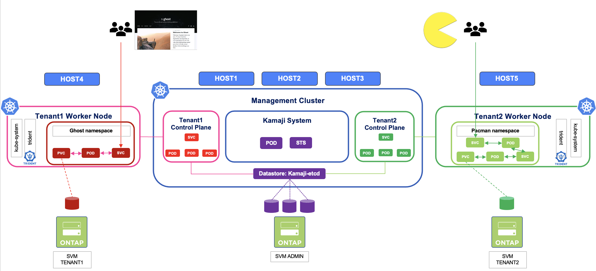

#########################################################################################
# SCENARIO 21: Persistent Volumes and Kamaji.
#########################################################################################

Multi-tenancy can be achieved in multiple ways depending on your needs or your end-users. 

From an infrastructure point ov view, maybe you are looking for efficiency and sustainability through mutualization?  
Or a better way to manage multiple clusters at scale ?  

This could be achieved by virtualizing Kubernetes Control planes (on top of VMware for instance), or by running "Control planes" in Kubernetes management cluster, which is what **Kamaji** is doing.  

In a nutshell, with Kamaji the Kubernetes admin manages **Tenants**, ie user Kubernetes cluters, which Control planes (**TCP**, Tenant Control Plane) are deployed on a **centralized management cluster** as pods in their own namespaces. A benefit (amongst many) is that the end user has then full access to his Kubernetes cluster, including cluster resources!  

Worker nodes can be easily added to tenants in a declarative way (cf _ClusterAPI_) or in a more traditional fashion with _kubeadm_, which is the method we are going to use in this scenario.

There is a last concept that needs to be introduced: **datastores**.  
All Kubernetes orchestrators, whatever flavors they are, need to write their _state_ somewhere. Traditionally this is done in an ECTD database, automatically deployed during the initial setup.  
With Kamaji, you can setup a shared datastore for multiple tenants (default behavior), or dedicate datastores per tenants. The decision depends on multiple factors, not discussed here.  

Those datastores can be configured :  
- automatically during the Kamaji setup, as an ETCD database    
- separately (External ETCD, MySQL, PostgreSQL)  

**Kamaji can use a dedicated datastore for each tenant. However, as this lab has limited resources, we will configure a shared datastore to host the 2 tenants.**  
The Tenant Control Plane _dataStore_ field is used to specify which one is assigned to a tenant.  

For more details, please refer to https://kamaji.clastix.io/concepts/.  

This scenario will guide you through the following tasks:  
- Kamaji installation  
- Creation of 2 tenants  
- Connect one worker node per tenant  
- Trident installation & setup in each tenant  
- Deployment of a stateful app in each tenant  

With the lab configuration, you could also test one single tenant, with 2 worker nodes. However this is not covered here.  

<p align="center"></p>

## A. Scenario requirements

The worker nodes we are going to add to the new tenants are based on the hosts _RHEL4_ and _RHEL5_.  
As they are off by default, you first need to start them.  

In order to power them on, you need to navigate to the Lab on Demand "MyLabs" page, and click on the "VM Status" button corresponding to the instance of your lab:  
<p align="center"></p>

From there, you can easily start those 2 hosts.  

Next, we will taint the windows nodes to avoid any side effect:  
```bash
kubectl taint nodes win1 win=true:NoSchedule
kubectl taint nodes win2 win=true:NoSchedule
```
Last, we will use different SVM for each part of the scenario, to showcase multi-tenancy at all levels:  
- Kamaji ETCD (in the Management Cluster): _sansvm_  
- Tenant1: _nassvm_  
- Tenant2: *svm_secondary*  

The last SVM is not configured by default. 
The procedure can be found here:  
- [Addenda04](../../../Addendum/Addenda04/): Ansible installation  
- [Addenda13](../../../Addendum/Addenda13/): Secondary SVM setup  


## B. Kamaji installation  

We are going to deploy with Helm 3 elements in this archictecture:  
- Jetstack cert-manager: manages the certificates of all elements of Kamaji  
- Kamaji: Control Plane Manager  
- Kamaji ETCD: database provided by Clastix  

Let's start by the certificate manager:  
```bash
helm repo add jetstack https://charts.jetstack.io
helm repo update
helm install cert-manager jetstack/cert-manager --namespace cert-manager --create-namespace --version v1.11.0 --set installCRDs=true
```
After a short time, you should see the following:  
```bash
$ kubectl get -n cert-manager po,svc
NAME                                           READY   STATUS    RESTARTS   AGE
pod/cert-manager-86844d9d7-vst59               1/1     Running   0          24h
pod/cert-manager-cainjector-6d5f558c69-29f9j   1/1     Running   0          24h
pod/cert-manager-webhook-bd76f6cf9-z7sn7       1/1     Running   0          24h

NAME                           TYPE        CLUSTER-IP      EXTERNAL-IP   PORT(S)    AGE
service/cert-manager           ClusterIP   10.109.77.237   <none>        9402/TCP   24h
service/cert-manager-webhook   ClusterIP   10.96.233.193   <none>        443/TCP    24h
```
We can now proceed with the 2 elements of Kamaji
```bash
helm repo add clastix https://clastix.github.io/charts
helm repo update

helm install kamaji clastix/kamaji --namespace kamaji-system --create-namespace \
  --set etcd.deploy=false \
  --set nodeSelector."kubernetes\.io/os"=linux \
  --set telemetry.disabled=true

helm install kamaji-etcd clastix/kamaji-etcd --namespace kamaji-system \
  --set datastore.enabled=true \
  --set persistentVolumeClaim.storageClassName=storage-class-iscsi-economy 
```
After a few minutes, here is the expected result:  
```bash
$ kubectl get -n kamaji-system po,svc,sts,pvc
NAME                          READY   STATUS    RESTARTS   AGE
pod/kamaji-76fb6f76cd-4w4cq   1/1     Running   0          24h
pod/kamaji-etcd-0             1/1     Running   0          24h
pod/kamaji-etcd-1             1/1     Running   0          24h
pod/kamaji-etcd-2             1/1     Running   0          24h

NAME                             TYPE        CLUSTER-IP       EXTERNAL-IP   PORT(S)                      AGE
service/kamaji-etcd              ClusterIP   None             <none>        2379/TCP,2380/TCP,2381/TCP   24h
service/kamaji-metrics-service   ClusterIP   10.102.241.203   <none>        8080/TCP                     24h
service/kamaji-webhook-service   ClusterIP   10.98.82.98      <none>        443/TCP                      24h

NAME                           READY   AGE
statefulset.apps/kamaji-etcd   3/3     24h

NAME                                       STATUS   VOLUME                                     CAPACITY   ACCESS MODES   STORAGECLASS                  VOLUMEATTRIBUTESCLASS   AGE
persistentvolumeclaim/data-kamaji-etcd-0   Bound    pvc-2a8d6ed8-1604-4400-b5e3-61722aa1321b   10Gi       RWO            storage-class-iscsi-economy   <unset>                 24h
persistentvolumeclaim/data-kamaji-etcd-1   Bound    pvc-c1272edd-5d67-465f-a7cd-868f22ebc74e   10Gi       RWO            storage-class-iscsi-economy   <unset>                 24h
persistentvolumeclaim/data-kamaji-etcd-2   Bound    pvc-244ba126-e7a1-4f05-ba51-c64918775ddc   10Gi       RWO            storage-class-iscsi-economy   <unset>                 24h
```
Notice the ETCD statefulset? This is the **datastore** deployed with the Kamaji-etcd helm chart.  
About datastores, you will see the following, granted we will use the _kamaji-etcd_ one: 
```bash
$ kubectl get datastore
NAME          DRIVER   AGE
default       etcd     24h
kamaji-etcd   etcd     24h
```
At this point, Kamaji is installed & ready to use!

## C. Tenant creation  

You can see in the following table the configuration I am using for the 2 tenants, as well as the management cluster:  

| Configuration | Mgmt cluster | tenant-01 | tenant-02 | 
| :--- | :---: | :---: | :---: |
| namespace | - | tenant1 | tenant2 |
| version | v1.29.0 | v1.29.0 | v1.29.0 |
| domain | cluster.local | cluster.local | cluster.local |
| POD CIDR | 192.168.24.0/21 | 192.168.32.0/24 | 192.168.33.0/24 |
| SVC CIDR | 10.96.0.0/12  | 10.112.0.0/24 | 10.113.0.0/24 |
| DNS Service | 10.96.0.10 | 10.112.0.10 | 10.113.0.10 |
| Tenant port | - | 6443 | 6443 |
| Tenant proxy port | - | 8132 | 8132 |

Time to create those tenants !!  
You can find in this folder two _tcp.yaml_ files fully configured & ready to be applied:  
```bash
$ kubectl create ns tenant1
namespace/tenant1 created

$ kubectl create ns tenant2
namespace/tenant2 created

$ kubectl create -f tenant1_tcp.yaml -f tenant2_tcp.yaml
tenantcontrolplane.kamaji.clastix.io/tenant-01 created
tenantcontrolplane.kamaji.clastix.io/tenant-02 created

$ kubectl get tcp -A
NAMESPACE   NAME        VERSION   STATUS   CONTROL-PLANE ENDPOINT   KUBECONFIG                   DATASTORE     AGE
tenant1     tenant-01   v1.29.0   Ready    192.168.0.212:6443       tenant-01-admin-kubeconfig   kamaji-etcd   2m29s
tenant2     tenant-02   v1.29.0   Ready    192.168.0.213:6443       tenant-02-admin-kubeconfig   kamaji-etcd   2m29s
```
As tenants are similar to full-on Kubernetes clusters, we can also generate a kubeconfig file for each tenant:  
```bash
$ kubectl get secrets -n tenant1 tenant-01-admin-kubeconfig -o json \
  | jq -r '.data["admin.conf"]' \
  | base64 --decode \
  > tenant1.kubeconfig

$ kubectl get secrets -n tenant2 tenant-02-admin-kubeconfig -o json \
  | jq -r '.data["admin.conf"]' \
  | base64 --decode \
  > tenant2.kubeconfig
```
Now you can interact with your tenants!
```bash
$ kubectl --kubeconfig=tenant1.kubeconfig cluster-info
Kubernetes control plane is running at https://192.168.0.212:6443
CoreDNS is running at https://192.168.0.212:6443/api/v1/namespaces/kube-system/services/kube-dns:dns/proxy

$ kubectl --kubeconfig=tenant2.kubeconfig cluster-info
Kubernetes control plane is running at https://192.168.0.213:6443
CoreDNS is running at https://192.168.0.213:6443/api/v1/namespaces/kube-system/services/kube-dns:dns/proxy
```

## D. Working the workers  

Let's assign available hosts to each tenant:  
- _RHEL4_ assigned to _tenant-01_  
- _RHEL5_ assigned to _tenant-02_

All the necessary tools & packages are already present on each hosts.  
You just need to retrieve the command to join nodes from each tenant and apply them to the availabe hosts.  
Let's start with the first tenant:  
```bash
JOIN_CMD_RHEL4=$(kubeadm --kubeconfig=tenant1.kubeconfig token create --print-join-command)
ssh root@rhel4 -t ${JOIN_CMD_RHEL4}
```
You can quickly see your worker node appearing in your tenant.  
```bash
$ kubectl get --kubeconfig=tenant1.kubeconfig node
NAME    STATUS      ROLES    AGE   VERSION
rhel4   NotReady    <none>    2m   v1.29.4
```
However, it will remain in a "NotReady" state, simply because there is no network manager installed yet.  
Let's proceed and install Calico (a very well known CNI) on this environment:  
```bash
kubectl --kubeconfig=tenant1.kubeconfig create -f tenant1_calico.yaml
```
After a few seconds, you will see your node change state:  
```bash
$ kubectl get --kubeconfig=tenant1.kubeconfig node
NAME    STATUS   ROLES    AGE   VERSION
rhel4   Ready    <none>   22m   v1.29.4
```
There you go, you just added a worker node to a Kamaji tenant, following the same method you would use to add a worker node to a 'traditional' cluster.  

You can now repeat all those steps for the second tenant:  
```bash
JOIN_CMD_RHEL5=$(kubeadm --kubeconfig=tenant2.kubeconfig token create --print-join-command)
ssh root@rhel5 -t ${JOIN_CMD_RHEL5}

kubectl --kubeconfig=tenant2.kubeconfig create -f tenant2_calico.yaml

kubectl get --kubeconfig=tenant2.kubeconfig node
```

## E. Trident installation & setup

Now that both our tenants are ready to be used, let's install Trident:  
```bash
tenants=( "tenant1" "tenant2" )
for tenant in "${tenants[@]}"
do
  helm install trident netapp-trident/trident-operator --version 100.2502.1 -n trident --create-namespace --set tridentAutosupportImage=registry.demo.netapp.com/trident-autosupport:25.02.0 --set operatorImage=registry.demo.netapp.com/trident-operator:25.02.1 --set tridentImage=registry.demo.netapp.com/trident:25.02.1 --set tridentSilenceAutosupport=true --kubeconfig=$tenant.kubeconfig
done
```
After a couple of minutes, Trident should be ready. Let's see what we can expect on the first tenant:  
```bash
$ kubectl --kubeconfig=tenant1.kubeconfig -n trident get pod
NAME                                  READY   STATUS    RESTARTS   AGE
trident-controller-6bd8c7cc8c-cxzcz   6/6     Running   0          71s
trident-node-linux-mqrtt              2/2     Running   0          37s
trident-operator-b577897b8-fglnw      1/1     Running   0          11m

$ kubectl --kubeconfig=tenant2.kubeconfig -n trident get tver
NAME      VERSION
trident   25.02.1
```
Let's also create a backend for each tenant. Each backend will point to a different SVM:  
```bash
$ kubectl --kubeconfig=tenant1.kubeconfig -n trident create -f tenant1_trident.yaml
secret/svm-credentials created
tridentbackendconfig.trident.netapp.io/backend-nfs created
storageclass.storage.k8s.io/storage-class-nfs created

$ kubectl --kubeconfig=tenant2.kubeconfig -n trident create -f tenant2_trident.yaml
secret/svm-credentials created
tridentbackendconfig.trident.netapp.io/backend-nfs created
storageclass.storage.k8s.io/storage-class-nfs created
```
Make sure both configurations are bound and successful:  
```bash
$ kubectl --kubeconfig=tenant1.kubeconfig -n trident get tbc
NAME          BACKEND NAME   BACKEND UUID                           PHASE   STATUS
backend-nfs   nfs            1cf49dfc-2545-4d17-89b5-51482839e1f5   Bound   Success

$ kubectl --kubeconfig=tenant2.kubeconfig -n trident get tbc
NAME          BACKEND NAME   BACKEND UUID                           PHASE   STATUS
backend-nfs   nfs            bad39b47-ab42-4b02-8e8d-4d2817322736   Bound   Success
```
& voilà ! Setup complete. You can now create apps in each tenants to complete the tests!  

## F. Tenants & applications

Let's create an application in the first tenant:  
```bash
$ kubectl --kubeconfig=tenant1.kubeconfig create -f tenant1_ghost.yaml
namespace/ghost created
persistentvolumeclaim/blog-content created
deployment.apps/blog created
service/blog created
```
After a few seconds, you can see that everything is up & running:  
```bash
$ kubectl --kubeconfig=tenant1.kubeconfig get -n ghost po,svc,pvc
NAME                        READY   STATUS    RESTARTS   AGE
pod/blog-596445b7f7-8n4bj   1/1     Running   0          33s

NAME           TYPE       CLUSTER-IP     EXTERNAL-IP   PORT(S)        AGE
service/blog   NodePort   10.112.0.151   <none>        80:30080/TCP   33s

NAME                                 STATUS   VOLUME                                     CAPACITY   ACCESS MODES   STORAGECLASS        VOLUMEATTRIBUTESCLASS   AGE
persistentvolumeclaim/blog-content   Bound    pvc-bee7599f-2f78-4544-8045-2fe0e82a8977   5Gi        RWX            storage-class-nfs   <unset>                 33s
```
As this app uses a NodePort type service, you can connect to its GUI on the worker node IP adress on a specific port (ie _192.168.0.64:30080_). 
If you like, you can now create some blogs with Ghost!  

Out of curiosity, let's check the the name of the underlying ONTAP volume:  
```bash
$ kubectl --kubeconfig=tenant1.kubeconfig get pv $( kubectl --kubeconfig=tenant1.kubeconfig -n ghost get pvc blog-content -o=jsonpath='{.spec.volumeName}') -o=jsonpath='{.spec.csi.volumeAttributes.internalName}'; echo
tenant1_ghost_blog_content_cd66b
```

Now, let's create an application in the second tenant:  
```bash
$ kubectl --kubeconfig=tenant2.kubeconfig create -f tenant2_pacman.yaml
namespace/pacman created
persistentvolumeclaim/mongo-storage created
service/mongo created
deployment.apps/mongo created
service/pacman created
deployment.apps/pacman created
```
After a few seconds, you can see that everything is up & running:  
```bash
$ kubectl --kubeconfig=tenant2.kubeconfig get -n pacman po,svc,pvc
NAME                         READY   STATUS    RESTARTS   AGE
pod/mongo-74768ff5c6-txll5   1/1     Running   0          8m54s
pod/pacman-b5ddc45d9-cxgfd   1/1     Running   0          8m54s

NAME             TYPE       CLUSTER-IP     EXTERNAL-IP   PORT(S)           AGE
service/mongo    NodePort   10.113.0.17    <none>        27017:31017/TCP   8m54s
service/pacman   NodePort   10.113.0.175   <none>        80:30080/TCP      8m54s

NAME                                  STATUS   VOLUME                                     CAPACITY   ACCESS MODES   STORAGECLASS        VOLUMEATTRIBUTESCLASS   AGE
persistentvolumeclaim/mongo-storage   Bound    pvc-8fb9714c-528f-4b35-9886-326660aed411   8Gi        RWO            storage-class-nfs   <unset>                 5m11s
```
Here again, this app uses a NodePort type service (there is no LoadBalancer installed in the tenant), you can connect to its GUI on the worker node IP adress on a specific port (ie _192.168.0.65:30080_). 
Time to chase some ghosts with pacman! 

Why not check the name of the underlying volume in ONTAP:  
```bash
$ kubectl --kubeconfig=tenant2.kubeconfig get pv $( kubectl --kubeconfig=tenant2.kubeconfig -n pacman get pvc mongo-storage -o=jsonpath='{.spec.volumeName}') -o=jsonpath='{.spec.csi.volumeAttributes.internalName}'; echo
tenant2_pacman_mongo_storage_8fb97
```
If you connect to the ONTAP platform, you would that the persitent volumes created in this scenario are built in different SVM!  
That way, you really have a multi-tenant architecture at all levels:  
```bash
cluster1::> vol show -volume ten*
Vserver   Volume       Aggregate    State      Type       Size  Available Used%
--------- ------------ ------------ ---------- ---- ---------- ---------- -----
nassvm    tenant1_ghost_blog_content_cd66b
                       aggr1        online     RW          5GB     5.00GB    0%
svm_secondary
          tenant2_pacman_mongo_storage_8fb97
                       aggr2        online     RW          8GB     7.98GB    0%
2 entries were displayed.
```
You can notice even the aggregates are different, hence those two tenants don't share the same physical disks.  

Also, the Trident backends are configured with Dynamic export policies enabled.  
With that feature, only the worker nodes mounting a specific volume will appear in the ONTAP export policy in each SVM.  
When you add more nodes to a tenant, Trident will automatically update the export policy.  
Let's retrieve the export policy for each PVC:  
```bash
cluster1::> vol show -vserver nassvm -volume tenant1_ghost_blog_content_cd66b -fields policy
vserver volume                           policy
------- -------------------------------- --------------------------------------------
nassvm  tenant1_ghost_blog_content_cd66b trident-1cf49dfc-2545-4d17-89b5-51482839e1f5

cluster1::> vol show -vserver svm_secondary -volume tenant2_pacman_mongo_storage_8fb97 -fields policy
vserver       volume                             policy
------------- ---------------------------------- --------------------------------------------
svm_secondary tenant2_pacman_mongo_storage_8fb97 trident-bad39b47-ab42-4b02-8e8d-4d2817322736
```
Now we can easily identify the rules configured by Trident:  
```bash
cluster1::> export-policy rule show -vserver nassvm -policyname trident-1cf49dfc-2545-4d17-89b5-51482839e1f5
             Policy          Rule    Access   Client                RO
Vserver      Name            Index   Protocol Match                 Rule
------------ --------------- ------  -------- --------------------- ---------
nassvm       trident-1cf49dfc-2545-4d17-89b5-51482839e1f5
                             1       nfs      192.168.0.64          any

cluster1::> export-policy rule show -vserver svm_secondary -policyname trident-bad39b47-ab42-4b02-8e8d-4d2817322736
             Policy          Rule    Access   Client                RO
Vserver      Name            Index   Protocol Match                 Rule
------------ --------------- ------  -------- --------------------- ---------
svm_secondary
             trident-bad39b47-ab42-4b02-8e8d-4d2817322736
                             1       nfs      192.168.0.65          any
```
As expected, you only see the worker node for each tenant.  

>> **Conclusion:**  
>> With Kamaji & NetApp, you have the possibility to create multiple tenants totally isolated from each other at all levels, while reducing the server footprint (with all Control Planes mutualized by Kamaji on a central management cluster), as well as benefiting from NetApp security features & efficiency (to reduce storage footprint)!  