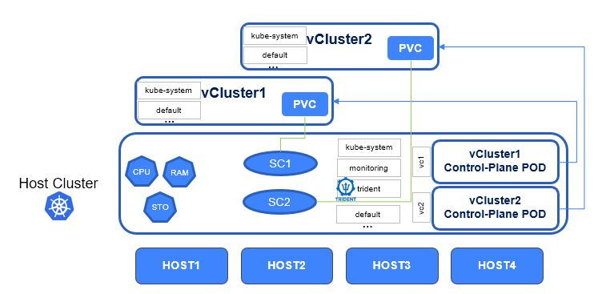
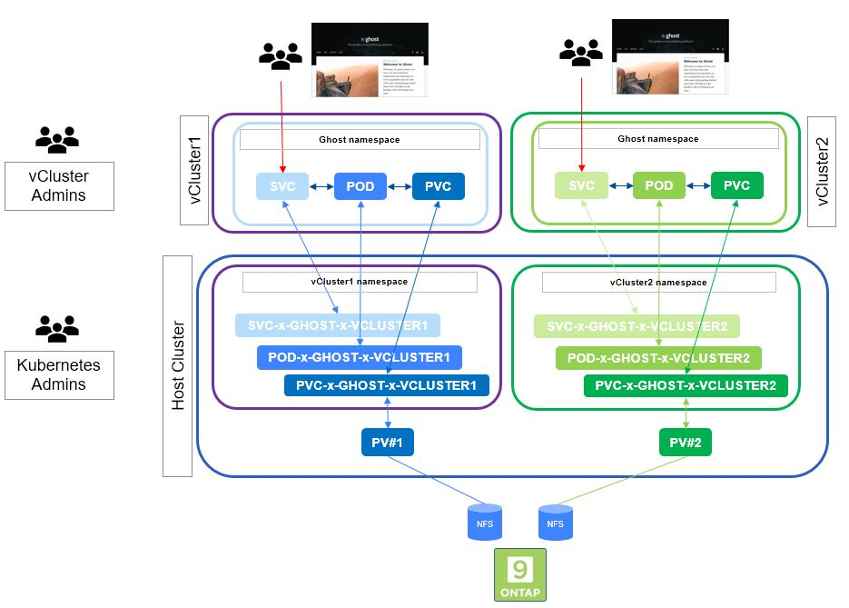

#########################################################################################
# SCENARIO 21: Persistent Volumes and vClusters.
#########################################################################################

Virtual Clusters (https://www.vcluster.com/) from https://loft.sh are quite an interesting piece of technology.  
They look & taste like real clusters, as you basically have access to everything (admin role, with your own set of APIs), but its construct reside in the namespace of an underlying Kubernetes cluster.

This has many advantages, especially when you dig into all the options you have at hand  
- speed of deployment or retirement of a vCluster (just a few seconds, litteraly)
- resource management done in the underlying Kubernetes cluster (choose how many nodes you will run onto, quotas & limits management, ...)
- isolation (with pod security)
- ...

When it comes to storage management, especially in the K8S-aaS context, often comes on the table the question of who will manage the storage & how...  
Trident is fully integrated into Kubernetes, which is great, however some dont want to give access to the Trident configuration to the end-user.  

vClusters could definitely help:  
- The storage class is managed by default on the underlying cluster, and can optionally be customized at the vCluster level
- Trident being part of the underlying cluster cannot be modified by the end-user
- Resource Quotas & LimitRanges can be applied to a vCluster to control storage consumption by the Kubernetes admin

Let's see this in action! We are going to create 2 vClusters in this environment:

<p align="center"></p>

## A. Environment setup  

Before testing vClusters, we will prepare the Trident configuration that can be used here.  
Let's create two new Trident backends associated with specific storage classes, so that we can demonstrate how the Kubernetes admin can control the storage consumption of a Tenant:  
```bash
$ kubectl create -f ../scenario21_trident_config.yaml
secret/sc21_credentials created
tridentbackendconfig.trident.netapp.io/backend-tenant1 created
tridentbackendconfig.trident.netapp.io/backend-tenant2 created

$ kubectl create -f ../scenario21_storage_classes.yaml
storageclass.storage.k8s.io/sc-tenant1 created
storageclass.storage.k8s.io/sc-tenant2 created
```

If you have not yet read the [Addenda08](../../Addendum/Addenda08) about the Docker Hub management, it would be a good time to do so.  
Also, if no action has been made with regards to the container images, you can find a shell script in this directory *scenario21_pull_images.sh* to pull images utilized in this scenario if needed:  
```bash
sh ../scenario21_pull_images.sh
```

In order to best benefit from this experiment, you will also need to:  
- Allow user applications on the control plane: cf [Addenda03](../../../Addendum/Addenda03/)
- Add an extra node to the Kubernetes cluster: cf [Addenda01](../../../Addendum/Addenda01)

With 4 linux nodes, your cluster will look the following:
```bash
$ kubectl get node -l kubernetes.io/os=linux
NAME    STATUS   ROLES           AGE     VERSION
rhel1   Ready    <none>          99d     v1.29.4
rhel2   Ready    <none>          99d     v1.29.4
rhel3   Ready    control-plane   99d     v1.29.4
rhel4   Ready    <none>          2m49s   v1.29.4
```

Last, as both solutions can benefit from labels positioned on nodes, we will already configure some:  
```bash
$ kubectl label node rhel1 "tenant=tenant1"
node/rhel1 labeled
$ kubectl label node rhel2 "tenant=tenant1"
node/rhel2 labeled
$ kubectl label node rhel3 "tenant=tenant2"
node/rhel3 labeled
$ kubectl label node rhel4 "tenant=tenant2"
node/rhel4 labeled
```

You are now ready to proceed with the vCluster installation.  

## B. vCluster Requirements

One of the requirements of vCluster is to run a recent version of Helm (v3.10.0+).  
The lab runs Helm 3.XXXX. Here are the steps to upgrade this tool:  
```bash
$ helm version --short
v3.9.4+gdbc6d8e

$ wget https://get.helm.sh/helm-v3.15.3-linux-amd64.tar.gz
$ tar -xvf helm-v3.15.3-linux-amd64.tar.gz
$ /bin/cp -f linux-amd64/helm /usr/local/bin/

$ helm version --short
v3.15.3+g3bb50bb
```

## C. Install vCluster

This is really the easiest thing ever... In short, download & use:  
```bash
$ curl -L -o vcluster "https://github.com/loft-sh/vcluster/releases/download/v0.19.7/vcluster-linux-amd64" && install -c -m 0755 vcluster /usr/local/bin && rm -f vcluster

$ vcluster version
vcluster version 0.19.7
```

To get more information, you can refer to https://www.vcluster.com/docs/v0.19/getting-started/setup  

## D. Create vClusters

Virtual clusters can be created on one node (default behavior), a subset of Kubernetes nodes (based on labels), or on all of them.  
We have already set some labels for the purporse of this exercise.  

vCluster will use either Vanilla Kubernetes, K3S (default architecture) or K0S to create tenants.  
For this lab, we will use K0S which is more adapted for this environment.  

We are now ready to create 2 virtual clusters !  
The admin can deeply customize the setup of the vClusters through the use of a parameter YAML file.  
In my case, I have specified a resource limit for the Control Planes & the labels to look for on the nodes.  

I have also used the following arguments:  
- _expose_: the vCluster will be reachable through a LoadBalancer service (ie IP address given by MetalLB)
- _connect=false_: will not automatically connect to the cluster after the creation is successful

```bash
$ vcluster create vcluster-1 -n vc1 -f ~/LabNetApp/Kubernetes_v6/Trident_Scenarios/Scenario21/Loft_vClusters/vcluster_vc1.yaml --expose --connect=false --distro k0s
10:05:53 info Creating namespace vc1
10:05:53 info Create vcluster vcluster-1...
10:05:53 info execute command: helm upgrade vcluster-1 /tmp/vcluster-k0s-0.19.7.tgz-1109357542 --kubeconfig /tmp/3341718974 --namespace vc1 --install --repository-config='' --values /tmp/524587589 --values vc1.yaml
10:05:54 done Successfully created virtual cluster vcluster-1 in namespace vc1.
- Use 'vcluster connect vcluster-1 --namespace vc1' to access the virtual cluster
- Use `vcluster connect vcluster-1 --namespace vc1 -- kubectl get ns` to run a command directly within the vcluster

$ vcluster create vcluster-2 -n vc2 -f ~/LabNetApp/Kubernetes_v6/Trident_Scenarios/Scenario21/Loft_vClusters/vcluster_vc2.yaml --expose --connect=false --distro k0s
10:05:41 info Creating namespace vc2
10:05:41 info Create vcluster vcluster-2...
10:05:41 info execute command: helm upgrade vcluster-2 /tmp/vcluster-k0s-0.19.7.tgz-4154764837 --kubeconfig /tmp/468142798 --namespace vc2 --install --repository-config='' --values /tmp/1557733757 --values vc2.yaml
10:05:42 done Successfully created virtual cluster vcluster-2 in namespace vc2.
- Use 'vcluster connect vcluster-2 --namespace vc2' to access the virtual cluster
- Use `vcluster connect vcluster-2 --namespace vc2 -- kubectl get ns` to run a command directly within the vcluster

$ vcluster list
       NAME    |           CLUSTER           | NAMESPACE | STATUS  | VERSION | CONNECTED |            CREATED            | AGE  | DISTRO
  -------------+-----------------------------+-----------+----------+---------+-----------+-------------------------------+------+---------
    vcluster-1 | kubernetes-admin@kubernetes | vc1       | Running | 0.19.7  |           | 2024-08-05 15:39:05 +0000 UTC | 5m6s | OSS
    vcluster-2 | kubernetes-admin@kubernetes | vc2       | Running | 0.19.7  |           | 2024-08-05 15:43:37 +0000 UTC | 34s  | OSS
```
Let's also check which nodes host the vcluster pods (vcluster1 should run on rhel1/2 et vcluster2 on rhel3/4):  
```bash
$ kubectl get -n vc1 pod -o wide
NAME                                                  READY   STATUS    RESTARTS       AGE    IP               NODE    NOMINATED NODE   READINESS GATES
coredns-68bdd584b4-v5n94-x-kube-system-x-vcluster-1   1/1     Running   0              50m    192.168.28.124   rhel2   <none>           <none>
vcluster-1-0                                          1/1     Running   13 (48m ago)   101m   192.168.28.123   rhel2   <none>           <none>

$ kubectl get -n vc2 pod -o wide
NAME                                                  READY   STATUS    RESTARTS   AGE    IP               NODE    NOMINATED NODE   READINESS GATES
coredns-86c6d8c6b9-h2wp2-x-kube-system-x-vcluster-2   1/1     Running   0          137m   192.168.26.101   rhel4   <none>           <none>
vcluster-2-0                                          1/1     Running   0          138m   192.168.26.100   rhel4   <none>           <none>
```
Also, a specific storage class was specified to host the vcluster PVC:  
```bash
$ kubectl get -n vc1 pvc
NAME                 STATUS   VOLUME                                     CAPACITY   ACCESS MODES   STORAGECLASS        VOLUMEATTRIBUTESCLASS   AGE
data-vcluster-1-0    Bound    pvc-0f1ff341-aec2-4ac8-b56d-bbe5baf8e343   5Gi        RWO            storage-class-nfs   <unset>                 153m
```

The _vcluster_ pod is the "control plane" of your tenant, which runs K0S.  
You may wonder what the other POD is? It is the system POD running in the vCluster _kube-system_ namespace but viewed from a different perspective, directly on the host cluster in the vCluster namespace. In order to recognize the different resources on the host cluster, the following naming convention is applied: PODNAME-x-NAMESPACE-x-VCLUSTER  
```bash
$ vcluster connect vcluster-1 --namespace vc1 -- kubectl get pod -A -o wide
NAMESPACE     NAME                       READY   STATUS    RESTARTS   AGE    IP               NODE    NOMINATED NODE   READINESS GATES
kube-system   coredns-86c6d8c6b9-5tgp6   1/1     Running   0          138m   192.168.28.126   rhel2   <none>           <none>
```

Our two vClusters are now up & running. Let's look closely at what we have here in the first one:  
```bash
$ vcluster connect vcluster-1 --namespace vc1 -- kubectl get nodes -o wide
NAME    STATUS   ROLES    AGE    VERSION   INTERNAL-IP     EXTERNAL-IP   OS-IMAGE                              KERNEL-VERSION                 CONTAINER-RUNTIME
rhel1   Ready    <none>   138m   v1.29.4   10.98.188.27    <none>        Red Hat Enterprise Linux 9.3 (Plow)   5.14.0-362.24.1.el9_3.x86_64   cri-o://1.30.0
rhel2   Ready    <none>   138m   v1.29.4   10.109.64.154   <none>        Red Hat Enterprise Linux 9.3 (Plow)   5.14.0-362.24.1.el9_3.x86_64   cri-o://1.30.0

$ vcluster connect vcluster-1 --namespace vc1 -- kubectl get namespaces
NAME              STATUS   AGE
default           Active   139m
k0s-autopilot     Active   139m
kube-node-lease   Active   139m
kube-public       Active   139m
kube-system       Active   139m

$ vcluster connect vcluster-1 --namespace vc1 -- kubectl get svc -A
NAMESPACE     NAME         TYPE        CLUSTER-IP      EXTERNAL-IP   PORT(S)                  AGE
default       kubernetes   ClusterIP   10.99.85.219    <none>        443/TCP                  139m
kube-system   kube-dns     ClusterIP   10.102.38.175   <none>        53/UDP,53/TCP,9153/TCP   139m

$ vcluster connect vcluster-1 --namespace vc1 -- kubectl get crd
NAME                                    CREATED AT
controlnodes.autopilot.k0sproject.io    2024-08-07T10:06:31Z
plans.autopilot.k0sproject.io           2024-08-07T10:06:31Z
updateconfigs.autopilot.k0sproject.io   2024-08-07T10:06:31Z

$ vcluster connect vcluster-1 --namespace vc1 -- kubectl get sc
No resources found in default namespace.
```

A few things to notice:  
- It looks like a brand new K0S cluster
- There is no Trident resource in the vCluster, nor storage class, as these are managed directly from the underlying cluster
- From a vCluster standpoint, the nodes INTERNAL IP are different from the once you find using the _kubectl get nodes_ command on the underlying cluster

In order to create Persistent Volumes, the Kubernetes admin will have to provide the vCluster admin or the end-users with the right Storage Class to use.  
Note that you can also create customer storage classes within the vCluster.  

Last, vClusters are created & managed with Helm.  
Each tenant then appears in the Helm listing:  
```bash
$ helm ls -n vc1
NAME            NAMESPACE       REVISION        UPDATED                                 STATUS          CHART                   APP VERSION
vcluster-1      vc1             2               2024-08-07 12:45:06.22819239 +0000 UTC  deployed        vcluster-k0s-0.19.7
$ helm ls -n vc2
NAME            NAMESPACE       REVISION        UPDATED                                 STATUS          CHART                   APP VERSION
vcluster-2      vc2             1               2024-08-07 10:05:41.416349277 +0000 UTC deployed        vcluster-k0s-0.19.7
```

## E. Use vClusters

I would recommend looking into how to connect to a vCluster to see the extent of what it possible: https://www.vcluster.com/docs/getting-started/connect.  
Let's create the kubeconfig files related to each vCluster:  
```bash
$ vcluster connect vcluster-1 -n vc1 --kube-config ~/kubeconfig_vc1 --update-current=false
12:27:28 info Using vcluster vcluster-1 load balancer endpoint: 192.168.0.213
12:27:28 done Virtual cluster kube config written to: /root/kubeconfig_vc1
- Use `kubectl --kubeconfig /root/kubeconfig_vc1 get namespaces` to access the vcluster

$ vcluster connect vcluster-2 -n vc2 --kube-config ~/kubeconfig_vc2 --update-current=false
12:27:45 info Using vcluster vcluster-2 load balancer endpoint: 192.168.0.212
12:27:45 done Virtual cluster kube config written to: /root/kubeconfig_vc2
- Use `kubectl --kubeconfig /root/kubeconfig_vc2 get namespaces` to access the vcluster
```

The vCluster admin & end-users would be provided with their own kubeconfig file to use, which can be exported in the KUBECONFIG variable.  
In this lab, I will just use the parameter _--kubeconfig_ with the kubectl command in order to avoir juggling with multiple terminals.  

As a vCluster admin, let's first check what we have:  
```bash
$ kubectl --kubeconfig ~/kubeconfig_vc1 get nodes -o wide
NAME    STATUS   ROLES    AGE    VERSION   INTERNAL-IP     EXTERNAL-IP   OS-IMAGE                              KERNEL-VERSION                 CONTAINER-RUNTIME
rhel1   Ready    <none>   141m   v1.29.4   10.98.188.27    <none>        Red Hat Enterprise Linux 9.3 (Plow)   5.14.0-362.24.1.el9_3.x86_64   cri-o://1.30.0
rhel2   Ready    <none>   141m   v1.29.4   10.109.64.154   <none>        Red Hat Enterprise Linux 9.3 (Plow)   5.14.0-362.24.1.el9_3.x86_64   cri-o://1.30.0
```

Let's install Ghost on this vCluster. For that, you can use the _ghost_vc1.sh_ file from the Ghost_vc1 directory.  
It will be installed in its own namespace called _ghostvc1_.  
Since this application's service is of LoadBalancer type, the script retrieves the IP address & sets it in the pod.  
```bash
$ sh Ghost_vc1/ghost_vc1.sh
namespace/ghostvc1 created
persistentvolumeclaim/blog-content-vc1 created
service/blog-vc1 created
deployment.apps/blog-vc1 created

$ kubectl --kubeconfig ~/kubeconfig_vc1 -n ghostvc1 get svc,pod,pvc
NAME               TYPE           CLUSTER-IP       EXTERNAL-IP     PORT(S)        AGE
service/blog-vc1   LoadBalancer   10.103.185.246   192.168.0.214   80:32153/TCP   32s

NAME                            READY   STATUS    RESTARTS   AGE
pod/blog-vc1-559cc9757c-22p7t   1/1     Running   0          26s

NAME                                     STATUS   VOLUME                                     CAPACITY   ACCESS MODES   STORAGECLASS   VOLUMEATTRIBUTESCLASS   AGE
persistentvolumeclaim/blog-content-vc1   Bound    pvc-4203d0c0-d26c-46b7-867a-f69062e70960   5Gi        RWX            sc-tenant1     <unset>                 32s
```

You can now connect to the IP address provided to the Ghost service by the LoadBalancer in order to use this app (192.168.0.214 in this example).  
Let's see what corresponding resources we have on the underlying cluster:  
```bash
$ kubectl get -n vc1 pod,svc,pvc -l vcluster.loft.sh/namespace=ghostvc1
NAME                                                    READY   STATUS    RESTARTS   AGE
pod/blog-vc1-559cc9757c-22p7t-x-ghostvc1-x-vcluster-1   1/1     Running   0          67s

NAME                                       TYPE           CLUSTER-IP       EXTERNAL-IP     PORT(S)        AGE
service/blog-vc1-x-ghostvc1-x-vcluster-1   LoadBalancer   10.103.185.246   192.168.0.214   80:32153/TCP   72s

NAME                                                             STATUS   VOLUME                                     CAPACITY   ACCESS MODES   STORAGECLASS   VOLUMEATTRIBUTESCLASS   AGE
persistentvolumeclaim/blog-content-vc1-x-ghostvc1-x-vcluster-1   Bound    pvc-4203d0c0-d26c-46b7-867a-f69062e70960   5Gi        RWX            sc-tenant1     <unset>                 73s
```

Here again we see the same resources, but from a different perspective & with a different naming convention.  
The vCluster2 could also decide to deploy Ghost (with the script ghost_vc2.sh in the Ghost_vc2 folder).

<p align="center"></p>

## F. What about CSI Snapshots

If the current setup does not yet have a volume snapshot class at the cluster level, you can find in the Scenario13 folder:  
```bash
$ kubectl create -f ../Scenario13/sc-volumesnapshot.yaml
volumesnapshotclass.snapshot.storage.k8s.io/csi-snap-class created
```
With the class created, let's try to get a Volume Snapshot of our PVC:  
```bash
$ kubectl --kubeconfig ~/kubeconfig_vc1 -n ghostvc1 create -f Ghost_vc1/pvc_snapshot.yaml
error: resource mapping not found for name: "blog-content-vc1-snapshot" namespace: "" from "Ghost_vc1/pvc_snapshot.yaml": no matches for kind "VolumeSnapshot" in version "snapshot.storage.k8s.io/v1"
ensure CRDs are installed first
```
This fails, as the feature is disabled for this vCluster.  
We then first need to upgrade our vcluster to enable that feature:
```bash
$ vcluster create vcluster-1 -n vc1 -f ~/LabNetApp/Kubernetes_v6/Trident_Scenarios/Scenario21/Loft_vClusters/vcluster_vc1_upgrade.yaml --expose --connect=false --distro k0s --upgrade
12:45:06 info Upgrade vcluster vcluster-1...
12:45:06 info execute command: helm upgrade vcluster-1 /tmp/vcluster-k0s-0.19.7.tgz-4122250687 --kubeconfig /tmp/3013372027 --namespace vc1 --install --repository-config='' --values /tmp/3840310634 --values vc1u.yaml
12:45:07 done Successfully created virtual cluster vcluster-1 in namespace vc1.
- Use 'vcluster connect vcluster-1 --namespace vc1' to access the virtual cluster
- Use `vcluster connect vcluster-1 --namespace vc1 -- kubectl get ns` to run a command directly within the vcluster
```

This volume snapshot class has been made available through the vcluster parameter _volumesnapshots:enabled:true_.  
Let's verify this, create a CSI snapshot & a new PVC from it.    
```bash
$ kubectl --kubeconfig ~/kubeconfig_vc1 -n ghostvc1 get volumesnapshotclass
NAME             DRIVER                  DELETIONPOLICY   AGE
csi-snap-class   csi.trident.netapp.io   Delete           98s

$ kubectl --kubeconfig ~/kubeconfig_vc1 -n ghostvc1 create -f Ghost_vc1/pvc_snapshot.yaml
volumesnapshot.snapshot.storage.k8s.io/blog-content-vc1-snapshot created

$ kubectl --kubeconfig ~/kubeconfig_vc1 -n ghostvc1 get pvc,volumesnapshot
NAME                                     STATUS   VOLUME                                     CAPACITY   ACCESS MODES   STORAGECLASS   VOLUMEATTRIBUTESCLASS   AGE
persistentvolumeclaim/blog-content-vc1   Bound    pvc-4203d0c0-d26c-46b7-867a-f69062e70960   5Gi        RWX            sc-tenant1     <unset>                 18m

NAME                                                               READYTOUSE   SOURCEPVC          SOURCESNAPSHOTCONTENT   RESTORESIZE   SNAPSHOTCLASS    SNAPSHOTCONTENT                                    CREATIONTIME   AGE
volumesnapshot.snapshot.storage.k8s.io/blog-content-vc1-snapshot   true         blog-content-vc1                           744Ki         csi-snap-class   snapcontent-5b5fc0ad-4843-4ab5-8c83-ee6c94c85af4   12s            12s

$ kubectl --kubeconfig ~/kubeconfig_vc1 -n ghostvc1 create -f Ghost_vc1/pvc_from_snap.yaml
persistentvolumeclaim/blog-content-vc1-from-snap created

$ kubectl --kubeconfig ~/kubeconfig_vc1 -n ghostvc1 get pvc
NAME                         STATUS   VOLUME                                     CAPACITY   ACCESS MODES   STORAGECLASS   VOLUMEATTRIBUTESCLASS   AGE
blog-content-vc1             Bound    pvc-4203d0c0-d26c-46b7-867a-f69062e70960   5Gi        RWX            sc-tenant1     <unset>                 19m
blog-content-vc1-from-snap   Bound    pvc-1d8f7a1b-36b7-4d3a-9cca-945108aba39d   5Gi        RWX            sc-tenant1     <unset>                 8s
```

There you go. We just saw how to easily give access to CSI snapshots to a vCluster user. 

## G. Clean up

Deleting the vClusters is pretty straight forward. Note that all resources created within the vCluster will also be deleted:  
```bash
$ vcluster delete vcluster-1 -n vc1 --delete-namespace
12:51:49 info Delete vcluster vcluster-1...
12:51:50 done Successfully deleted virtual cluster vcluster-1 in namespace vc1
12:51:50 done Successfully deleted virtual cluster namespace vc1
12:51:50 info Waiting for virtual cluster to be deleted...
12:52:07 done Virtual Cluster is deleted

$ vcluster delete vcluster-2 -n vc2 --delete-namespace
12:52:37 info Delete vcluster vcluster-2...
12:52:37 done Successfully deleted virtual cluster vcluster-2 in namespace vc2
12:52:38 done Successfully deleted virtual cluster namespace vc2
12:52:38 info Waiting for virtual cluster to be deleted...
12:52:49 done Virtual Cluster is deleted
```

## What's next

You can go back to the [FrontPage](https://github.com/YvosOnTheHub/LabNetApp)