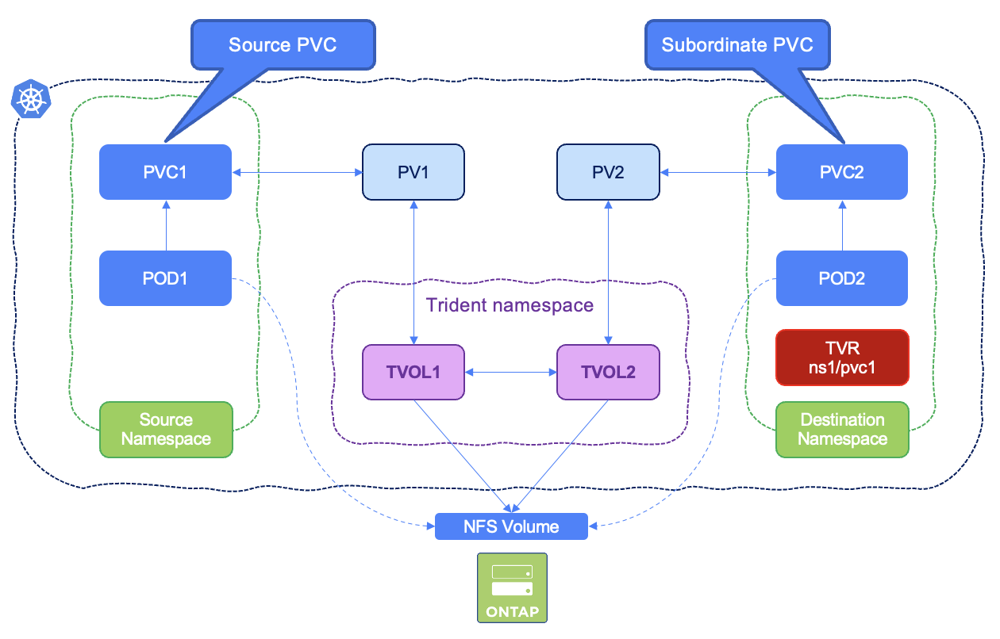

#########################################################################################
# SCENARIO 22: Sharing NFS volumes across namespaces
#########################################################################################

Have you ever wanted to share volumes between Kubernetes namespaces? You can now! Trident `v22.10` introduced cross-namespace volume access!  

This Kubernetes-native solution has the following benefits:
- Multiple levels of access control to ensure security
- Works with all Trident NFS volume drivers
- No reliance on tridentctl or any other non-native Kubernetes feature

This diagram illustrates NFS volume sharing across two Kubernetes namespaces:
<p align="center"></p>

## A. Set up the environment

#### Ensure you have configured nas backend `BackendForNFS` and storage-class `storage-class-nfs` from [Scenario02](../../Scenario02)  
```
$ kubectl get tbc -n trident
NAME              BACKEND NAME    BACKEND UUID                           PHASE   STATUS
backend-tbc-nfs   BackendForNFS   11d28fb4-6cf5-4c59-931d-94b8d8a5e061   Bound   Success

$ kubectl get sc
NAME                PROVISIONER             RECLAIMPOLICY   VOLUMEBINDINGMODE   ALLOWVOLUMEEXPANSION   AGE
storage-class-nfs   csi.trident.netapp.io   Delete          Immediate           true                   6m41s
```

## B. Create primary namespace, PVC and Pod
```bash
$ kubectl create -f primary.yaml
namespace/cnva-primary created
persistentvolumeclaim/primary-pvc created
pod/busybox-primary created
```
This will create the primary PVC and mount it into a busybox pod, in the `primary` namespace.

Notice the annotation **shareToNamespace** for the PVC in the _primary.yaml_ file, granting access to the volume from the **cnva-secondary** namespace
```yaml
  annotations:
    trident.netapp.io/shareToNamespace: cnva-secondary
```

Not setting this annotation would lead to the following error in the secondary namespace, when trying to mount a volume:
```yaml
csi.trident.netapp.io    subordinate volume source PVC is not shared with namespace cnva-secondary
csi.trident.netapp.io_trident-csi-xyz  failed to provision volume with StorageClass "storage-class-nfs": rpc error: code = Unknown desc = subordinate volume source PVC is not shared with namespace cnva-secondary
```

You can verify the creations of the resources with:  
```bash
$ kubectl get pod,pvc -n cnva-primary
NAME                  READY   STATUS    RESTARTS   AGE
pod/busybox-primary   1/1     Running   0          41m

NAME                                STATUS   VOLUME                                     CAPACITY   ACCESS MODES   STORAGECLASS        AGE
persistentvolumeclaim/primary-pvc   Bound    pvc-988032b9-1fe7-4a5c-bf1c-371e17ee128e   10Gi      RWX            storage-class-nfs   47m
```

Access the primary busybox pod shell and create a test file in the persistent volume:  
```bash
$ kubectl exec -it busybox-primary -n cnva-primary  -- ls -ld /mnt/sharedvolume
drwxrwxrwx    2 99       99            4096 Nov 29 15:03 /mnt/sharedvolume

$ kubectl exec -it busybox-primary -n cnva-primary  -- sh -c 'echo "Testing cross-namespace volumes" > /mnt/sharedvolume/testfile.txt'

$ kubectl exec -it busybox-primary -n cnva-primary  -- more /mnt/sharedvolume/testfile.txt
Testing cross-namespace volumes
```

## C. Setup the secondary namespace

Create a TridentVolumeReference CR in the destination namespace that refers to the source namespace PVC.  
This object is used to define in the secondary namespace where source objects can be found.  
```bash
$ kubectl create ns cnva-secondary
namespace/cnva-secondary created
$ kubectl create -f secondary-tvr.yaml
tridentvolumereference.trident.netapp.io/secondary-pvc created
$ kubectl get tvr -n cnva-secondary
NAME            AGE
secondary-pvc   33s
```

Create the secondary RWX PVC (**the storage class must be the same one as the primary PVC**):  
```bash
$ kubectl create -f secondary-pvc.yaml
persistentvolumeclaim/secondary-pvc created
```

Notice the annotation **shareFromPVC** in _secondary-pvc.yaml_, referencing the source namespace and PVC:
```yaml
  annotations:
    trident.netapp.io/shareFromPVC: cnva-primary/primary-pvc
```
You can verify the creation of the PVC with:  
```bash
$ kubectl get pvc -n cnva-secondary
NAME            STATUS   VOLUME                                     CAPACITY   ACCESS MODES   STORAGECLASS        AGE
secondary-pvc   Bound    pvc-cb08a6a6-5520-4370-9244-71ee2ed2519c   10Gi       RWX            storage-class-nfs   5s
```

Also notice with tridentctl that only one volume was created, but two PVCs: one of which is shown as `subordinate`
```bash
$ tridentctl get backend -n trident
+---------------+----------------+--------------------------------------+--------+------------+---------+
|     NAME      | STORAGE DRIVER |                 UUID                 | STATE  | USER-STATE | VOLUMES |
+---------------+----------------+--------------------------------------+--------+------------+---------+
| BackendForNFS | ontap-nas      | 11d28fb4-6cf5-4c59-931d-94b8d8a5e061 | online | normal     |       1 |
+---------------+----------------+--------------------------------------+--------+------------+---------+

$ tridentctl get volumes -n trident
+------------------------------------------+---------+-------------------+----------+--------------------------------------+-------------+---------+
|                   NAME                   |  SIZE   |   STORAGE CLASS   | PROTOCOL |             BACKEND UUID             |    STATE    | MANAGED |
+------------------------------------------+---------+-------------------+----------+--------------------------------------+-------------+---------+
| pvc-988032b9-1fe7-4a5c-bf1c-371e17ee128e | 10 GiB  | storage-class-nfs | file     | 11d28fb4-6cf5-4c59-931d-94b8d8a5e061 | online      | true    |
| pvc-cb08a6a6-5520-4370-9244-71ee2ed2519c | 10 GiB  | storage-class-nfs | file     | 11d28fb4-6cf5-4c59-931d-94b8d8a5e061 | subordinate | true    |
+------------------------------------------+---------+-------------------+----------+--------------------------------------+-------------+---------+
```

If the TVR was absent at the time of the creation of the PVC, you would see the following message in the PVC:
```yaml
Warning  ProvisioningFailed    1s (x4 over 55s)   csi.trident.netapp.io_trident-csi-xyz  failed to provision volume with StorageClass "storage-class-nfs": rpc error: code = Unknown desc = volume reference secondary_primary/primary-pvc not found in cache
```


## D. Create a Pod in the secondary namespace and mount the subordinate volume

```bash
$ kubectl create -f secondary-pod.yaml
pod/busybox-secondary created

$ kubectl get pods -n cnva-secondary
NAME                READY   STATUS    RESTARTS   AGE
busybox-secondary   1/1     Running   0          14s
```

Access the Pod shell, check the test file in the shared volume & try to write in the shared volume:
```bash
$ kubectl exec -it busybox-secondary -n cnva-secondary  -- ls -ld /mnt/sharedvolume
drwxrwxrwx    2 99       99            4096 Nov 29 15:08 /mnt/sharedvolume

$ kubectl exec -it busybox-secondary -n cnva-secondary  -- more /mnt/sharedvolume/testfile.txt
Testing cross-namespace volumes

$ kubectl exec -it busybox-secondary -n cnva-secondary  -- sh -c 'echo "Writing from the secondary namespace" >> /mnt/sharedvolume/testfile.txt'

$ kubectl exec -it busybox-secondary -n cnva-secondary  -- more /mnt/sharedvolume/testfile.txt
Testing cross-namespace volumes
Writing from the secondary namespace
```
Last check, let's validate we can read the modifications from the primary namespace:  
```bash
$ kubectl exec -it busybox-primary -n cnva-primary  -- more /mnt/sharedvolume/testfile.txt
Testing cross-namespace volumes
Writing from the secondary namespace
```

**Voilà! we have demonstrated the use of cross-namespace Persistent Volumes with Trident!**

## E. What happens if I delete the primary namespace?

Theoretically, it should not impact subordonate workloads.  
Let's verify that. Let's delete the namespace first:  
```bash
$ kdel ns cnva-primary
namespace "cnva-primary" deleted
```
After a few seconds, the whole namespace will be gone, alongside the corresponding PV.  
However, Trident still keeps that volume in its internal database, with the label _deleting_.  
```bash
$ tridentctl -n trident get volume
+------------------------------------------+--------+-------------------+----------+--------------------------------------+-------------+---------+
|                   NAME                   |  SIZE  |   STORAGE CLASS   | PROTOCOL |             BACKEND UUID             |    STATE    | MANAGED |
+------------------------------------------+--------+-------------------+----------+--------------------------------------+-------------+---------+
| pvc-93faca47-46c9-4e9c-a53a-bbdb42978fc2 | 10 GiB | storage-class-nfs | file     | 11d28fb4-6cf5-4c59-931d-94b8d8a5e061 | deleting    | true    |
| pvc-e05f5ba1-59d8-4502-a91b-8641eb533cb4 | 10 GiB | storage-class-nfs | file     | 11d28fb4-6cf5-4c59-931d-94b8d8a5e061 | subordinate | true    |
+------------------------------------------+--------+-------------------+----------+--------------------------------------+-------------+---------+
```
You can also see those 2 volumes in the Trident CR:  
```bash
$ kubectl get tvol -n trident
NAME                                       AGE
pvc-93faca47-46c9-4e9c-a53a-bbdb42978fc2   13m
pvc-e05f5ba1-59d8-4502-a91b-8641eb533cb4   12m
```
It is only when all the subordonate volumes are deleted that the primary one will also disappear.  

## F. Cleanup

```bash
$ kubectl delete ns cnva-secondary cnva-primary
namespace "cnva-secondary" deleted
namespace "cnva-primary" deleted
```

You can go back to the [FrontPage](https://github.com/YvosOnTheHub/LabNetApp)