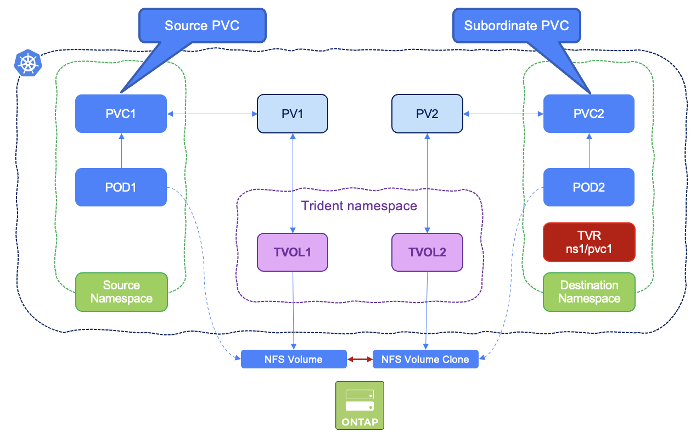

#########################################################################################
# SCENARIO 22: Cloning volumes across namespaces
#########################################################################################

Trident 25.02 introduced the volume cloning capability accross namespaces.  

>> As customers adopt virtual machines on Kubernetes, this feature allows administrators to maintain a single ‘golden image’ for VM templates in a dedicated namespace. Developers can then deploy new virtual machines in application namespaces on demand, without duplicating those images. Under the covers, this leverages ONTAP FlexClone for rapid VM deployment and benefiting from ONTAP data efficiencies like compression, deduplication, and compaction.  

Let's see this feature in action with simple containers.  

This diagram illustrates a volume and its clone in two Kubernetes namespaces:
<p align="center"></p>

## A. Set up the environment

#### Ensure you have configured nas backend `BackendForNFS` and storage-class `storage-class-nfs` from [Scenario02](../../Scenario02)  
```
$ kubectl get tbc -n trident backend-tbc-nfs
NAME              BACKEND NAME    BACKEND UUID                           PHASE   STATUS
backend-tbc-nfs   BackendForNFS   11d28fb4-6cf5-4c59-931d-94b8d8a5e061   Bound   Success

$ kubectl get sc
NAME                PROVISIONER             RECLAIMPOLICY   VOLUMEBINDINGMODE   ALLOWVOLUMEEXPANSION   AGE
storage-class-nfs   csi.trident.netapp.io   Delete          Immediate           true                   6m41s
```

## B. Create primary namespace, PVC and Pod
```bash
$ kubectl create -f primary.yaml
namespace/cnvc-primary created
persistentvolumeclaim/primary-pvc created
pod/busybox-primary created
```
This will create the primary PVC and mount it into a busybox pod, in the `primary` namespace.

Notice the PVC annotation **cloneToNamespace** in the _primary.yaml_ file, granting access to the volume from the **cnvc-secondary** namespace
```yaml
  annotations:
    trident.netapp.io/cloneToNamespace: cnvc-secondary
```

Not setting this annotation would lead to the following error in the secondary namespace, when trying to mount a volume:
```yaml
csi.trident.netapp.io    cloning to namespace cnvc-secondary is not allowed, it is not listed in cloneToNamespace annotation
```

You can verify the creations of resources with:  
```
$ kubectl get pod,pvc -n cnvc-primary
NAME                  READY   STATUS    RESTARTS   AGE
pod/busybox-primary   1/1     Running   0          41m

NAME                                STATUS   VOLUME                                     CAPACITY   ACCESS MODES   STORAGECLASS        AGE
persistentvolumeclaim/primary-pvc   Bound    pvc-cd3dfc0c-5e9a-44a2-9d86-b791cd246418   10Gi      RWX            storage-class-nfs   47m
```

Access the primary busybox pod shell and create a test file in the persistent volume:  
```bash
$ kubectl exec -it busybox-primary -n cnvc-primary  -- ls -ld /mnt/sharedvolume
drwxrwxrwx    2 99       99            4096 Mar 3 15:03 /mnt/sharedvolume

$ kubectl exec -it busybox-primary -n cnvc-primary  -- sh -c 'echo "Testing cross-namespace clones" > /mnt/sharedvolume/testfile.txt'

$ kubectl exec -it busybox-primary -n cnvc-primary  -- more /mnt/sharedvolume/testfile.txt
Testing cross-namespace clones
```

## C. Setup the secondary namespace

Create a TridentVolumeReference CR in the destination namespace that refers to the source namespace PVC.  
This object is used to define in the secondary namespace where source objects can be found.  
```bash
$ kubectl create ns cnvc-secondary
namespace/cnvc-secondary created
$ kubectl create -f secondary-tvr.yaml
tridentvolumereference.trident.netapp.io/secondary-pvc created
$ kubectl get tvr -n cnvc-secondary
NAME            AGE
secondary-pvc   33s
```

Create the secondary RWX PVC (**the storage class must be the same one as the primary PVC**):  
```bash
$ kubectl create -f secondary-pvc.yaml
persistentvolumeclaim/secondary-pvc created
```
Notice the two annotations **cloneFromPVC** and **cloneFromNamespace** in _secondary-pvc.yaml_, referencing the source namespace and PVC:
```yaml
  annotations:
    trident.netapp.io/cloneFromPVC: primary-pvc
    trident.netapp.io/cloneFromNamespace: cnvc-primary
```
You can verify the creation of the PVC with the following:  
```bash
$ kubectl get pvc -n cnvc-secondary
NAME            STATUS   VOLUME                                     CAPACITY   ACCESS MODES   STORAGECLASS        VOLUMEATTRIBUTESCLASS   AGE
secondary-pvc   Bound    pvc-794c4764-088c-49eb-8f13-20955694ae0d   10Gi       RWX            storage-class-nfs   <unset>                 13m
```
From a Trident perspective, we have 2 volumes this time:  
```bash
$ tridentctl -n trident get volume
+------------------------------------------+--------+-------------------+----------+--------------------------------------+-------+---------+
|                   NAME                   |  SIZE  |   STORAGE CLASS   | PROTOCOL |             BACKEND UUID             | STATE | MANAGED |
+------------------------------------------+--------+-------------------+----------+--------------------------------------+-------+---------+
| pvc-794c4764-088c-49eb-8f13-20955694ae0d | 10 GiB | storage-class-nfs | file     | 11d28fb4-6cf5-4c59-931d-94b8d8a5e061 |       | true    |
| pvc-cd3dfc0c-5e9a-44a2-9d86-b791cd246418 | 10 GiB | storage-class-nfs | file     | 11d28fb4-6cf5-4c59-931d-94b8d8a5e061 |       | true    |
+------------------------------------------+--------+-------------------+----------+--------------------------------------+-------+---------+
```

## D. Create a Pod in the secondary namespace and mount the clone  

```bash
$ kubectl create -f secondary-pod.yaml
pod/busybox-secondary created

$ kubectl get pods -n cnvc-secondary
NAME                READY   STATUS    RESTARTS   AGE
busybox-secondary   1/1     Running   0          14s
```
Let's verify the content of the volume and write some new content as well:  
```bash
$ kubectl exec -it busybox-secondary -n cnvc-secondary  -- more /mnt/sharedvolume/testfile.txt
Testing cross-namespace clones

$ kubectl exec -it busybox-secondary -n cnvc-secondary  -- sh -c 'echo "Adding content to the clone" >> /mnt/sharedvolume/testfile.txt'

$ kubectl exec -it busybox-secondary -n cnvc-secondary  -- more /mnt/sharedvolume/testfile.txt
Testing cross-namespace clones
Adding content to the clone
```
As this volume is a clone, the primary volume should not contain the changes you just applied:  
```bash
$ kubectl exec -it busybox-primary -n cnvc-primary  -- more /mnt/sharedvolume/testfile.txt
Testing cross-namespace clones
```
Last, you can verify in ONTAP that the secondary volume is indeed a FlexClone:  
```bash
cluster1::> vol clone show -vserver nassvm
                      Parent  Parent        Parent
Vserver FlexClone     Vserver Volume        Snapshot             State     Type
------- ------------- ------- ------------- -------------------- --------- ----
nassvm  trident_pvc_794c4764_088c_49eb_8f13_20955694ae0d
                      nassvm  trident_pvc_cd3dfc0c_5e9a_44a2_9d86_b791cd246418
                                            20250303T152741Z     online    RW
```

**Voilà! we have demonstrated how to create clones  accross namespaces with Trident!**
<!--
## E. What happens if I delete the primary namespace?

Let's try this out:  
```bash
$ kubectl delete ns cnvc-primary
namespace "cnvc-primary" deleted
```
After a few seconds, the namespace is gone.  
You can then see that PV has changed status. It is now "released":  
```bash
$ kubectl get pv
NAME                                       CAPACITY   ACCESS MODES   RECLAIM POLICY   STATUS     CLAIM                          STORAGECLASS        VOLUMEATTRIBUTESCLASS   REASON   AGE
pvc-3f8c8a65-fa13-468a-849f-3e9acd295371   10Gi       RWX            Delete           Released   cnvc-primary/primary-pvc       storage-class-nfs   <unset>                          4m44s
pvc-f5a2c6fa-a899-4a4f-8e82-8495d90f785f   10Gi       RWX            Delete           Bound      cnvc-secondary/secondary-pvc   storage-class-nfs   <unset>                          4m10s

$ tridentctl -n trident get volume
+------------------------------------------+--------+-------------------+----------+--------------------------------------+-------------+---------+
|                   NAME                   |  SIZE  |   STORAGE CLASS   | PROTOCOL |             BACKEND UUID             |    STATE    | MANAGED |
+------------------------------------------+--------+-------------------+----------+--------------------------------------+-------------+---------+
| pvc-3f8c8a65-fa13-468a-849f-3e9acd295371 | 10 GiB | storage-class-nfs | file     | 11d28fb4-6cf5-4c59-931d-94b8d8a5e061 |             | true    |
| pvc-f5a2c6fa-a899-4a4f-8e82-8495d90f785f | 10 GiB | storage-class-nfs | file     | 11d28fb4-6cf5-4c59-931d-94b8d8a5e061 |             | true    |
+------------------------------------------+--------+-------------------+----------+--------------------------------------+-------------+---------+

```
-->

## F. Cleanup

```bash
$ kubectl delete ns cnvc-secondary cnvc-primary
namespace "cnvc-secondary" deleted
namespace "cnvc-primary" deleted
```

You can go back to the [FrontPage](https://github.com/YvosOnTheHub/LabNetApp)