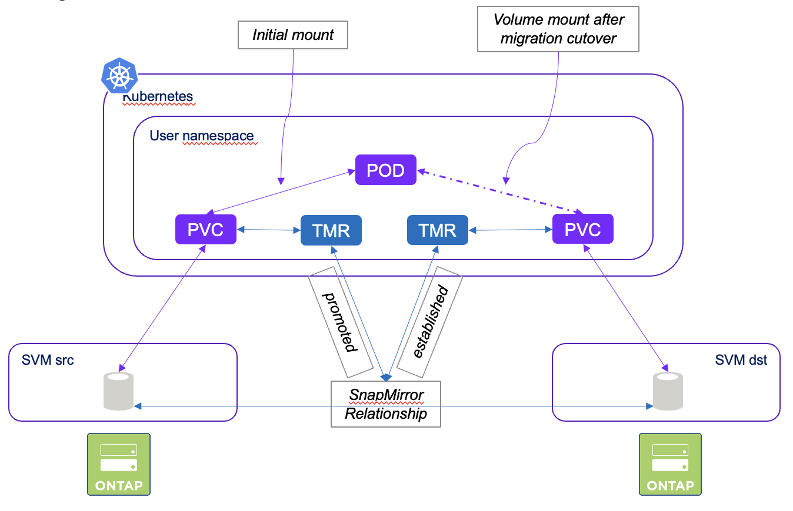

#########################################################################################
# SCENARIO 24: Mirroring volumes: Storage Migration  
#########################################################################################  

In the lifecycle of data, once in a while, storage must be changed, maybe for something more modern, more efficent or just faster.  
Or maybe you just want to migrate your Kubernetes volumes between systems.  

Let's see how you can achieve this.  
Here are the steps you will perform:  
- creation of a new Trident backend using the source SVM  
- creation of a new Trident backend using the destination SVM  
- creation of the corresponding storage classes  
- creation of an application that uses the source SVM  
- creation of the mirroring relationship between the 2 SVM  
- cutover on the target SVM  

## A. Trident configuration

Let's create two new backends, each one pointing to a different SVM:  
```bash
$ kubectl create -f scenario24_trident_config.yaml
secret/sc24-credentials-vsadmin created
tridentbackendconfig.trident.netapp.io/backend-tmr-src created
storageclass.storage.k8s.io/sc-mirror-src created
secret/sc24-credentials-trident created
tridentbackendconfig.trident.netapp.io/backend-tmr-dst created
storageclass.storage.k8s.io/sc-mirror-dst created
```
Note that you can pass two optional parameters to a Trident backend:  
- _replicationPolicy_: existing policy to apply to the the replication relationship (default: _MirrorAndVault_)  
- _replicationSchedule_: existing schedule to apply to the replication relationship (default: empty)  

In this example, here are the 2 values set:  
- replicationPolicy: _MirrorAllSnapshots_
- replicationSchedule: 5 minutes (_5min_)

Also the storage class is _snapmirror enabled_ with the annotation: _trident.netapp.io/replication: "true"_.  

## B. Application creation

Let's create a Busybox deployment with one NFS PVC attached to it:  
```bash
$ kubectl create -f busybox.yaml
namespace/sc24busybox created
persistentvolumeclaim/mydatasrc created
deployment.apps/busybox created

$ kubectl get -n sc24busybox pod,pvc
NAME                           READY   STATUS    RESTARTS   AGE
pod/busybox-66d9b6bf76-wpl4k   1/1     Running   0          12s

NAME                              STATUS   VOLUME                                     CAPACITY   ACCESS MODES   STORAGECLASS    VOLUMEATTRIBUTESCLASS   AGE
persistentvolumeclaim/mydatasrc   Bound    pvc-5ef7bde1-eb83-4998-a2f4-bb120704a0b8   1Gi        RWX            sc-mirror-src   <unset>                 12s
```
Let's create some content on the application volume:  
```bash
$ kubectl exec -n sc24busybox $(kubectl get pod -n sc24busybox -o name) -- sh -c 'echo "SnapMirror test!" > /data/test.txt'
$ kubectl exec -n sc24busybox $(kubectl get pod -n sc24busybox -o name) -- more /data/test.txt
SnapMirror test!
```

## C. Mirroring configuration

This part is done with a new CR called a **TridentMirrorRelationship** (_TMR_ in short).  

<p align="center"></p>

Let's create a TMR for the mirroring source relationship.  
This object refers to the PVC to protect (PVC _mydatasrc_ in this exercise).  
```bash
$ kubectl create -f tmr_src.yaml
tridentmirrorrelationship.trident.netapp.io/busybox-mirror-src created
```
On the same Kubernete cluster, we will now create 2 objects:
- a TMR that refers to the source volume and is the end part of the mirror relationship    
- a PVC that will be the destination of the mirror relatioship  

This folder contains a script that will retrieve the internal volume name & customize the target TMR.  
The volume name is required in order to establish the SnapMirror relationship.  
```bash
$ sh tmr_dst.sh
tridentmirrorrelationship.trident.netapp.io/busybox-mirror-dst created
```
Last, we can now create the volume:  
```bash
$ kubectl create -f pvc_dst.yaml
persistentvolumeclaim/mydatadst created

$ kubectl get -n sc24busybox pvc
NAME        STATUS   VOLUME                                     CAPACITY   ACCESS MODES   STORAGECLASS    VOLUMEATTRIBUTESCLASS   AGE
mydatadst   Bound    pvc-b2cfa305-2018-431a-b02e-cf6f675e89b5   1Gi        RWX            sc-mirror-dst   <unset>                 4m47s
mydatasrc   Bound    pvc-5ef7bde1-eb83-4998-a2f4-bb120704a0b8   1Gi        RWX            sc-mirror-src   <unset>                 6m52s
```

After a few seconds, the SnapMirror relationship should be present. Let's check:  
```bash
$ curl -s -X GET -ku admin:Netapp1! "https://cluster1.demo.netapp.com/api/snapmirror/relationships" -H "accept: application/json"
{
  "records": [
    {
      "uuid": "eb8abf20-6484-11ef-9079-005056815f82",
      "source": {
        "path": "nassvm:tmr1_pvc_5ef7bde1_eb83_4998_a2f4_bb120704a0b8",
        "svm": {
          "name": "nassvm"
        }
      },
      "destination": {
        "path": "svm_secondary:tmr2_pvc_b2cfa305_2018_431a_b02e_cf6f675e89b5",
        "svm": {
          "name": "svm_secondary"
        }
      },
      "state": "snapmirrored",
      "healthy": true
    }
  ],
  "num_records": 1
}
```

## D. Volume Migration in action

The migration cutover will be done in several steps:  
- application scale down
- last mirror update
- destination volume available (ie _promoted_)  
- update the application to use the new volume  
- application scale up

Scaling down the application is done to make sure no data is written to the volume when it is time to perform the last update operation:  
```bash
$ kubectl -n sc24busybox scale deploy busybox --replicas=0
deployment.apps/busybox scaled
```

Let's do one last snapmirror update before the cutover.  
This can be achieved via a different CR, called _TridentActionMirrorUpdate_, which will trigger a snapmirror update.  
You can notice the following: 
- you need to specify the secondary TMR, which is where the update will controlled  
- you could specify a snapshot for this update. If not done, all snapshots will be transfered  
- the _generateName_ parameter replaces the usual _name_ parameter, in case you would like to run several updates with the same manifest  

```bash
$ kubectl create -f tamu.yaml
tridentactionmirrorupdate.trident.netapp.io/update-mirror-474g2 created

$ kubectl get -n sc24busybox tamu
NAME                  NAMESPACE     STATE       COMPLETIONTIME
update-mirror-474g2   sc24busybox   Succeeded   3s
```

We then need to update the state the secondary TMR to _promoted_, so that the volume becomes available & writable.  
Once done, we can edit the application to use the secondary volume.  
```bash
$ kubectl -n sc24busybox patch tmr busybox-mirror-dst  --type=merge -p '{"spec":{"state":"promoted"}}'
tridentmirrorrelationship.trident.netapp.io/busybox-mirror-dst patched

$ kubectl -n sc24busybox patch deploy busybox --type=json -p '[{"op": "replace", "path": "/spec/template/spec/volumes/0/persistentVolumeClaim/claimName", "value":"mydatadst"}]'
deployment.apps/busybox patched
```

Last, we can now restart our application, check if the content of the volume is present:  
```bash
$ kubectl -n sc24busybox scale deploy busybox --replicas=1
deployment.apps/busybox scaled

$ kubectl get -n sc24busybox pod,rs,deploy
NAME                           READY   STATUS    RESTARTS   AGE
pod/busybox-76f76d854f-h7fqd   1/1     Running   0          113s

NAME                                 DESIRED   CURRENT   READY   AGE
replicaset.apps/busybox-66d9b6bf76   0         0         0       16m
replicaset.apps/busybox-76f76d854f   1         1         1       3m20s

NAME                      READY   UP-TO-DATE   AVAILABLE   AGE
deployment.apps/busybox   1/1     1            1           16m

$ kubectl exec -n sc24busybox $(kubectl get pod -n sc24busybox -o name) -- df /data
Filesystem           1K-blocks      Used Available Use% Mounted on
192.168.0.141:/tmr2_pvc_b2cfa305_2018_431a_b02e_cf6f675e89b5
                       1048576       768   1047808   0% /data

$ kubectl exec -n sc24busybox $(kubectl get pod -n sc24busybox -o name) -- more /data/test.txt
SnapMirror test!
```
We also checked that the volume mounted to the app is indeed the target one.  

To complete the migration, once everything is verified, you can go ahead & delete the source volume and both TMR:  
```bash
$ kubectl delete -n sc24busybox pvc mydatasrc
persistentvolumeclaim "mydatasrc" deleted

$ kubectl delete -n sc24busybox tmr --all
tridentmirrorrelationship.trident.netapp.io "busybox-mirror-dst" deleted
tridentmirrorrelationship.trident.netapp.io "busybox-mirror-src" deleted
```

& voilà, you just succesfully migrated your volume to a new storage system!  

## E. Clean up

```bash
kubectl delete ns sc24busybox
kubectl delete -f scenario24_trident_config.yaml
```
