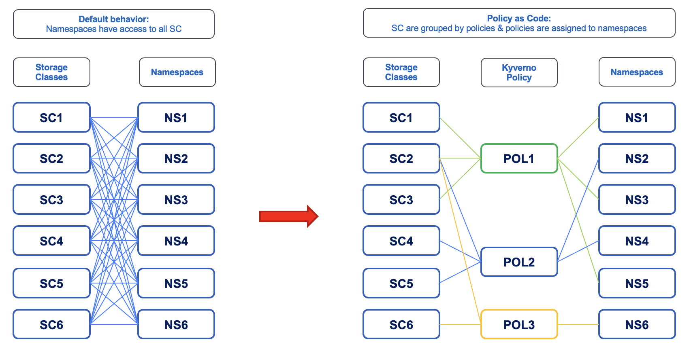
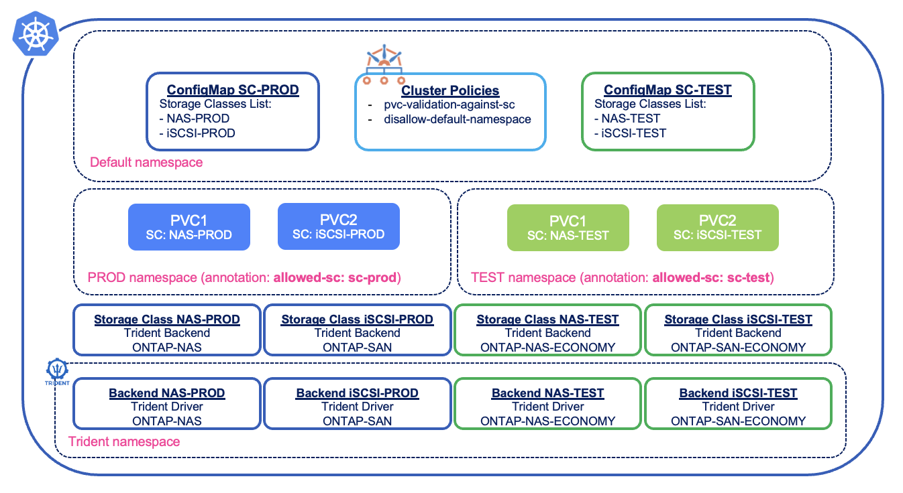

#########################################################################################
# SCENARIO 25: Storage & Policy Management  
#########################################################################################

When it comes to storage consumption, a user or an application will most of the time create Persistent Volume Claims (PVC) against specific Storage Classes. Each class will have its own set of parameters and configuration.  

While PVCs are namespace bound resources, Storage Classes are cluster wide ones.  
Said differently, all users & namespaces can see and access all storage classes by default.  

In some cases, you may want to limit storage classes visibility and/or access.  
Enters Policy Management.

Let's see how you can use Kyverno to limit storage classes access.

According to Kyverno website (http://kyverno.io):  
>>>Kyverno (Greek for “govern”) is a cloud native policy engine. It was originally built for Kubernetes and now can also be used outside of Kubernetes clusters as a unified policy language.

>>>Kyverno allows platform engineers to automate security, compliance, and best practices validation and deliver secure self-service to application teams.  

Here is a high level comparison between a default setup with 6 storage classes & a policy based architecture with fine grain control:  
<p align="center"></p>

Policies provided by Kyverno can also be applied in Service Providers environments offering Namespace-as-a-Service platforms.  
That way full control over access is done at the cluster level!  

Let's see this in action and how you can control storage classes access:  
<p align="center"></p>

## A. Kyverno installation

This step is pretty easy as this solution can be installed with a Helm chart:  
```bash
helm repo add kyverno https://kyverno.github.io/kyverno/
helm repo update
helm install kyverno kyverno/kyverno -n kyverno --create-namespace --version 3.3.3 --set global.nodeSelector."kubernetes\\.io/os"=linux
```
It just takes a few seconds to complete.  Now, the fun starts.

## B. Kyverno policy configuration: _Disallow default namespace_

Let's create a rule that requires users to create PVCs in specific namespaces, ie not in the _default_ namespace:  
```bash
$ kubectl create -f cluster_policy1_disallow_default_namespace.yaml
clusterpolicy.kyverno.io/disallow-default-namespace created
```
Note that in this scenario, policies are created in the default namespace.  

Now, let's try to create a PVC without specifying a namespace:  
```bash
$ kubectl create -f pvc_nfs.yaml
Error from server: error when creating "pvc_nfs.yaml": admission webhook "validate.kyverno.svc-fail" denied the request:

resource PersistentVolumeClaim/default/pvc-sc-nfs was blocked due to the following policies

disallow-default-namespace:
  validate-namespace: 'validation error: Using ''default'' namespace is not allowed.
    rule validate-namespace failed at path /metadata/namespace/'
```

In this simple example, you must then create a PVC in a different namespace.  
That said, Kyverno is really powerful, you can add many more rules to really get a fine grain policy.  

## C. Kyverno policy configuration: _PVC validation_

PVC are namespace bound objects, created against a specific storage class.  
Here is how we will control storage classes access:  
- ConfigMaps (_storage-classes-prod_ & _storage-classes-test_) are created with a list of allowed storage classes  
- An annotation _allowedStorageClasses_ is set in namespaces pointing to the configMap listing namespaces that can be used for PVC  
- A new ClusterPolicy is created that dynamically allows or denies incoming PVC requests  

Note that since there is already a policy avoiding PVC creation in the default namespace, a pre-condition is added to apply this new policy to all namespaces except the default one.  

Let's start with the configMaps:  
```bash
$ kubectl create -f config_map_prod.yaml
configmap/storage-classes-prod created
$ kubectl create -f config_map_test.yaml
configmap/storage-classes-test created
```
The _storage-classes-prod_ configMap contains _storage-class-nfs_ & _storage-class-iscsi_.  
The _storage-classes-test_ configMap contains _storage-class-nas-economy_ & _storage-class-iscsi-economy_.  

In this context, you could apply different SLA per environment.  
For instance, the _PROD_ volumes can be protected with snapshots or mirroring.  
The _TEST_ environment, which does not require any protection, will also use up fewer ONTAP FlexVol.  

Next, let's create 2 namespaces and add an annotation to them:  
```bash
$ kubectl create ns prod
namespace/prod created
$ kubectl label ns prod allowedStorageClasses=storage-classes-prod
namespace/prod labeled

$ kubectl create ns test
namespace/test created
$ kubectl label ns test allowedStorageClasses=storage-classes-test
namespace/test labeled
```

Finally, let's add the new ConfigPolicy:  
```bash
$ kubectl create -f cluster_policy2_pvc_validation.yaml
clusterpolicy.kyverno.io/pvc-validation-against-sc created
```

All is setup up for the final test.  
One PVC is linked to _storage-class-nfs_  while the other is to _storage-class-nas-economy_.  
As per the policy & the configMaps, the first PVC can only be used in the _PROD_ namespace, while the other one in the _TEST_ namespace.  
Let's first use the _PROD_ namespace:  
```bash
$ kubectl create -n prod -f pvc_nfs.yaml
persistentvolumeclaim/pvc-sc-nfs created

$ kubectl create -n prod -f pvc_nas_eco.yaml
Error from server: error when creating "pvc_nas_eco.yaml": admission webhook "validate.kyverno.svc-fail" denied the request:

resource PersistentVolumeClaim/prod/pvc-sc-nas-eco was blocked due to the following policies

pvc-validation-against-sc:
  validate-storage-class: |
    Creating PVC in the "prod" namespace against the "storage-class-nas-economy" storage class is not allowed. Only the following storage classes are allowed ["storage-class-nfs", "storage-class-iscsi"]
```

Now, we should experience the opposite behavior with the _TEST_ namespace:  
```bash
$ kubectl -n test -f pvc_nfs.yaml
Error from server: error when creating "pvc-nfs.yaml": admission webhook "validate.kyverno.svc-fail" denied the request:

resource PersistentVolumeClaim/test/pvc-sc-nfs was blocked due to the following policies

pvc-validation-against-sc:
  validate-storage-class: |
    Creating PVC in the "test" namespace against the "storage-class-nfs" storage class is not allowed. Only the following storage classes are allowed ["storage-class-nas-economy", "storage-class-iscsi-economy"]

$ kubectl -n test -f pvc_nas_eco.yaml
persistentvolumeclaim/pvc-sc-nas-eco created
```

There you go, point proven !  
You can now give it try & build your own policies.

## D. Clean up

Let's remove the objects created in this scenario:  
```bash
$ kubectl delete ns prod test
namespace "prod" deleted
namespace "test" deleted
$ kubectl delete cm storage-classes-prod storage-classes-test
configmap "storage-classes-prod" deleted
configmap "storage-classes-test" deleted
$ kubectl delete cpol --all
clusterpolicy.kyverno.io "disallow-default-namespace" deleted
clusterpolicy.kyverno.io "pvc-validation-against-sc" deleted
$ helm delete kyverno -n kyverno
```

