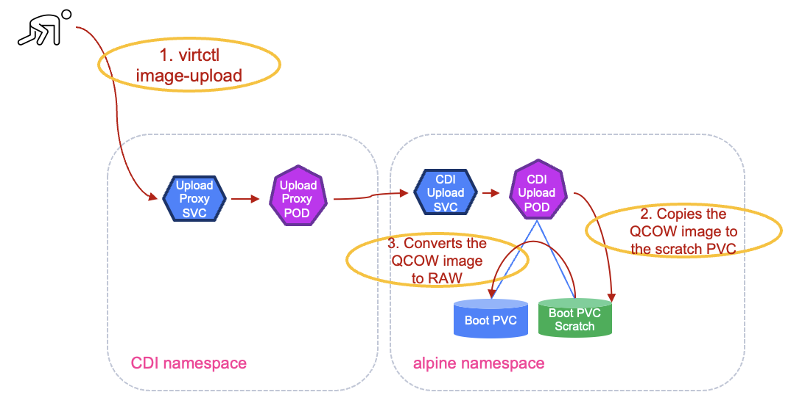

#########################################################################################
# SCENARIO 27: Creating Virtual Machines: import an image on a PVC 
#########################################################################################

This chapter will use the namespace _sc26-alpine-a_. Let's start by creating it:  
```bash
$ kubectl create  ns sc26-alpine-a
namespace/sc26-alpine-a created
```

The method described here requires you to have a virtual machine image locally. Multiple formats are supported, such as _iso_, _img_ or _qcow2_. An image for Alpine linux is alrady present in the folder "~/images".  


Let's create a PVC that will be the target recipient for that image.  
Of course, make sure the PVC is big enough to host the content...
```bash
cat << EOF | kubectl apply  -f -
apiVersion: v1
kind: PersistentVolumeClaim
metadata:
  name: alpine-boot
  namespace: sc26-alpine-a
  annotations:
    cdi.kubevirt.io/storage.upload.target: ""
spec:
  accessModes:
    - ReadWriteMany
  resources:
    requests:
      storage: 1Gi
  storageClassName: storage-class-iscsi
  volumeMode: Block
EOF
persistentvolumeclaim/alpine-boot-pvc created
```
A few important things to notice:  
- the VolumeMode is set a **Block**, which mounts a Raw Block Device on the host  
- the accessMode is set to **RWX** (_ReadWriteMany_), which is requires for VM Movement between worker nodes  
- the annotation **cdi.kubevirt.io/storage.upload.target: ""** is here to prepare the environment to receive an image

Creating that PVC will trigger a few things:  
- Creation of a temporary PVC (**alpine-boot-scratch**) that can be used to convert images (Qcow2 to Raw for instance) 
- Creation of a pod and a service **cdi-upload**  

```bash
$ kubectl get all,pvc -n sc26-alpine-a
NAME                         READY   STATUS    RESTARTS   AGE
pod/cdi-upload-alpine-boot   1/1     Running   0          9m56s

NAME                             TYPE        CLUSTER-IP     EXTERNAL-IP   PORT(S)   AGE
service/cdi-upload-alpine-boot   ClusterIP   10.101.97.11   <none>        443/TCP   9m56s

NAME                                        STATUS   VOLUME                                     CAPACITY   ACCESS MODES   STORAGECLASS          VOLUMEAT
TRIBUTESCLASS   AGE
persistentvolumeclaim/alpine-boot           Bound    pvc-7e299aeb-fb94-47de-85aa-b20afd2ccc33   1Gi        RWX            storage-class-iscsi   <unset>
                9m57s
persistentvolumeclaim/alpine-boot-scratch   Bound    pvc-2ba57685-5208-46a1-bcbc-19b323987c1f   1086Mi     RWO            storage-class-iscsi   <unset>
                9m56s
```
Both volumes are mounted on the _cdi-upload_ pod:  
```bash
$ kubectl get -n sc26-alpine-a po -o yaml | grep volumeDev -A 7
      volumeDevices:
      - devicePath: /dev/cdi-block-volume
        name: cdi-data-vol
      volumeMounts:
      - mountPath: /etc/tls/
        name: tls-config
      - mountPath: /scratch
        name: cdi-scratch-vol
```
I recommend reading the logs of the _cdi-upload_ pod while uploading the image to see all the steps performed.  
This can be achieved (in a different window) with the command:  
```bash
kubectl logs cdi-upload-alpine-boot -n sc26-alpine-a -f
```

We can now upload our image to the PVC using the _virtctl_ command line:  
```bash
$ virtctl image-upload pvc alpine-boot \
  --namespace sc26-alpine-a \
  --image-path=/root/images/nocloud_alpine-3.22.1-x86_64-bios-tiny-r0.qcow2 \
  --size=1Gi \
  --insecure \
  --uploadproxy-url=https://192.168.0.212:443

Using existing PVC sc26-alpine-a/alpine-boot
Uploading data to https://192.168.0.212:443

114.31 MiB / 114.31 MiB [-------------------------------------------------------------------------------------------------------] 100.00% 91.36 MiB p/s 1.5s

Uploading data completed successfully, waiting for processing to complete, you can hit ctrl-c without interrupting the progress
Processing completed successfully
Uploading /root/images/nocloud_alpine-3.22.1-x86_64-bios-tiny-r0.qcow2 completed successfully
```
Let's dive a bit into this upload process:  
- the _virtctl image-upload_ command will first connect to the CDI Upload Proxy  
- within the target namespace, Kubevirt will use the scratch PVC is a temporary work space, especially to convert the image from QCOW to RAW if required  
- when the RAW file is ready, the _CDI upload pod_ will write this file to the _alpine-boot_ pvc  
- at this point, the upload process it complete and the temporary resources are deleted.  

<p align="center"></p>

The logs in the pod should have displayed something similar to:  
```bash
$ kubectl logs cdi-upload-alpine-boot-pvc -n sc26-alpine-a -f
I1007 07:20:28.429190       1 uploadserver.go:81] Running server on 0.0.0.0:8443
...
I1007 07:20:53.033234       1 file.go:230] copyWithSparseCheck to /scratch/tmpimage
I1007 07:20:53.958766       1 file.go:195] Read 119865344 bytes, wrote 119208344 bytes to /scratch/tmpimage
I1007 07:20:53.960826       1 data-processor.go:260] New phase: ValidatePause
I1007 07:20:53.960886       1 data-processor.go:266] Validating image
...
I1007 07:20:53.980291       1 data-processor.go:160] Resuming processing at phase Convert
I1007 07:20:53.980412       1 data-processor.go:266] Validating image
I1007 07:20:53.987909       1 qemu.go:119] Running qemu-img with args: [convert -t writeback -p -O raw /scratch/tmpimage /dev/cdi-block-volume]
I1007 07:20:54.548210       1 data-processor.go:260] New phase: Resize
I1007 07:20:54.551607       1 data-processor.go:260] New phase: Complete
I1007 07:20:54.551627       1 uploadserver.go:396] Wrote data to /dev/cdi-block-volume
I1007 07:20:54.551646       1 uploadserver.go:215] Shutting down http server after successful upload
I1007 07:20:54.552068       1 uploadserver.go:115] UploadServer successfully exited
```

Checking the content of the namespace, you will now see that only the boot PVC is left:  
```bash
$ kubectl get all,pvc -n sc26-alpine-a
NAME                                STATUS   VOLUME                                     CAPACITY   ACCESS MODES   STORAGECLASS          VOLUMEATTRIBUTES
CLASS   AGE
persistentvolumeclaim/alpine-boot   Bound    pvc-7e299aeb-fb94-47de-85aa-b20afd2ccc33   1Gi        RWX            storage-class-iscsi   <unset>
        37m
```

The disk is ready. You can create the VM that will use it to boot, using the *alpine_vm.yaml* manifest:  
```bash
$ kubectl create -f ../alpine_vm.yaml -n sc26-alpine-a
virtualmachine.kubevirt.io/alpine-vm created

$ kubectl get all,pvc -n sc26-alpine-a
NAME                                READY   STATUS    RESTARTS   AGE
pod/virt-launcher-alpine-vm-vgcwp   2/2     Running   0          7m36s

NAME                                           AGE     PHASE     IP              NODENAME   READY
virtualmachineinstance.kubevirt.io/alpine-vm   7m36s   Running   192.168.28.99   rhel2      True

NAME                                   AGE     STATUS    READY
virtualmachine.kubevirt.io/alpine-vm   7m36s   Running   True

NAME                                STATUS   VOLUME                                     CAPACITY   ACCESS MODES   STORAGECLASS          VOLUMEATTRIBUTESCLASS
   AGE
persistentvolumeclaim/alpine-boot   Bound    pvc-2696aae5-85ec-42b0-9d2c-c0703052b238   1Gi        RWX            storage-class-iscsi   <unset>
   8m24s
```
KubeVirt automatically created ephemeral objects to support the VM:  
- Pod: the pod that carries the VM
- Virtual Machine Instance: the object representing the running VM

Let's get some more details on those ephemeral objects:  
```bash
$ kubectl get vmi,po -n sc26-alpine-a -o wide 
NAME                                           AGE   PHASE     IP              NODENAME   READY   LIVE-MIGRATABLE   PAUSED
virtualmachineinstance.kubevirt.io/alpine-vm   11m   Running   192.168.28.99   rhel2      True    True

NAME                                READY   STATUS    RESTARTS   AGE   IP              NODE    NOMINATED NODE   READINESS GATES
pod/virt-launcher-alpine-vm-vgcwp   2/2     Running   0          11m   192.168.28.99   rhel2   <none>           1/1
```
You can notice:  
- that the Pod & the VMI have the same IP address, as expected thanks to the Masquerade type of the interface. 
- the VMI tells you that it is *Live migratable*, thanks to the RWX type of the PVC

Let's connect to the VM (it takes a bit less than 2 minutes for the boot procedure to complete).  
As set in the CloudInit configuration, the password of the _alpine_ user is _alpine_:  
```bash
$ virtctl console -n sc26-alpine-a alpine-vm
Successfully connected to alpine-vm console. Press Ctrl+] or Ctrl+5 to exit console.
alpine-vm.sc26-alpine-a.svc.cluster.local login: alpine
Password:
Welcome to Alpine on KubeVirt in the NetApp LoD!

alpine-vm:~$ doas df -h
Filesystem                Size      Used Available Use% Mounted on
devtmpfs                 10.0M         0     10.0M   0% /dev
shm                      45.9M         0     45.9M   0% /dev/shm
/dev/vda                956.0M     90.5M    821.1M  10% /
tmpfs                    18.4M    120.0K     18.3M   1% /run
```
The filesystem /dev/vda represents our boot disk/pvc.

There you go, you managed to create your first Virtual Machine & to log into it!  

You can now remove the namespace:  
```bash
kubectl delete ns sc26-alpine-a
```