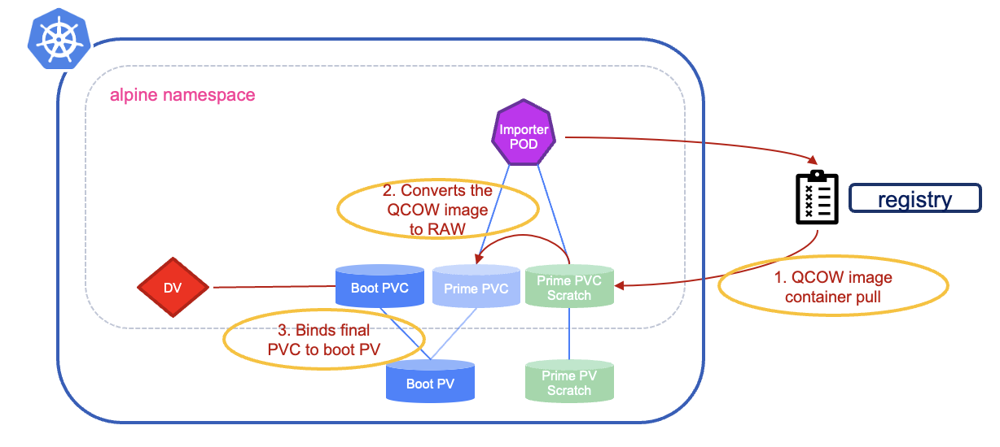

#########################################################################################
# SCENARIO 27: Creating Virtual Machines: DataVolume and container registry
#########################################################################################

In this chapter, we will see how to create a DataVolume from a container registry.  
This chapter will use the namespace _sc26-alpine-b_. Let's start by creating it first:  
```bash
$ kubectl create  ns sc26-alpine-b
namespace/sc26-alpine-b created
```

We already have an Alpine image, but only in a Qcow format.  
For this exercise, we need to embed it in a container. Let's create a quick Dockerfile:  
```bash
$ cat <<EOF > ~/images/Dockerfile
FROM alpine:3.19
ADD nocloud_alpine-3.22.1-x86_64-bios-tiny-r0.qcow2 /disk/
EOF
```
We can now create the container image and push it to the registry:  
```bash
cd ~/images
podman build -t registry.demo.netapp.com/kubevirt/alpine:qcow .
podman push registry.demo.netapp.com/kubevirt/alpine:qcow
```

As the container registry used a login (_registryuser_) and password (_Netapp1!_), we first need to add a secret that will be used by the CDI to retrieve the image. Those 2 fields must be encrypted:  
```bash
$ cat << EOF | kubectl apply  -f -
apiVersion: v1
kind: Secret
metadata:
  name: endpoint-secret
  namespace: sc26-alpine-b
  labels:
    app: containerized-data-importer
type: Opaque
data:
  accessKeyId: "cmVnaXN0cnl1c2Vy"   # registryuser
  secretKey:   "TmV0YXBwMSE="       # Netapp1!
EOF
secret/endpoint-secret created
```

<p align="center"></p>

Let's define our DataVolume. In this example, you will see it uses the URL of an image stored in the lab registry:  
```bash
$ cat << EOF | kubectl apply  -f -
apiVersion: cdi.kubevirt.io/v1beta1
kind: DataVolume
metadata:
  name: alpine-boot
  namespace: sc26-alpine-b
spec:
  pvc:
    accessModes:
      - ReadWriteMany
    resources:
      requests:
        storage: 1Gi
    volumeMode: Block
    storageClassName: storage-class-iscsi
  contentType: kubevirt
  source:
    registry:
      url: "docker://registry.demo.netapp.com/kubevirt/alpine:qcow"
      secretRef: endpoint-secret
EOF
datavolume.cdi.kubevirt.io/alpine-boot created
```
What does that trigger? Let's check the content of the namespace:  
```bash
$ kubectl get all,pvc -n sc26-alpine-b 
NAME                                                      READY   STATUS    RESTARTS   AGE
pod/importer-prime-1c65d555-9926-45a5-a4c1-6c53b6afca31   1/1     Running   0          21s

NAME                                     PHASE              PROGRESS   RESTARTS   AGE
datavolume.cdi.kubevirt.io/alpine-boot   ImportInProgress   N/A                   21s

NAME                                                                       STATUS    VOLUME                                     CAPACITY   ACCESS MODES   STORAGE
CLASS          VOLUMEATTRIBUTESCLASS   AGE
persistentvolumeclaim/alpine-boot                                          Pending                                                                        storage
-class-iscsi   <unset>                 22s
persistentvolumeclaim/prime-1c65d555-9926-45a5-a4c1-6c53b6afca31           Bound     pvc-478d2ea2-0c94-4800-b802-da334fbab147   1Gi        RWX            storage
-class-iscsi   <unset>                 22s
persistentvolumeclaim/prime-1c65d555-9926-45a5-a4c1-6c53b6afca31-scratch   Bound     pvc-ac1fcfa2-64a1-4bc3-a5f1-48d37486852e   1086Mi     RWO            storage
-class-iscsi   <unset>                 22s
```
Here is a description of what we see:  
- the **pod** is managed by CDI and will perform the image import & conversion  
- the **scratch** PVC is used as a temporary resource to convert the image  
- the **prime** PVC will host the target content of the disk  
- an _alpine-boot_ PVC was automatically created, following the same name as the DataVolume  
- the alpine-boot PVC is currently in _pending_ state, while for CDI to finish its job

Looking at the pod defition, you will see both _prime_ volume attached:  
```bash
$ kubectl get -n sc26-alpine-b po -o yaml | grep volumeDev -A 7
      volumeDevices:
      - devicePath: /dev/cdi-block-volume
        name: cdi-data-vol
      volumeMounts:
      - mountPath: /scratch
        name: cdi-scratch-vol

$ kubectl get -n sc26-alpine-b po -o yaml | grep volumes: -A 6
    volumes:
    - name: cdi-data-vol
      persistentVolumeClaim:
        claimName: prime-1c65d555-9926-45a5-a4c1-6c53b6afca31 
    - name: cdi-scratch-vol
      persistentVolumeClaim:
        claimName: prime-1c65d555-9926-45a5-a4c1-6c53b6afca31-scratch
```
You can also check the logs of the pod to follow up with the import process. Note that the pod will be deleted once the task is complete:  
```bash
$ kubectl logs -n sc26-alpine-b pod/importer-prime-1c65d555-9926-45a5-a4c1-6c53b6afca31 -f
I1108 17:39:30.540587       1 importer.go:107] Starting importer
I1108 17:39:30.542412       1 importer.go:182] begin import process
I1108 17:39:30.542556       1 registry-datasource.go:191] Copying proxy certs
I1108 17:39:30.542583       1 registry-datasource.go:61] Error creating allCertDir open /proxycerts/: no such file or directory
I1108 17:39:30.542649       1 data-processor.go:361] Calculating available size
I1108 17:39:30.544005       1 data-processor.go:369] Checking out block volume size.
I1108 17:39:30.544134       1 data-processor.go:386] Target size 1073741824.
I1108 17:39:30.544222       1 data-processor.go:260] New phase: TransferScratch
I1108 17:39:30.544402       1 registry-datasource.go:101] Copying registry image to scratch space.
I1108 17:39:30.544532       1 transport.go:199] Downloading image from 'docker://registry.demo.netapp.com/kubevirt/alpine:qcow', copying file from 'disk' to '/scratch'
I1108 17:39:30.592597       1 transport.go:231] Processing layer {Digest:sha256:7086c9dca344dfc19f7f6fbf02727a90e74abc1fce8894c1c9abe5263c881f29 Size:96005389 URLs:[] Annotations:map[] MediaType:application/vnd.oci.image.layer.v1.tar+gzip CompressionOperation:0 CompressionAlgorithm:<nil> CryptoOperation:0}
I1108 17:39:34.537543       1 transport.go:231] Processing layer {Digest:sha256:bc0b73a0e2d35b7506c82b2e6f2a96006d5fa76c593ee57a0a262bcb13d986a1 Size:3734065 URLs:[] Annotations:map[] MediaType:application/vnd.oci.image.layer.v1.tar+gzip CompressionOperation:0 CompressionAlgorithm:<nil> CryptoOperation:0}
I1108 17:39:34.715757       1 transport.go:231] Processing layer {Digest:sha256:ab51b78a12d3b208e8def5993f35009e62b03a9d53350edebdb99413376b609f Size:1305 URLs:[] Annotations:map[] MediaType:application/vnd.oci.image.layer.v1.tar+gzip CompressionOperation:0 CompressionAlgorithm:<nil> CryptoOperation:0}
I1108 17:39:34.733206       1 transport.go:231] Processing layer {Digest:sha256:af9c0c45e6c7e17219b91a6476a871ce9ec661cf4dfdfed95d57b9e0c4d0a5d3 Size:82072012 URLs:[] Annotations:map[] MediaType:application/vnd.oci.image.layer.v1.tar+gzip CompressionOperation:0 CompressionAlgorithm:<nil> CryptoOperation:0}
I1108 17:39:34.748688       1 transport.go:158] File 'disk/nocloud_alpine-3.22.1-x86_64-bios-tiny-r0.qcow2' found in the layer
I1108 17:39:34.751566       1 file.go:230] copyWithSparseCheck to /scratch/disk/nocloud_alpine-3.22.1-x86_64-bios-tiny-r0.qcow2
I1108 17:39:36.500347       1 file.go:195] Read 119865344 bytes, wrote 119438336 bytes to /scratch/disk/nocloud_alpine-3.22.1-x86_64-bios-tiny-r0.qcow2
I1108 17:39:36.509337       1 registry-datasource.go:179] VM disk image filename is nocloud_alpine-3.22.1-x86_64-bios-tiny-r0.qcow2
I1108 17:39:36.509371       1 data-processor.go:260] New phase: Convert
I1108 17:39:36.509382       1 data-processor.go:266] Validating image
E1108 17:39:36.518673       1 prlimit.go:156] failed to kill the process; os: process already finished
I1108 17:39:36.518793       1 qemu.go:119] Running qemu-img with args: [convert -t writeback -p -O raw /scratch/disk/nocloud_alpine-3.22.1-x86_64-bios-tiny-r0.qcow2 /dev/cdi-block-volume]
I1108 17:39:36.525098       1 qemu.go:283] 0.00
...
I1108 17:39:36.725819       1 qemu.go:283] 98.46
E1108 17:39:37.325388       1 prlimit.go:156] failed to kill the process; os: process already finished
I1108 17:39:37.327649       1 data-processor.go:260] New phase: Resize
I1108 17:39:37.332126       1 data-processor.go:260] New phase: Complete
I1108 17:39:37.333828       1 importer.go:231] {"scratchSpaceRequired":false,"preallocationApplied":false,"message":"Import Complete"}
```
The _import_ process is done. Checking the resources of the namespace, you will see that the POD, as well as the prime PVCs, are deleted.  
The DataVolume is also labelled as **succeeded**:  
```bash
$ kubectl get all,pvc -n sc26-alpine-b                                                                     
NAME                                     PHASE       PROGRESS   RESTARTS   AGE
datavolume.cdi.kubevirt.io/alpine-boot   Succeeded   100.0%                38s

NAME                                STATUS   VOLUME                                     CAPACITY   ACCESS MODES   STORAGECLASS          VOLUMEATTRIBUTESCLASS   A
GE
persistentvolumeclaim/alpine-boot   Bound    pvc-478d2ea2-0c94-4800-b802-da334fbab147   1Gi        RWX            storage-class-iscsi   <unset>                 3
8s
```
How does the final PVC and the temporary prime PVC point to the same PV?  
After the write/convert completes, CDI transitions the DataVolume to completion. To present the result as the DataVolume’s final PVC (alpine-boot) CDI will bind the PV created for the prime PVC to the target claim name (alpine-boot). Because Kubernetes PVC names cannot be renamed, CDI typically creates the final claim and binds it to the same PV (or otherwise updates the PV.claimRef) and then deletes the temporary prime PVC.  

Note:  
If you delete the PVC, the DataVolume is automatically going to recreate it.  

You can now deploy the Virtual Machine on top of disk.  
```bash
$ kubectl create -f ../alpine_vm.yaml -n sc26-alpine-b
virtualmachine.kubevirt.io/alpine-vm created
```
You will quickly see the environment ready:  
```bash
$ kubectl get all,pvc -n sc26-alpine-b
NAME                                READY   STATUS    RESTARTS   AGE
pod/virt-launcher-alpine-vm-6jhdv   2/2     Running   0          42s

NAME                                     PHASE       PROGRESS   RESTARTS   AGE
datavolume.cdi.kubevirt.io/alpine-boot   Succeeded   100.0%                104s

NAME                                           AGE   PHASE     IP              NODENAME   READY
virtualmachineinstance.kubevirt.io/alpine-vm   42s   Running   192.168.26.10   rhel1      True

NAME                                   AGE   STATUS    READY
virtualmachine.kubevirt.io/alpine-vm   42s   Running   True

NAME                                STATUS   VOLUME                                     CAPACITY   ACCESS MODES   STORAGECLASS          VOLUMEATTRIBUTESCLASS   AGE
persistentvolumeclaim/alpine-boot   Bound    pvc-478d2ea2-0c94-4800-b802-da334fbab147   1Gi        RWX            storage-class-iscsi   <unset>                 104s
```

Let's connect to the VM (it takes a bit less than 2 minutes for the boot procedure to complete).  
As set in the CloudInit configuration, the password of the _alpine_ user is _alpine_:  
```bash
$ virtctl console -n sc26-alpine-b alpine-vm
Successfully connected to alpine-vm console. Press Ctrl+] or Ctrl+5 to exit console.
alpine-vm.sc26-alpine-b.svc.cluster.local login: alpine
Password:
Welcome to Alpine on KubeVirt in the NetApp LoD!
```
There you go. You managed to create your second Virtual Machine!

You can now delete this namespace:  
```bash
kubectl delete ns c26-alpine-b
```