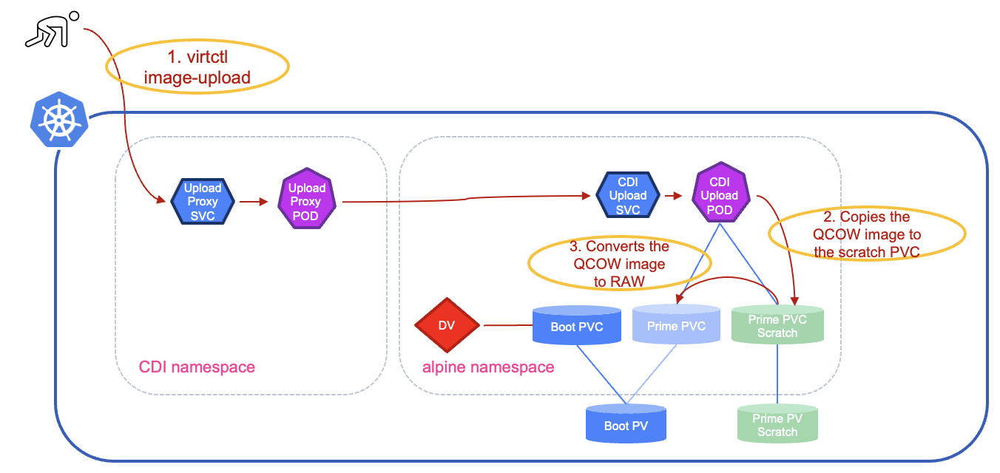

#########################################################################################
# SCENARIO 27: Creating Virtual Machines: DataVolume and image upload
#########################################################################################

This chapter is a mix of both methods presented previously:  
- a DataVolume is created to manage the PVC  
- virtctl is used to upload the image  

This chapter will use the namespace _sc26-alpine-c_. Let's start by creating it first:  
```bash
$ kubectl create  ns sc26-alpine-c
namespace/sc26-alpine-c created
```

<p align="center"></p>

Let's define our DataVolume. In this example, you will see it uses the URL of an image stored in the lab registry:  
```bash
$ cat << EOF | kubectl apply  -f -
apiVersion: cdi.kubevirt.io/v1beta1
kind: DataVolume
metadata:
  name: alpine-boot
  namespace: sc26-alpine-c
spec:
  pvc:
    accessModes:
      - ReadWriteMany
    resources:
      requests:
        storage: 1Gi
    volumeMode: Block
    storageClassName: storage-class-iscsi
  contentType: kubevirt
  source:
    upload: {}
EOF
datavolume.cdi.kubevirt.io/alpine-boot created
```
What does that give us in the namespace:  
```bash
$ kubectl get -n sc26-alpine-c all,pvc
Warning: kubevirt.io/v1 VirtualMachineInstancePresets is now deprecated and will be removed in v2.
NAME                                                        READY   STATUS    RESTARTS   AGE
pod/cdi-upload-prime-5c54db0c-beda-4b8a-a75a-11738cd7bd7d   1/1     Running   0          21s

NAME                                                            TYPE        CLUSTER-IP      EXTERNAL-IP   PORT(S)   AGE
service/cdi-upload-prime-5c54db0c-beda-4b8a-a75a-11738cd7bd7d   ClusterIP   10.97.122.174   <none>        443/TCP   21s

NAME                                     PHASE         PROGRESS   RESTARTS   AGE
datavolume.cdi.kubevirt.io/alpine-boot   UploadReady   N/A                   21s

NAME                                                                       STATUS    VOLUME                                     CAPACITY   ACCESS MODES   STORAGECLASS          VOLUMEATTRIBUTESCLASS   AGE
persistentvolumeclaim/alpine-boot                                          Pending                                                                        storage-class-iscsi   <unset>                 21s
persistentvolumeclaim/prime-5c54db0c-beda-4b8a-a75a-11738cd7bd7d           Bound     pvc-b4a4895e-878a-4e0e-9c9d-cfd7290eb61c   1Gi        RWX            storage-class-iscsi   <unset>                 21s
persistentvolumeclaim/prime-5c54db0c-beda-4b8a-a75a-11738cd7bd7d-scratch   Bound     pvc-ea056716-6f2a-49c5-b2d2-9c9c5cc98aa2   1086Mi     RWO            storage-class-iscsi   <unset>                 21s
```
Here is a description of what we see:  
- the **pod** is managed by CDI and will perform the conversion  
- the **datavolume** in state _UploadReady_  
- the **scratch** PVC is used as a temporary resource to convert the image  
- the **prime** PVC will host the target content of the disk  
- an _alpine-boot_ PVC was automatically created, following the same name as the DataVolume  
- the alpine-boot PVC is currently in _pending_ state, while for CDI to finish its job  
- a _cdi-upload_ **service** is also present to allow connectivity  

Let's launch the image upload. Notice that, compared to the first method, the command is "image-upload dv":  
```bash
$ virtctl image-upload dv alpine-boot \
  --namespace sc26-alpine-c \
  --image-path=/root/images/nocloud_alpine-3.22.1-x86_64-bios-tiny-r0.qcow2 \
  --size=1Gi \
  --insecure \
  --uploadproxy-url=https://192.168.0.212:443
Using existing PVC sc26-alpine-c/prime-5c54db0c-beda-4b8a-a75a-11738cd7bd7d
Uploading data to https://192.168.0.212:443

114.31 MiB / 114.31 MiB [------------------------------------------------------------------------------------------------------------------------] 100.00% 99.86 MiB p/s 1.3s

Uploading data completed successfully, waiting for processing to complete, you can hit ctrl-c without interrupting the progress
Processing completed successfully
Uploading /root/images/nocloud_alpine-3.22.1-x86_64-bios-tiny-r0.qcow2 completed successfully
```
While the upload was in process, here are the logs you could see in the temporary pod.  
You will see that the Qemu image was written on the _scratch_ volume, and then converted on the target volume.  
```bash
$ kubectl logs -n sc26-alpine-c cdi-upload-prime-5c54db0c-beda-4b8a-a75a-11738cd7bd7d -f
I1111 08:27:43.284325       1 uploadserver.go:81] Running server on 0.0.0.0:8443
I1111 08:35:35.163489       1 uploadserver.go:361] Content type header is ""
I1111 08:35:35.164084       1 data-processor.go:361] Calculating available size
I1111 08:35:35.168381       1 data-processor.go:369] Checking out block volume size.
I1111 08:35:35.168416       1 data-processor.go:386] Target size 1073741824.
I1111 08:35:35.168600       1 data-processor.go:260] New phase: TransferScratch
I1111 08:35:35.171820       1 file.go:230] copyWithSparseCheck to /scratch/tmpimage
I1111 08:35:36.424692       1 file.go:195] Read 119865344 bytes, wrote 119208344 bytes to /scratch/tmpimage
I1111 08:35:36.424925       1 data-processor.go:260] New phase: ValidatePause
I1111 08:35:36.424953       1 data-processor.go:266] Validating image
E1111 08:35:36.439444       1 prlimit.go:156] failed to kill the process; os: process already finished
I1111 08:35:36.440410       1 data-processor.go:260] New phase: Pause
I1111 08:35:36.440491       1 uploadserver.go:399] Returning success to caller, continue processing in background
I1111 08:35:36.440803       1 data-processor.go:160] Resuming processing at phase Convert
I1111 08:35:36.440832       1 data-processor.go:266] Validating image
E1111 08:35:36.451472       1 prlimit.go:156] failed to kill the process; os: process already finished
I1111 08:35:36.452967       1 qemu.go:119] Running qemu-img with args: [convert -t writeback -p -O raw /scratch/tmpimage /dev/cdi-block-volume]
E1111 08:35:37.398092       1 prlimit.go:156] failed to kill the process; os: process already finished
I1111 08:35:37.398132       1 data-processor.go:260] New phase: Resize
I1111 08:35:37.402614       1 data-processor.go:260] New phase: Complete
I1111 08:35:37.402654       1 uploadserver.go:396] Wrote data to /dev/cdi-block-volume
I1111 08:35:37.402688       1 uploadserver.go:215] Shutting down http server after successful upload
I1111 08:35:37.404828       1 uploadserver.go:115] UploadServer successfully exited
```
Once the upload and conversion processes are done, you will only have the datavolume and the pvc left in the namespace:  
```bash
$ kubectl get -n sc26-alpine-c all,pvc
Warning: kubevirt.io/v1 VirtualMachineInstancePresets is now deprecated and will be removed in v2.
NAME                                     PHASE       PROGRESS   RESTARTS   AGE
datavolume.cdi.kubevirt.io/alpine-boot   Succeeded   N/A                   8m44s

NAME                                STATUS   VOLUME                                     CAPACITY   ACCESS MODES   STORAGECLASS          VOLUMEATTRIBUTESCLASS   AGE
persistentvolumeclaim/alpine-boot   Bound    pvc-b4a4895e-878a-4e0e-9c9d-cfd7290eb61c   1Gi        RWX            storage-class-iscsi   <unset>                 8m44s
```
You can now deploy the Virtual Machine on top of disk.  
```bash
$ kubectl create -f ../alpine_vm.yaml -n sc26-alpine-c
virtualmachine.kubevirt.io/alpine-vm created
```
And here is the expected result:  
```bash
$ kubectl get -n sc26-alpine-c all,pvc
NAME                                READY   STATUS    RESTARTS   AGE
pod/virt-launcher-alpine-vm-c29k2   2/2     Running   0          58s

NAME                                     PHASE       PROGRESS   RESTARTS   AGE
datavolume.cdi.kubevirt.io/alpine-boot   Succeeded   N/A                   20m

NAME                                           AGE   PHASE     IP               NODENAME   READY
virtualmachineinstance.kubevirt.io/alpine-vm   58s   Running   192.168.28.125   rhel2      True

NAME                                   AGE   STATUS    READY
virtualmachine.kubevirt.io/alpine-vm   58s   Running   True

NAME                                STATUS   VOLUME                                     CAPACITY   ACCESS MODES   STORAGECLASS          VOLUMEATTRIBUTESCLASS   AGE
persistentvolumeclaim/alpine-boot   Bound    pvc-b4a4895e-878a-4e0e-9c9d-cfd7290eb61c   1Gi        RWX            storage-class-iscsi   <unset>                 20m
```
Let's connect to the VM (it takes a bit less than 2 minutes for the boot procedure to complete).  
As set in the CloudInit configuration, the password of the _alpine_ user is _alpine_:  
```bash
$ virtctl console -n sc26-alpine-c alpine-vm
Successfully connected to alpine-vm console. Press Ctrl+] or Ctrl+5 to exit console.
alpine-vm.sc26-alpine-c.svc.cluster.local login: alpine
Password:
Welcome to Alpine on KubeVirt in the NetApp LoD!
```
There you go. You managed to create your third Virtual Machine!