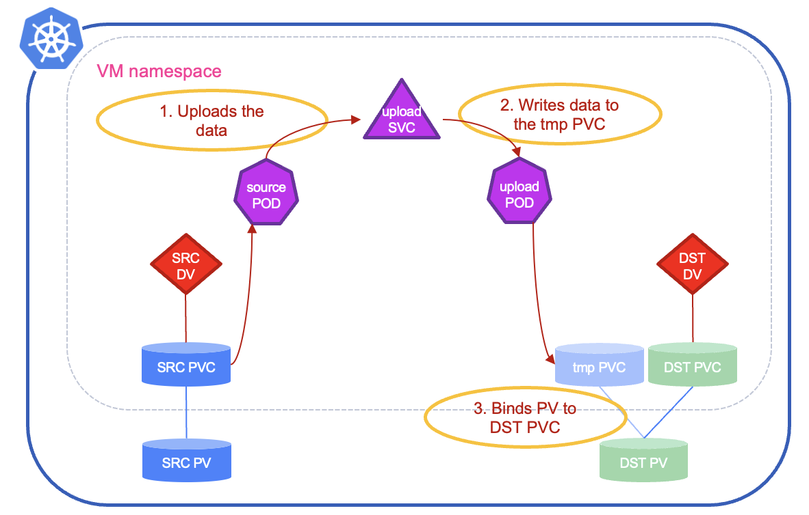
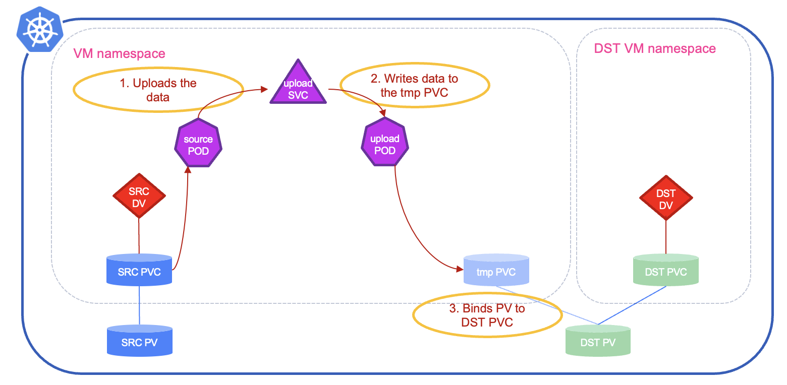
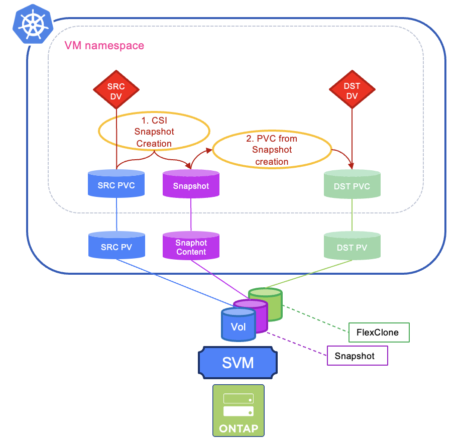
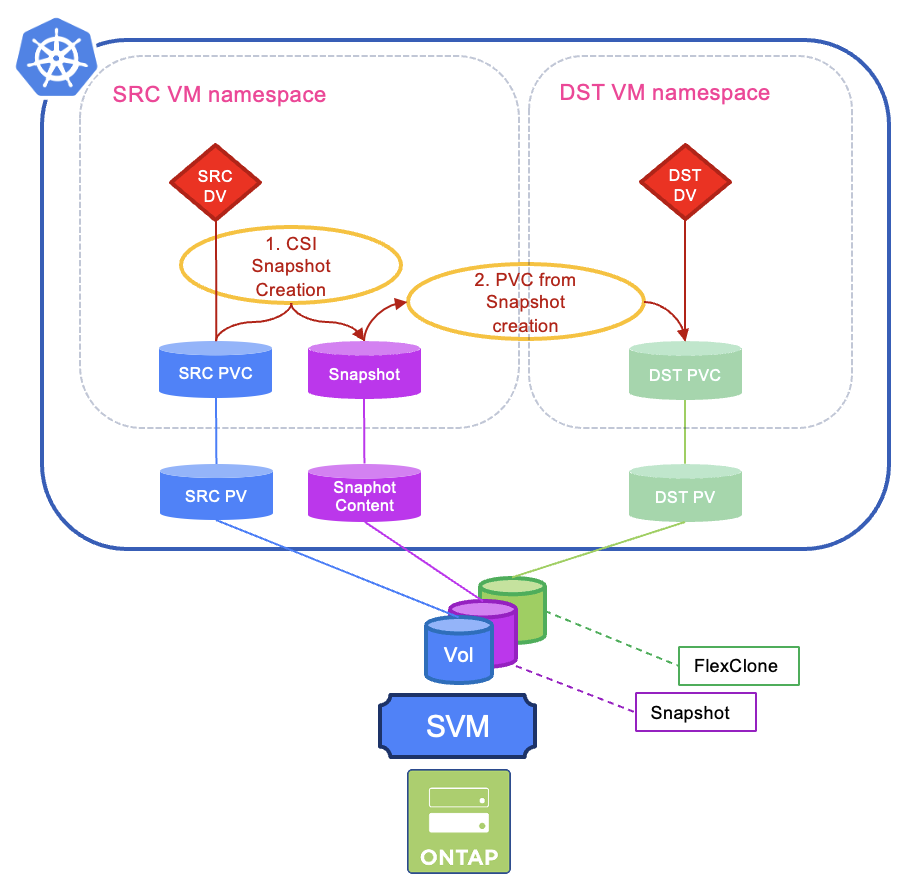
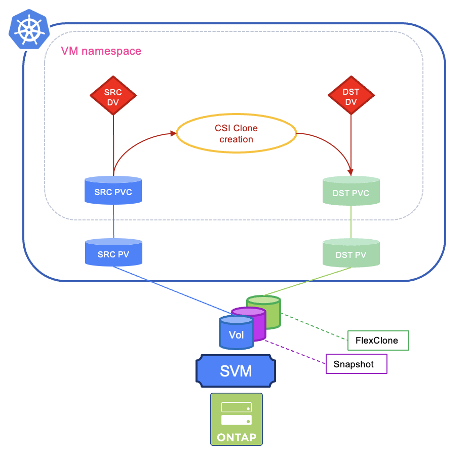
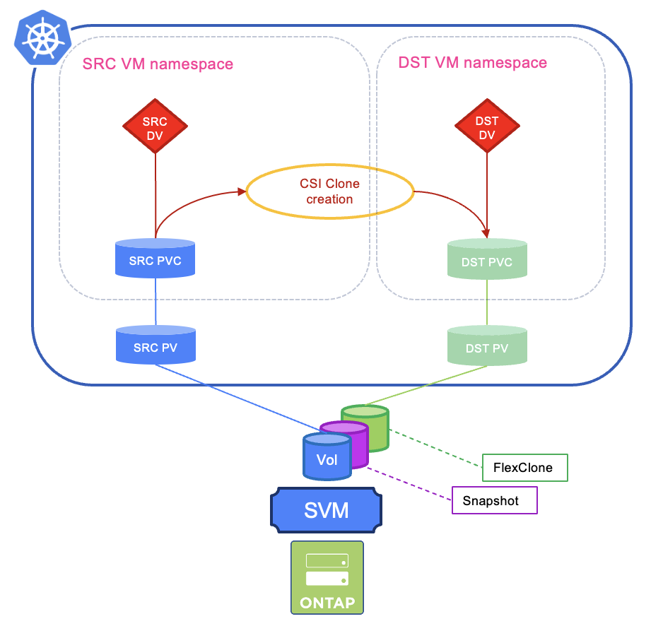

#########################################################################################
# SCENARIO 27: Creating Virtual Machines: boot volume clone (same storage class)
#########################################################################################

In this last chapter, we will see how to create a new Virtual Machine after an existing one using an existing PVC while keeping the same storage class.  
Multiple scenarios can be tested:  
- [Strategy1](#strategy1) cloning within the same namespace (strategy: copy)  
- [Strategy2](#strategy2) cloning to a different namespace (strategy: copy)  
- [Strategy3](#strategy3) cloning within the same namespace (strategy: snapshot)  
- [Strategy4](#strategy4) cloning to a different namespace (strategy: snapshot)  
- [Strategy5](#strategy5) cloning within the same namespace (strategy: csi-clone)  
- [Strategy6](#strategy6) cloning to a different namespace (strategy: csi-clone)  
 
**TL;DR START**  
The standard method to clone a volume is simply a full copy, which can be pretty slow for large datasets.  
As soon as you create a Volume Snapchot Class, the clone strategy switches to _snapshot_, which is way faster!  
You could also override that value to _csi-clone_, which can even be slightly faster, but not supported by all CSI drivers.
| CloneStrategy | Local Clone | Clone to a different namespace |
| :--- | :---: | :---: | 
| copy | slowest | slowest |
| snapshot | fast | fast |
| csi-clone | fastest | fastest |

**TL;DR STOP**

For the purpose of creating a disk from an existing one, a new CRD is introduced here, the **storageProfile**. It maps a Kubernetes StorageClass to CDI import/clone/snapshot behaviors used when creating DataVolumes. It is not a KubeVirt core API, but CDI uses it for VM disk import/clone workflows.  

When creating a DataVolume, CDI looks for the storageProfile matching the requested storageClassName and follows its status fields (ex: cloneStrategy, snapshotClass ...) to decide whether it can do instant CSI cloning or must copy the data, which volumeMode/accessModes to request, and which snapshot class to use.  

There is one storageProfile per storageClass, created with the same name.  
```bash
$ kubectl get storageprofile
NAME                          AGE
storage-class-iscsi           20h
storage-class-iscsi-economy   20h
storage-class-nas-economy     20h
storage-class-nfs             20h
storage-class-nvme            20h
storage-class-smb             20h
```
As we have used the _storage-class-iscsi_ one for this scenario, let's check its content:  
```bash
$ kubectl get storageprofile storage-class-iscsi -o yaml
apiVersion: cdi.kubevirt.io/v1beta1
kind: StorageProfile
metadata:
  creationTimestamp: "2025-11-10T15:05:18Z"
  generation: 1
  labels:
    app: containerized-data-importer
    app.kubernetes.io/component: storage
    app.kubernetes.io/managed-by: cdi-controller
    cdi.kubevirt.io: ""
  name: storage-class-iscsi
...
status:
  claimPropertySets:
  - accessModes:
    - ReadWriteMany
    volumeMode: Block
  cloneStrategy: copy
  dataImportCronSourceFormat: pvc
  provisioner: csi.trident.netapp.io
  storageClass: storage-class-iscsi
```
Notice that the **cloneStrategy** is set to **copy**. This is because I don't have a **volumeSnapshotClass** available just yet. If you have one, delete it in order continue with the beginning of this chapter (_kubectl delete vsclass --all_). Don't worry you are going to recreate it faily soon.   

For this chapter, let's suppose you have already gone through the [third method](../3_Method3/), and the content is still present. Cloning a disk requires the source Virtual Machine to be offline.  
Let's stop the VM using _virtctl_:  
```bash
$ virtctl stop -n sc27-alpine-c alpine-vm
VM alpine-vm was scheduled to stop
```

## A. Cloning within the same namespace (strategy: copy) 
<a name="strategy1"></a>

<p align="center"></p>

Let's see how to create a clone of the existing Virtual Machine using a DataVolume:  
```bash
$ cat << EOF | kubectl apply  -f -
apiVersion: cdi.kubevirt.io/v1beta1
kind: DataVolume
metadata:
  name: alpine-boot-clone
  namespace: sc27-alpine-c
  labels:
    method: clone1
spec:
  pvc:
    accessModes:
      - ReadWriteMany
    resources:
      requests:
        storage: 1Gi
    volumeMode: Block
    storageClassName: storage-class-iscsi
  contentType: kubevirt
  source:
    pvc:
      name: alpine-boot
      namespace: sc27-alpine-c
EOF
datavolume.cdi.kubevirt.io/alpine-boot-clone created
```
This triggers the creation of multiple objects:  
- a **tmp-pvc** that will receive the data.  
- the target **alpine-boot-clone** pvc, not bound to a PV yet.  
- **2 temporary pods**, one that manages the _clone_ process and one that _copies_ the content of the disk.  
- a **service**  to expose the second temporary pod to the first one:  

```bash
$ kubectl get -n sc27-alpine-c all,pvc
Warning: kubevirt.io/v1 VirtualMachineInstancePresets is now deprecated and will be removed in v2.
NAME                                                          READY   STATUS          RESTARTS   AGE
pod/b21e6444-ddcf-4aa6-a893-71653fbbb2a2-source-pod           1/1     Running         0          1s
pod/cdi-upload-tmp-pvc-8901a9d1-d945-4b1c-91c5-586a92696cea   1/1     Running         0          19s

NAME                                                              TYPE        CLUSTER-IP     EXTERNAL-IP   PORT(S)   AGE
service/cdi-upload-tmp-pvc-8901a9d1-d945-4b1c-91c5-586a92696cea   ClusterIP   10.98.247.45   <none>        443/TCP   19s

NAME                                           PHASE             PROGRESS   RESTARTS   AGE
datavolume.cdi.kubevirt.io/alpine-boot         Succeeded         N/A                   59m
datavolume.cdi.kubevirt.io/alpine-boot-clone   CloneInProgress   N/A                   19s

NAME                                   AGE   STATUS    READY
virtualmachine.kubevirt.io/alpine-vm   56m   Stopped   False

NAME                                                                 STATUS    VOLUME                                     CAPACITY   ACCESS MODES   STORAGECLASS          VOLUMEATTRIBUTESCLASS   AGE
persistentvolumeclaim/alpine-boot                                    Bound     pvc-dedf8d1e-ae3e-4f84-bfe4-ca5a3d9ab446   1Gi        RWX            storage-class-iscsi   <unset>                 59m
persistentvolumeclaim/alpine-boot-clone                              Pending                                                                        storage-class-iscsi   <unset>                 19s
persistentvolumeclaim/tmp-pvc-8901a9d1-d945-4b1c-91c5-586a92696cea   Bound     pvc-b21e6444-ddcf-4aa6-a893-71653fbbb2a2   1Gi        RWX            storage-class-iscsi   <unset>                 19s
```
Here are the logs you can read from the first temporary pod:  
```bash
$ kubectl logs -n sc27-alpine-c pod/b21e6444-ddcf-4aa6-a893-71653fbbb2a2-source-pod -f
VOLUME_MODE=block
MOUNT_POINT=/dev/cdi-block-volume
UPLOAD_BYTES=1073741824
I1111 09:53:38.389872       3 clone-source.go:223] content-type is "blockdevice-clone"
I1111 09:53:38.389962       3 clone-source.go:224] mount is "/dev/cdi-block-volume"
I1111 09:53:38.389969       3 clone-source.go:225] upload-bytes is 1073741824
I1111 09:53:38.389981       3 clone-source.go:242] Starting cloner target
I1111 09:53:38.826712       3 clone-source.go:258] Set header to blockdevice-clone
I1111 09:53:39.391368       3 prometheus.go:78] 5.07
...
I1111 09:53:56.407041       3 prometheus.go:78] 98.44
I1111 09:53:56.698781       3 clone-source.go:127] Wrote 1073741824 bytes
I1111 09:53:56.716160       3 clone-source.go:276] Response body:
I1111 09:53:56.716392       3 clone-source.go:278] clone complete
```
In this pod, the _/dev/cdi-block-volume_ corresponds to the source PVC (_alpine-boot_).  
Reading through the POD description, you will see that it will upload the image to the service linked to the second pod:  
```yaml
  - name: UPLOAD_URL
        value: https://cdi-upload-tmp-pvc-fd08a884-d587-41a0-84b4-f45f7607688b.sc27-alpine-c.svc/v1beta1/upload
```
Let's look into the second pod:  
```bash
$ kubectl logs -n sc27-alpine-c pod/cdi-upload-tmp-pvc-8901a9d1-d945-4b1c-91c5-586a92696cea -f
I1111 09:53:28.521523       1 uploadserver.go:81] Running server on 0.0.0.0:8443
I1111 09:53:38.855537       1 uploadserver.go:410] Content type header is "blockdevice-clone"
I1111 09:53:38.860307       1 file.go:230] copyWithSparseCheck to /dev/cdi-block-volume
I1111 09:53:56.713029       1 file.go:195] Read 1073741824 bytes, wrote 120193024 bytes to /dev/cdi-block-volume
I1111 09:53:56.713636       1 uploadserver.go:436] Wrote data to /dev/cdi-block-volume
I1111 09:53:56.714463       1 uploadserver.go:215] Shutting down http server after successful upload
I1111 09:53:56.718794       1 uploadserver.go:115] UploadServer successfully exited
```
This time, the _/dev/cdi-block-volume_ device corresponds to the target PVC where the content of the clone is written.  


Once the copy is completed, temporary resources (POD, SVC, PVC) are deleted.  
However, the underlying PV is re-bound to the target PVC.  
```bash
$ kubectl get -n sc27-alpine-c all,pvc -l method=clone1
Warning: kubevirt.io/v1 VirtualMachineInstancePresets is now deprecated and will be removed in v2.
NAME                                           PHASE       PROGRESS   RESTARTS   AGE
datavolume.cdi.kubevirt.io/alpine-boot-clone   Succeeded   100.0%                94s

NAME                                      STATUS   VOLUME                                     CAPACITY   ACCESS MODES   STORAGECLASS          VOLUMEATTRIBUTESCLASS   AGE
persistentvolumeclaim/alpine-boot-clone   Bound    pvc-b21e6444-ddcf-4aa6-a893-71653fbbb2a2   1Gi        RWX            storage-class-iscsi   <unset>                 95s
```
You can check the details of the PVC, you will find interesting information in the annotations:  
```bash
$ kubectl describe -n sc27-alpine-c pvc -l method=clone1
Name:          alpine-boot-clone
Namespace:     sc27-alpine-c
StorageClass:  storage-class-iscsi
...
Annotations:   cdi.kubevirt.io/clonePhase: Succeeded
               cdi.kubevirt.io/cloneType: copy
               cdi.kubevirt.io/createdForDataVolume: 4319f8be-c484-4cb9-9fce-6b925b5fd344
               cdi.kubevirt.io/storage.condition.running: false
               cdi.kubevirt.io/storage.condition.running.message: Clone Complete
               cdi.kubevirt.io/storage.condition.running.reason: Completed
               cdi.kubevirt.io/storage.contentType: kubevirt
               cdi.kubevirt.io/storage.pod.restarts: 0
               cdi.kubevirt.io/storage.populator.progress: 100.0%
               cdi.kubevirt.io/storage.preallocation.requested: false
               cdi.kubevirt.io/storage.usePopulator: true
```
Let's analyse those fields:  
- **cdi.kubevirt.io/cloneType: copy**: CDI used a copy-based path rather than a storage-native clone path.  
- **cdi.kubevirt.io/storage.usePopulator: true**: CDI used the populator framework to fill the target volume.  
- **cdi.kubevirt.io/storage.contentType: kubevirt**: This volume was handled as a KubeVirt image workload.  
- **cdi.kubevirt.io/storage.preallocation.requested: false**: in essence that means that the volume is requested _thin provisioned_ if the driver supports it. In this case, CDI is not forcing all blocks to be materialized at creation time.  

The disk is now ready to be used.  
You can use the *alpine_vm_clone1_wo_cloudinit.yaml* file this time. As the boot disk was already customized, no need to go through similar step this time:  
```bash
$ kubectl create -f alpine_vm_clone1_wo_cloudinit.yaml -n sc27-alpine-c
virtualmachine.kubevirt.io/alpine-vm-clone created
```
The result would look like the following:  
```bash
$ kubectl get -n sc27-alpine-c all,pvc -l method=clone1
NAME                                           PHASE       PROGRESS   RESTARTS   AGE
datavolume.cdi.kubevirt.io/alpine-boot-clone   Succeeded   100.0%                7m22s

NAME                                         AGE     STATUS    READY
virtualmachine.kubevirt.io/alpine-vm-clone   2m54s   Running   True

NAME                                      STATUS   VOLUME                                     CAPACITY   ACCESS MODES   STORAGECLASS          VOLUMEATTRIBUTESCLASS   AGE
persistentvolumeclaim/alpine-boot-clone   Bound    pvc-b21e6444-ddcf-4aa6-a893-71653fbbb2a2   1Gi        RWX            storage-class-iscsi   <unset>                 7m22s
```
Finally, let's connect to the new VM:  
```bash
$ virtctl console -n sc27-alpine-c alpine-vm-clone
Successfully connected to alpine-vm-clone console. Press Ctrl+] or Ctrl+5 to exit console.

Welcome to Alpine Linux 3.22
Kernel 6.12.38-0-virt on x86_64 (/dev/ttyS0)

alpine-vm-clone.sc27-alpine-c.svc.cluster.local login: alpine
Password:
Welcome to Alpine on KubeVirt in the NetApp LoD!
```
If you managed to log in the VM with the correct password (alpine), and if you see the same message, the proves you are running with a copy of a disk that was already tailored.  


## B. Cloning to a different namespace (strategy: copy) 
<a name="strategy2"></a>

<p align="center"></p>

First step, let's create a new namespace called _sc27-alpine-d_.  
```bash
$ kubectl create ns sc27-alpine-d
namespace/sc27-alpine-d created
```
Let's directly create a dataVolume:  
Let's see how to create a clone of the existing Virtual Machine using a DataVolume:  
```bash
$ cat << EOF | kubectl apply  -f -
apiVersion: cdi.kubevirt.io/v1beta1
kind: DataVolume
metadata:
  name: alpine-boot-clone
  namespace: sc27-alpine-d
  labels:
    method: clone2
spec:
  pvc:
    accessModes:
      - ReadWriteMany
    resources:
      requests:
        storage: 1Gi
    volumeMode: Block
    storageClassName: storage-class-iscsi
  contentType: kubevirt
  source:
    pvc:
      name: alpine-boot
      namespace: sc27-alpine-c
EOF
datavolume.cdi.kubevirt.io/alpine-boot-clone created
```
The source of the copy being in the _sc27-alpine-c_ namespace, 2 temporary pods are created there.  
You can read there logs here:  
```bash
$ kubectl logs -n sc27-alpine-c cdi-upload-tmp-pvc-e8e705f3-9862-4981-b47c-7f5afda3ff63 -f
I1111 11:37:38.826990       1 uploadserver.go:81] Running server on 0.0.0.0:8443
I1111 11:37:49.323310       1 uploadserver.go:410] Content type header is "blockdevice-clone"
I1111 11:37:49.331934       1 file.go:230] copyWithSparseCheck to /dev/cdi-block-volume
I1111 11:38:08.023151       1 file.go:195] Read 1073741824 bytes, wrote 120291328 bytes to /dev/cdi-block-volume
I1111 11:38:08.023725       1 uploadserver.go:436] Wrote data to /dev/cdi-block-volume
I1111 11:38:08.024242       1 uploadserver.go:215] Shutting down http server after successful upload
I1111 11:38:08.029633       1 uploadserver.go:115] UploadServer successfully exited

$ kubectl logs -n sc27-alpine-c 627902f9-6f12-46bb-a938-8ad69e862c4c-source-pod -f
VOLUME_MODE=block
MOUNT_POINT=/dev/cdi-block-volume
UPLOAD_BYTES=1073741824
I1111 11:37:48.931421       3 clone-source.go:223] content-type is "blockdevice-clone"
I1111 11:37:48.931687       3 clone-source.go:224] mount is "/dev/cdi-block-volume"
I1111 11:37:48.931718       3 clone-source.go:225] upload-bytes is 1073741824
I1111 11:37:48.931759       3 clone-source.go:242] Starting cloner target
I1111 11:37:49.303065       3 clone-source.go:258] Set header to blockdevice-clone
I1111 11:37:49.932363       3 prometheus.go:78] 5.67
...
I1111 11:38:07.954927       3 prometheus.go:78] 99.67
I1111 11:38:08.010452       3 clone-source.go:127] Wrote 1073741824 bytes
I1111 11:38:08.025669       3 clone-source.go:276] Response body:
I1111 11:38:08.026122       3 clone-source.go:278] clone complete
```
As in the previous examples, you will also get a temporary PVC in the target namespace.  
Once the copy is done, you will end up with a datavolume and a pvc:  
```bash
$ kubectl get all,pvc -n sc27-alpine-d
Warning: kubevirt.io/v1 VirtualMachineInstancePresets is now deprecated and will be removed in v2.
NAME                                           PHASE       PROGRESS   RESTARTS   AGE
datavolume.cdi.kubevirt.io/alpine-boot-clone   Succeeded   100.0%                100s

NAME                                      STATUS   VOLUME                                     CAPACITY   ACCESS MODES   STORAGECLASS          VOLUMEATTRIBUTESCLASS   AGE
persistentvolumeclaim/alpine-boot-clone   Bound    pvc-627902f9-6f12-46bb-a938-8ad69e862c4c   1Gi        RWX            storage-class-iscsi   <unset>                 99s
```
Let's take a closer look at the DataVolume:  
```bash
$ kubectl get events -n sc27-alpine-d --field-selector involvedObject.kind=DataVolume
LAST SEEN   TYPE      REASON            OBJECT                         MESSAGE
5m6s        Normal    NotFound          datavolume/alpine-boot-clone   No PVC found
5m6s        Normal    CloneScheduled    datavolume/alpine-boot-clone   Cloning from sc27-alpine-c/alpine-boot into sc27-alpine-d/alpine-boot-clone scheduled
5m5s        Normal    Pending           datavolume/alpine-boot-clone   PVC alpine-boot-clone Pending
5m5s        Warning   Pending           datavolume/alpine-boot-clone   Clone Pending
5m5s        Normal    CloneInProgress   datavolume/alpine-boot-clone   Cloning from sc27-alpine-c/alpine-boot into sc27-alpine-d/alpine-boot-clone in progress
4m26s       Warning   Completed         datavolume/alpine-boot-clone   Clone Complete
4m24s       Normal    Bound             datavolume/alpine-boot-clone   PVC alpine-boot-clone Bound
4m24s       Normal    CloneSucceeded    datavolume/alpine-boot-clone   Successfully cloned from sc27-alpine-c/alpine-boot into sc27-alpine-d/alpine-boot-clone
```
That describes pretty well the steps happening in the creation of the volume.  
What can we see in the PVC now:  
```bash
$ kubectl describe -n sc27-alpine-d persistentvolumeclaim/alpine-boot-clone
Name:          alpine-boot-clone
Namespace:     sc27-alpine-d
StorageClass:  storage-class-iscsi
...
Annotations:   cdi.kubevirt.io/clonePhase: Succeeded
               cdi.kubevirt.io/cloneType: copy
               cdi.kubevirt.io/createdForDataVolume: 876edf9b-4898-4e93-ad5d-59c4abedc562
               cdi.kubevirt.io/dataSourceNamespace: sc27-alpine-c
               cdi.kubevirt.io/storage.clone.token: eyJhbGciOiJQUzI1NiJ9....
               cdi.kubevirt.io/storage.condition.running: false
               cdi.kubevirt.io/storage.condition.running.message: Clone Complete
               cdi.kubevirt.io/storage.condition.running.reason: Completed
               cdi.kubevirt.io/storage.contentType: kubevirt
               cdi.kubevirt.io/storage.extended.clone.token: eyJhbGciOiJQUzI1NiJ9....
               cdi.kubevirt.io/storage.pod.restarts: 0
               cdi.kubevirt.io/storage.populator.progress: 100.0%
               cdi.kubevirt.io/storage.preallocation.requested: false
               cdi.kubevirt.io/storage.usePopulator: true
```
A few extra fields compared to the previous chapter:  
- **cdi.kubevirt.io/storage.clone.token**: short lived token to authorize access between source and target issues by the cdi-apiserver. 
- **cdi.kubevirt.io/storage.extended.clone.token**: longer-lived companion token used when CDI needs authorization beyond the short initial window

If desired, you can also create a VM on top of this volume, and connect to its console to check the content with the following:  
```bash
kubectl create -f alpine_vm_clone2_wo_cloudinit.yaml -n sc27-alpine-d
virtctl console -n sc27-alpine-d alpine-vm-clone2
```

## C. Cloning within the same namespace (strategy: snapshot) 
<a name="strategy3"></a>

<p align="center"></p>

Main requirement, you need a Volume Snapshot Class:  
```bash
$ kubectl create -f ../../../Scenario13/1_CSI_Snapshots/sc-volumesnapshot.yaml
volumesnapshotclass.snapshot.storage.k8s.io/csi-snap-class created
```
The CDI automatically updated the storageProfile:  
```bash
$ kubectl get storageprofile storage-class-iscsi -o yaml
apiVersion: cdi.kubevirt.io/v1beta1
kind: StorageProfile
metadata:
  creationTimestamp: "2025-11-10T15:05:18Z"
  generation: 2
  labels:
    app: containerized-data-importer
    app.kubernetes.io/component: storage
    app.kubernetes.io/managed-by: cdi-controller
    cdi.kubevirt.io: ""
  name: storage-class-iscsi
...
status:
  claimPropertySets:
  - accessModes:
    - ReadWriteMany
    volumeMode: Block
  cloneStrategy: snapshot
  dataImportCronSourceFormat: snapshot
  provisioner: csi.trident.netapp.io
  snapshotClass: csi-snap-class
  storageClass: storage-class-iscsi
```
Notice the **cloneStrategy** and **dataImportCronSourceFormat** which were updated to _snapshot_?  

Let's create a new DataVolume:  
```bash
$ cat << EOF | kubectl apply  -f -
apiVersion: cdi.kubevirt.io/v1beta1
kind: DataVolume
metadata:
  name: alpine-boot-clone3
  namespace: sc27-alpine-c
  labels:
    method: clone3
spec:
  pvc:
    accessModes:
      - ReadWriteMany
    resources:
      requests:
        storage: 1Gi
    volumeMode: Block
    storageClassName: storage-class-iscsi
  contentType: kubevirt
  source:
    pvc:
      name: alpine-boot
      namespace: sc27-alpine-c
EOF
datavolume.cdi.kubevirt.io/alpine-boot-clone3 created
```
You will quickly see a temporary Volume Snapshot:  
```bash
$ kubectl get -n sc27-alpine-c vs
NAME                                                READYTOUSE   SOURCEPVC     SOURCESNAPSHOTCONTENT    RESTORESIZE   SNAPSHOTCLASS    SNAPSHOTCONTENT                                    CREATIONTIME   AGE
tmp-snapshot-49f5ffe4-a6f5-49ad-9ca9-002e83f15b2b   true         alpine-boot3                           1Gi           csi-snap-class   snapcontent-694c895f-f892-475c-bbd6-7d82648f1962   13s            13s
```
Pretty quickly, a new PVC will be able, built from the snapshot:  
```bash
$ kubectl get -n sc27-alpine-c all,pvc,vs -l method=clone3
Warning: kubevirt.io/v1 VirtualMachineInstancePresets is now deprecated and will be removed in v2.
NAME                                            PHASE       PROGRESS   RESTARTS   AGE
datavolume.cdi.kubevirt.io/alpine-boot-clone3   Succeeded   100.0%                4m55s

NAME                                       STATUS   VOLUME                                     CAPACITY   ACCESS MODES   STORAGECLASS          VOLUMEATTRIBUTESCLASS   AGE
persistentvolumeclaim/alpine-boot-clone3   Bound    pvc-32a3652a-a7d5-4536-b132-aec514bcfe04   1Gi        RWX            storage-class-iscsi   <unset>                 4m55s
```
You can then also confirm that Trident is using the ONTAP FlexClone feature to generate that new volume (*trident_pvc_32a3652a_a7d5_4536_b132_aec514bcfe04*) as a clone from the volume, using a snapshot as a reference point:  
```bash
cluster1::> vol clone show
                      Parent  Parent        Parent
Vserver FlexClone     Vserver Volume        Snapshot             State     Type
------- ------------- ------- ------------- -------------------- --------- ----
sansvm  trident_pvc_32a3652a_a7d5_4536_b132_aec514bcfe04
                      sansvm  trident_pvc_7d1a6f57_5cc9_46ac_b4af_658ef6329519
                                            snapshot-694c895f-f892-475c-bbd6-7d82648f1962
                                                                 online    RW
```

Now, let's look at the details of the DataVolume:  
```bash
$ kubectl get events -n sc27-alpine-c --field-selector involvedObject.kind=DataVolume
LAST SEEN   TYPE     REASON                              OBJECT                          MESSAGE
3m31s       Normal   CloneScheduled                      datavolume/alpine-boot-clone3   Cloning from sc27-alpine-c/alpine-boot into sc27-alpine-c/alpine-boot-clone3 scheduled
3m31s       Normal   Pending                             datavolume/alpine-boot-clone3   PVC alpine-boot-clone3 Pending
3m31s       Normal   SnapshotForSmartCloneInProgress     datavolume/alpine-boot-clone3   Creating snapshot for smart-clone is in progress (for pvc sc27-alpine-c/alpine-boot)
3m30s       Normal   CloneFromSnapshotSourceInProgress   datavolume/alpine-boot-clone3   Creating PVC from snapshot source is in progress (for pvc sc27-alpine-c/alpine-boot)
3m29s       Normal   RebindInProgress                    datavolume/alpine-boot-clone3   Rebinding PersistentVolumeClaim for DataVolume sc27-alpine-c/alpine-boot-clone3
3m29s       Normal   Bound                               datavolume/alpine-boot-clone3   PVC alpine-boot-clone3 Bound
3m29s       Normal   CloneSucceeded                      datavolume/alpine-boot-clone3   Successfully cloned from sc27-alpine-c/alpine-boot into sc27-alpine-c/alpine-boot-clone3
```
Notice the events mention a **smart clone**? In a nutshell, that proves that the process is based on a CSI Snapshot:  
- SnapshotForSmartCloneInProgress = creating snapshot from source.  
- CloneFromSnapshotSourceInProgress = creating destination PVC from that snapshot.  

What about the PVC details:  
```bash
$ kubectl describe -n sc27-alpine-c pvc -l method=clone3
Name:          alpine-boot-clone3
Namespace:     sc27-alpine-c
StorageClass:  storage-class-iscsi
...
Annotations:   cdi.kubevirt.io/clonePhase: Succeeded
               cdi.kubevirt.io/cloneType: snapshot
               cdi.kubevirt.io/createdForDataVolume: e510ae2b-b9a1-47c5-bf30-43f9ffc31acf
               cdi.kubevirt.io/storage.condition.running: false
               cdi.kubevirt.io/storage.condition.running.message: Clone Complete
               cdi.kubevirt.io/storage.condition.running.reason: Completed
               cdi.kubevirt.io/storage.contentType: kubevirt
               cdi.kubevirt.io/storage.pod.restarts: 0
               cdi.kubevirt.io/storage.populator.progress: 100.0%
               cdi.kubevirt.io/storage.preallocation.requested: false
               cdi.kubevirt.io/storage.usePopulator: true
               pv.kubernetes.io/bind-completed: yes
               pv.kubernetes.io/bound-by-controller: yes
               volume.beta.kubernetes.io/storage-provisioner: csi.trident.netapp.io
               volume.kubernetes.io/storage-provisioner: csi.trident.netapp.io
```
As expected, you can see **cdi.kubevirt.io/cloneType: snapshot** which proves again we used a CSI snapshot.   

In the backend, creating a PVC from the snapshot uses the NetApp FlexClone feature, one of the reasons the operation was so fast... Deleting the snapshot triggers a split clone, so that the volume corresponding to the PVC becomes detached from its parent volume.  

If desired, you can also create a VM on top of this volume, and connect to its console to check the content with the following:  
```bash
kubectl create -f alpine_vm_clone3_wo_cloudinit.yaml -n sc27-alpine-c
virtctl console -n sc27-alpine-d alpine-vm-clone3
```

## D. Cloning to a different namespace (strategy: snapshot) 
<a name="strategy4"></a>

<p align="center"></p>

First step, let's create a new namespace called _sc27-alpine-e_.  
```bash
$ kubectl create  ns sc27-alpine-e
namespace/sc27-alpine-e created
```

We can directly move to the datavolume creation:  
```bash
$ cat << EOF | kubectl apply  -f -
apiVersion: cdi.kubevirt.io/v1beta1
kind: DataVolume
metadata:
  name: alpine-boot-clone
  namespace: sc27-alpine-e
  labels:
    method: clone4
spec:
  pvc:
    accessModes:
      - ReadWriteMany
    resources:
      requests:
        storage: 1Gi
    volumeMode: Block
    storageClassName: storage-class-iscsi
  contentType: kubevirt
  source:
    pvc:
      name: alpine-boot
      namespace: sc27-alpine-c
EOF
datavolume.cdi.kubevirt.io/alpine-boot-clone created
```
Following the same logic as in the previous chapters, you will see a temporary snapshot in the source volume, and the corresponding new PVC & DV in the new namespace:  
```bash
$ kubectl get vs -n sc27-alpine-c
NAME                                                READYTOUSE   SOURCEPVC     SOURCESNAPSHOTCONTENT   RESTORESIZE   SNAPSHOTCLASS    SNAPSHOTCONTENT                                    CREATIONTIME   AGE
tmp-snapshot-bcb12db3-1c94-4d62-989e-ffd28388586a   true         alpine-boot                           1Gi           csi-snap-class   snapcontent-44c4d4b8-7ed2-445d-9c92-b444fd8cf0af   24s            24s

$ kubectl get all,pvc -n sc27-alpine-e
Warning: kubevirt.io/v1 VirtualMachineInstancePresets is now deprecated and will be removed in v2.
NAME                                           PHASE       PROGRESS   RESTARTS   AGE
datavolume.cdi.kubevirt.io/alpine-boot-clone   Succeeded   100.0%                10s

NAME                                      STATUS   VOLUME                                     CAPACITY   ACCESS MODES   STORAGECLASS          VOLUMEATTRIBUTESCLASS   AGE
persistentvolumeclaim/alpine-boot-clone   Bound    pvc-6971cc75-34ba-47f3-b06a-cd63bce53242c   1Gi        RWX            storage-class-iscsi   <unset>                 10s
```
You will also find a FlexClone in the ONTAP backend:  
```bash
cluster1::> vol clone show
                      Parent  Parent        Parent
Vserver FlexClone     Vserver Volume        Snapshot             State     Type
------- ------------- ------- ------------- -------------------- --------- ----
sansvm  trident_pvc_6971cc75_34ba_47f3_b06a_cd63bce53242
                      sansvm  trident_pvc_7d1a6f57_5cc9_46ac_b4af_658ef6329519
                                            snapshot-44c4d4b8-7ed2-445d-9c92-b444fd8cf0af
                                                                 online    RW
```
You will find similar events and annotations as in the previous exercise:  
```bash
$ kubectl get events -n sc27-alpine-e --field-selector involvedObject.kind=DataVolume
LAST SEEN   TYPE      REASON                              OBJECT                         MESSAGE
2m23s       Normal    CloneScheduled                      datavolume/alpine-boot-clone   Cloning from sc27-alpine-c/alpine-boot into sc27-alpine-e/alpine-boot-clone scheduled
2m23s       Normal    Pending                             datavolume/alpine-boot-clone   PVC alpine-boot-clone Pending
2m23s       Warning   Pending                             datavolume/alpine-boot-clone   Clone Pending
2m23s       Normal    SnapshotForSmartCloneInProgress     datavolume/alpine-boot-clone   Creating snapshot for smart-clone is in progress (for pvc sc27-alpine-c/alpine-boot)
2m22s       Normal    CloneFromSnapshotSourceInProgress   datavolume/alpine-boot-clone   Creating PVC from snapshot source is in progress (for pvc sc27-alpine-c/alpine-boot)
2m21s       Normal    Bound                               datavolume/alpine-boot-clone   PVC alpine-boot-clone Bound
2m21s       Normal    CloneSucceeded                      datavolume/alpine-boot-clone   Successfully cloned from sc27-alpine-c/alpine-boot into sc27-alpine-e/alpine-boot-clone
```

If desired, you can also create a VM on top of this volume, and connect to its console to check the content with the following:  
```bash
kubectl create -f alpine_vm_clone4_wo_cloudinit.yaml -n sc27-alpine-e
virtctl console -n sc27-alpine-e alpine-vm-clone4
```

## E. Cloning within the same namespace (strategy: csi-clone) 
<a name="strategy5"></a>

<p align="center"></p>

_cli-clone_ is the third cloning strategy available, however not supported by all CSI drivers (totally great with Trident).  
It provides native CSI PVC cloning, without the need of a CSI snapshot.  

In order to enable this method, you need to explicitely patch the storage profile:  
```bash
$ kubectl patch storageprofile storage-class-iscsi --type=merge -p '{"spec":{"cloneStrategy":"csi-clone"}}'
storageprofile.cdi.kubevirt.io/storage-class-iscsi patched
```
OK, let's create a new DataVolume:  
```bash
$ cat << EOF | kubectl apply  -f -
apiVersion: cdi.kubevirt.io/v1beta1
kind: DataVolume
metadata:
  name: alpine-boot-clone5
  namespace: sc27-alpine-c
  labels:
    method: clone5
spec:
  pvc:
    accessModes:
      - ReadWriteMany
    resources:
      requests:
        storage: 1Gi
    volumeMode: Block
    storageClassName: storage-class-iscsi
  contentType: kubevirt
  source:
    pvc:
      name: alpine-boot
      namespace: sc27-alpine-c
EOF
datavolume.cdi.kubevirt.io/alpine-boot-clone4 created
```
Let's see how fast it takes to be ready:
```bash
$ kubectl get -n sc27-alpine-c all,pvc,vs -l method=clone5
Warning: kubevirt.io/v1 VirtualMachineInstancePresets is now deprecated and will be removed in v2.
NAME                                            PHASE       PROGRESS   RESTARTS   AGE
datavolume.cdi.kubevirt.io/alpine-boot-clone5   Succeeded   100.0%                10s

NAME                                       STATUS   VOLUME                                     CAPACITY   ACCESS MODES   STORAGECLASS          VOLUMEATTRIBUTESCLASS   AGE
persistentvolumeclaim/alpine-boot-clone5   Bound    pvc-f566a159-75bf-44fe-89e9-137c1fba8ecb   1Gi        RWX            storage-class-iscsi   <unset>                 10s
```
**Creating this new PVC took less than 3 seconds to complete, making it the fastest method!!**. 

Let's inspects the various elements:  
```bash
$ kubectl get events -n sc27-alpine-c --field-selector involvedObject.kind=DataVolume
LAST SEEN   TYPE      REASON               OBJECT                          MESSAGE
96s         Normal    CloneScheduled       datavolume/alpine-boot-clone5   Cloning from sc27-alpine-c/alpine-boot into sc27-alpine-c/alpine-boot-clone5 scheduled
96s         Normal    Pending              datavolume/alpine-boot-clone5   PVC alpine-boot-clone5 Pending
96s         Warning   Pending              datavolume/alpine-boot-clone5   Clone Pending
96s         Normal    CSICloneInProgress   datavolume/alpine-boot-clone5   CSI Volume clone in progress (for pvc sc27-alpine-c/alpine-boot)
95s         Normal    CloneSucceeded       datavolume/alpine-boot-clone5   Successfully cloned from sc27-alpine-c/alpine-boot into sc27-alpine-c/alpine-boot-clone5
95s         Normal    Bound                datavolume/alpine-boot-clone5   PVC alpine-boot-clone5 Bound
```
The order of events is pretty clear. Now let's check the details of the PVC:  
```bash
$ kubectl describe -n sc27-alpine-c persistentvolumeclaim/alpine-boot-clone5
Name:          alpine-boot-clone5
Namespace:     sc27-alpine-c
StorageClass:  storage-class-iscsi
Status:        Bound
Volume:        pvc-f566a159-75bf-44fe-89e9-137c1fba8ecb
Labels:        app=containerized-data-importer
               app.kubernetes.io/component=storage
               app.kubernetes.io/managed-by=cdi-controller
               method=clone4
Annotations:   cdi.kubevirt.io/clonePhase: Succeeded
               cdi.kubevirt.io/cloneType: csi-clone
               cdi.kubevirt.io/createdForDataVolume: f87e1e40-b9c5-4545-88d1-e6f35ced6113
               cdi.kubevirt.io/storage.condition.running: false
               cdi.kubevirt.io/storage.condition.running.message: Clone Complete
               cdi.kubevirt.io/storage.condition.running.reason: Completed
               cdi.kubevirt.io/storage.contentType: kubevirt
               cdi.kubevirt.io/storage.pod.restarts: 0
               cdi.kubevirt.io/storage.populator.progress: 100.0%
               cdi.kubevirt.io/storage.preallocation.requested: false
               cdi.kubevirt.io/storage.usePopulator: true
               pv.kubernetes.io/bind-completed: yes
               pv.kubernetes.io/bound-by-controller: yes
```
This confirms that the right method was used to create the volume.  
At the storage layer, it is actually an ONTAP clone, which also explains the speed to accomplish the creation task:  
```bash
cluster1::> vol clone show
                      Parent  Parent        Parent
Vserver FlexClone     Vserver Volume        Snapshot             State     Type
------- ------------- ------- ------------- -------------------- --------- ----
sansvm  trident_pvc_f566a159_75bf_44fe_89e9_137c1fba8ecb
                      sansvm  trident_pvc_7d1a6f57_5cc9_46ac_b4af_658ef6329519
                                            20260622T192451Z1axlqs
                                                                 online    RW
```
If desired, you can also create a VM on top of this volume, and connect to its console to check the content with the following:  
```bash
kubectl create -f alpine_vm_clone5_wo_cloudinit.yaml -n sc27-alpine-c
virtctl console -n sc27-alpine-c alpine-vm-clone5
```

## F. Cloning to a different namespace (strategy: csi-clone) 
<a name="strategy6"></a>

<p align="center"></p>

First step, let's create a new namespace called _sc27-alpine-f_, followed by a new Data Volume.  
```bash
$ kubectl create  ns sc27-alpine-f
namespace/sc27-alpine-f created

$ cat << EOF | kubectl apply  -f -
apiVersion: cdi.kubevirt.io/v1beta1
kind: DataVolume
metadata:
  name: alpine-boot-clone6
  namespace: sc27-alpine-f
  labels:
    method: clone6
spec:
  pvc:
    accessModes:
      - ReadWriteMany
    resources:
      requests:
        storage: 1Gi
    volumeMode: Block
    storageClassName: storage-class-iscsi
  contentType: kubevirt
  source:
    pvc:
      name: alpine-boot
      namespace: sc27-alpine-c
EOF
datavolume.cdi.kubevirt.io/alpine-boot-clone6 created
```
Here again, it is super fast:  
```bash
$ kubectl get  -n sc27-alpine-f all,pvc,vs
Warning: kubevirt.io/v1 VirtualMachineInstancePresets is now deprecated and will be removed in v2.
NAME                                            PHASE       PROGRESS   RESTARTS   AGE
datavolume.cdi.kubevirt.io/alpine-boot-clone6   Succeeded   100.0%                3s

NAME                                       STATUS   VOLUME                                     CAPACITY   ACCESS MODES   STORAGECLASS          VOLUMEATTRIBUTESCLASS   AGE
persistentvolumeclaim/alpine-boot-clone6   Bound    pvc-44c6093b-80dc-4824-ab0f-9ac63124f5c1   1Gi        RWX            storage-class-iscsi   <unset>                 3s
```
Check the events and details will confirm what we already know by now:
```bash  
$ kubectl get events -n sc27-alpine-f --field-selector involvedObject.kind=DataVolume
LAST SEEN   TYPE      REASON               OBJECT                          MESSAGE
62s         Normal    NotFound             datavolume/alpine-boot-clone6   No PVC found
62s         Normal    CloneScheduled       datavolume/alpine-boot-clone6   Cloning from sc27-alpine-c/alpine-boot into sc27-alpine-f/alpine-boot-clone6 scheduled
62s         Normal    Pending              datavolume/alpine-boot-clone6   PVC alpine-boot-clone6 Pending
62s         Warning   Pending              datavolume/alpine-boot-clone6   Clone Pending
61s         Normal    CSICloneInProgress   datavolume/alpine-boot-clone6   CSI Volume clone in progress (for pvc sc27-alpine-c/alpine-boot)
61s         Normal    Bound                datavolume/alpine-boot-clone6   PVC alpine-boot-clone6 Bound
61s         Normal    CloneSucceeded       datavolume/alpine-boot-clone6   Successfully cloned from sc27-alpine-c/alpine-boot into sc27-alpine-f/alpine-boot-clone6

$ kubectl describe -n sc27-alpine-f persistentvolumeclaim/alpine-boot-clone6
Name:          alpine-boot-clone6
Namespace:     sc27-alpine-f
StorageClass:  storage-class-iscsi
Status:        Bound
Volume:        pvc-44c6093b-80dc-4824-ab0f-9ac63124f5c1
Labels:        app=containerized-data-importer
               app.kubernetes.io/component=storage
               app.kubernetes.io/managed-by=cdi-controller
               method=clone5
Annotations:   cdi.kubevirt.io/clonePhase: Succeeded
               cdi.kubevirt.io/cloneType: csi-clone
               cdi.kubevirt.io/createdForDataVolume: f2ec04dd-8bdf-4f5c-9db2-d6d245220a86
               cdi.kubevirt.io/dataSourceNamespace: sc27-alpine-c
               cdi.kubevirt.io/storage.clone.token:
                 eyJhbGciOiJQUzI1NiJ9.eyJleHAiOjE3ODIxNTc0OTAsImlhdCI6MTc4MjE1NzE5MCwiaXNzIjoiY2RpLWFwaXNlcnZlciIsIm5hbWUiOiJhbHBpbmUtYm9vdCIsIm5hbWVzcGFjZ...
               cdi.kubevirt.io/storage.condition.running: false
               cdi.kubevirt.io/storage.condition.running.message: Clone Complete
               cdi.kubevirt.io/storage.condition.running.reason: Completed
               cdi.kubevirt.io/storage.contentType: kubevirt
               cdi.kubevirt.io/storage.extended.clone.token:
                 eyJhbGciOiJQUzI1NiJ9.eyJleHAiOjIwOTc1MTcxOTAsImlhdCI6MTc4MjE1NzE5MCwiaXNzIjoiY2RpLWRlcGxveW1lbnQiLCJuYW1lIjoiYWxwaW5lLWJvb3QiLCJuYW1lc3BhY...
               cdi.kubevirt.io/storage.pod.restarts: 0
               cdi.kubevirt.io/storage.populator.progress: 100.0%
               cdi.kubevirt.io/storage.preallocation.requested: false
               cdi.kubevirt.io/storage.usePopulator: true
               pv.kubernetes.io/bind-completed: yes
               pv.kubernetes.io/bound-by-controller: yes
               volume.beta.kubernetes.io/storage-provisioner: csi.trident.netapp.io
               volume.kubernetes.io/storage-provisioner: csi.trident.netapp.io
```
Last verification, at the storage level to make sure the volume is indeed a FlexClone:  
```bash  cluster1::> vol clone show
                      Parent  Parent        Parent
Vserver FlexClone     Vserver Volume        Snapshot             State     Type
------- ------------- ------- ------------- -------------------- --------- ----
sansvm  trident_pvc_44c6093b_80dc_4824_ab0f_9ac63124f5c1
                      sansvm  trident_pvc_7d1a6f57_5cc9_46ac_b4af_658ef6329519
                                            20260623T071656Ziaooh3
                                                                 online    RW
```
And of course, if desired, you can also create a VM on top of this volume, and connect to its console to check the content with the following:  
```bash
kubectl create -f alpine_vm_clone6_wo_cloudinit.yaml -n sc27-alpine-f
virtctl console -n sc27-alpine-f alpine-vm-clone6
```

## F. Clean up

Let's remove some of the things we created:  
```bash
kubectl delete ns sc27-alpine-f sc27-alpine-e sc27-alpine-d
```
If you are planning on testing the following chapter, you need to keep the namespace _sc27-alpine-c_.