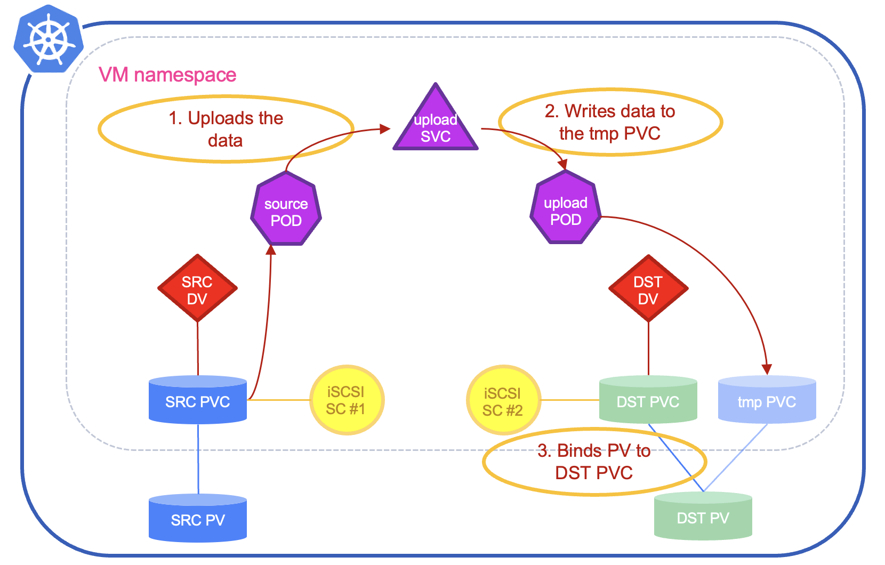
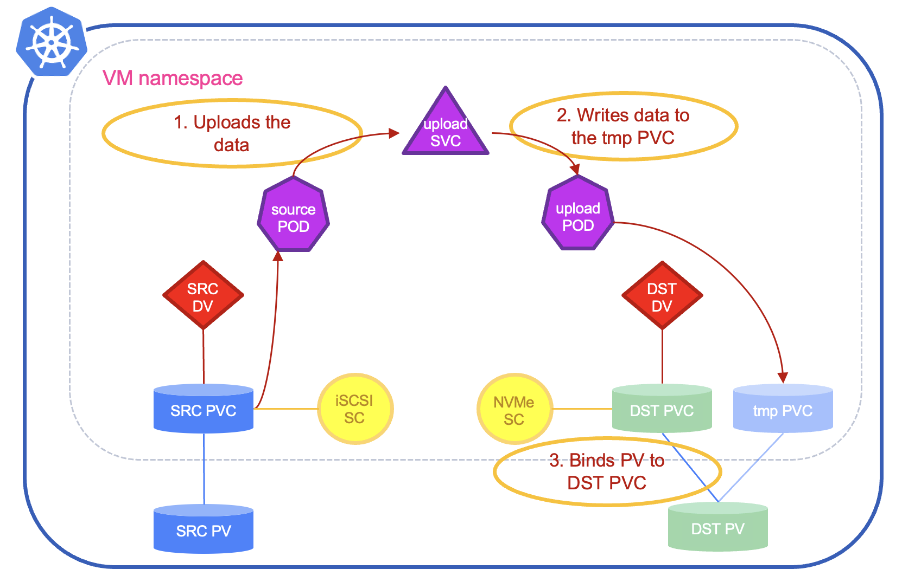
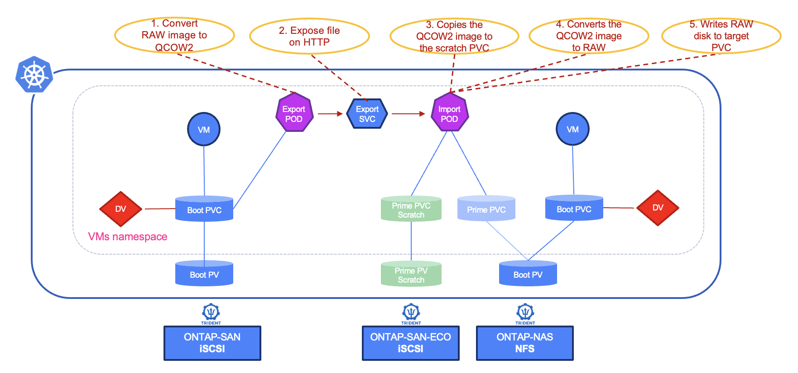

#########################################################################################
# SCENARIO 27: Creating Virtual Machines: boot volume clone (different storage class)
#########################################################################################

We saw in the previous scenario various methods to create a new disk, while keeping the same storage class.  
Let's see here what to expect if you are trying to switch storage class.  

Multiple scenarios can be tested:  
- [Strategy1](#strategy1) cloning to iSCSI (strategy: copy)  
- [Strategy2](#strategy2) cloning to NVMe (strategy: copy)  
- [Strategy3](#strategy3) cloning to NFS (strategy: copy)  
- [Strategy4](#strategy4) cloning to iSCSI (strategy: snapshot)  
- [Strategy5](#strategy5) cloning to NVMe (strategy: snapshot)  
- [Strategy6](#strategy6) cloning to NFS (strategy: snapshot)  

**TL;DR START**  
| CloneStrategy | Target Protocol | Result | Comment |
| :--- | :---: | :---: | :--- | 
| copy | iSCSI | :white_check_mark: | |
| copy | NVMe | :white_check_mark: | |
| copy | NFS | :stop_sign: | CDI clone copy does not perform a block-to-filesystem conversion during PVC clone |
| snapshot | iSCSI | :white_check_mark: | OK, as long as both storage classes use the same Trident backend |
| snapshot | NVMe | :stop_sign: | Trident: cloning with different storage classes that have no common backends is not allowed |
| snapshot | NFS | :stop_sign: | CDI falls back to 'copy' strategy - no block-to-filesystem conversion | 

## A. Scenario preparation.  

Let's delete the Volume Snapshot Class again, in order to use the **copy** method first:  
```bash
$ kubectl delete vsclass --all
volumesnapshotclass.snapshot.storage.k8s.io "csi-snap-class" deleted

$ kubectl get storageprofile storage-class-iscsi -o jsonpath='{.status.cloneStrategy}{"\n"}'
copy
```
The storageProfile is now correctly set for the first part of the scenario.  

If you want, you can quickly restart the Virtual Machine created in [Method3](../3_Method3/) and add a file:  
```bash
virtctl start -n sc27-alpine-c alpine-vm
virtctl ssh alpine@vm/alpine-vm -n sc27-alpine-c --command "echo 'this file was created with the iSCSI storage class' > /home/alpine/file.txt"
virtctl stop -n sc27-alpine-c alpine-vm
```
Of course, you need to wait for the VM to be ready to proceed with the file creation...  

## B. Cloning to a Block Volume with iSCSI (strategy: copy) 
<a name="strategy1"></a>

Let's start by creating a new Storage Class configured for iSCSI. In our case, it will use the same backend as the existing storage class:  
```bash
$ kubectl create -f sc-iscsi-ontap-san2.yaml
storageclass.storage.k8s.io/storage-class-iscsi2 created
```

<p align="center"></p>

We can now proceed with the DataVolume setup:  
```bash
$ cat << EOF | kubectl apply  -f -
apiVersion: cdi.kubevirt.io/v1beta1
kind: DataVolume
metadata:
  name: alpine-boot-clone
  namespace: sc27-alpine-c
  labels:
    method: copy-iscsi
spec:
  pvc:
    accessModes:
      - ReadWriteMany
    resources:
      requests:
        storage: 1Gi
    volumeMode: Block
    storageClassName: storage-class-iscsi2
  contentType: kubevirt
  source:
    pvc:
      name: alpine-boot
      namespace: sc27-alpine-c
EOF
datavolume.cdi.kubevirt.io/alpine-boot-clone created
```
You will see that it is pretty similar to the copy method with the same storage class (cf [Method4 - Strategy1](../4_Method4#strategy1)), in the sense that you get temporary pods that copy the data to a new volume created this time on the target storage class (_storage-class-iscsi2_):  
```bash
$ kubectl get -n sc27-alpine-c all,pvc
NAME                                                          READY   STATUS    RESTARTS   AGE
pod/87850678-38eb-496d-b779-8390af6f6671-source-pod           1/1     Running   0          10s
pod/cdi-upload-tmp-pvc-343cf46d-daa3-4686-80eb-af6b67a88475   1/1     Running   0          21s

NAME                                                              TYPE        CLUSTER-IP     EXTERNAL-IP   PORT(S)   AGE
service/cdi-upload-tmp-pvc-343cf46d-daa3-4686-80eb-af6b67a88475   ClusterIP   10.107.22.76   <none>        443/TCP   21s

NAME                                           PHASE             PROGRESS   RESTARTS   AGE
datavolume.cdi.kubevirt.io/alpine-boot         Succeeded         N/A                   21h
datavolume.cdi.kubevirt.io/alpine-boot-clone   CloneInProgress   1.19%                 22s

NAME                                   AGE   STATUS    READY
virtualmachine.kubevirt.io/alpine-vm   21h   Stopped   False

NAME                                                                 STATUS    VOLUME                                     CAPACITY   ACCESS MODES   STORAGECLASS
        VOLUMEATTRIBUTESCLASS   AGE
persistentvolumeclaim/alpine-boot                                    Bound     pvc-a3fc8aaa-2602-4edb-b12d-d46174948301   1Gi        RWX            storage-class-i
scsi    <unset>                 21h
persistentvolumeclaim/alpine-boot-clone                              Pending                                                                        storage-class-i
scsi2   <unset>                 21s
persistentvolumeclaim/tmp-pvc-343cf46d-daa3-4686-80eb-af6b67a88475   Bound     pvc-3152e4b0-a6ac-4277-93c2-f8c60da6cb31   1Gi        RWX            storage-class-i
scsi2   <unset>                 21s
```
Logs of both temporary pods give you more information about the copy:  
```bash
$ kubectl logs -n sc27-alpine-c pod/cdi-upload-tmp-pvc-343cf46d-daa3-4686-80eb-af6b67a88475 -f
I0720 08:52:26.736409       1 uploadserver.go:81] Running server on 0.0.0.0:8443
I0720 08:52:37.395441       1 uploadserver.go:410] Content type header is "blockdevice-clone"
I0720 08:52:37.405131       1 file.go:230] copyWithSparseCheck to /dev/cdi-block-volume
I0720 08:52:57.147160       1 file.go:195] Read 1073741824 bytes, wrote 121372672 bytes to /dev/cdi-block-volume
I0720 08:52:57.147862       1 uploadserver.go:436] Wrote data to /dev/cdi-block-volume
I0720 08:52:57.148324       1 uploadserver.go:215] Shutting down http server after successful upload
I0720 08:52:57.153025       1 uploadserver.go:115] UploadServer successfully exited

$ kubectl logs -n sc27-alpine-c pod/87850678-38eb-496d-b779-8390af6f6671-source-pod -f
VOLUME_MODE=block
MOUNT_POINT=/dev/cdi-block-volume
UPLOAD_BYTES=1073741824
I0720 08:52:36.561016       3 clone-source.go:223] content-type is "blockdevice-clone"
I0720 08:52:36.561130       3 clone-source.go:224] mount is "/dev/cdi-block-volume"
I0720 08:52:36.561137       3 clone-source.go:225] upload-bytes is 1073741824
I0720 08:52:36.561152       3 clone-source.go:242] Starting cloner target
I0720 08:52:37.357416       3 clone-source.go:258] Set header to blockdevice-clone
I0720 08:52:37.561664       3 prometheus.go:78] 0.94
I0720 08:52:38.562771       3 prometheus.go:78] 6.20
...
I0720 08:52:56.579227       3 prometheus.go:78] 97.11
I0720 08:52:57.130996       3 clone-source.go:127] Wrote 1073741824 bytes
I0720 08:52:57.149432       3 clone-source.go:276] Response body:
I0720 08:52:57.150128       3 clone-source.go:278] clone complete
```
As expected, once the copy the completed, the dataVolume is ready to be used by a Virtual Machine:  
```bash
$ kubectl get -n sc27-alpine-c all,pvc  -l method=copy-iscsi
Warning: kubevirt.io/v1 VirtualMachineInstancePresets is now deprecated and will be removed in v2.
NAME                                           PHASE       PROGRESS   RESTARTS   AGE
datavolume.cdi.kubevirt.io/alpine-boot-clone   Succeeded   100.0%                2m42s

NAME                                      STATUS   VOLUME                                     CAPACITY   ACCESS MODES   STORAGECLASS           VOLUMEATTRIBUTESCLASS   AGE
persistentvolumeclaim/alpine-boot-clone   Bound    pvc-3152e4b0-a6ac-4277-93c2-f8c60da6cb31   1Gi        RWX            storage-class-iscsi2   <unset>                 2m41s
```
You can use the *alpine_vm_clone1_wo_cloudinit.yaml* file this time. As the boot disk was already customized, no need to go through similar step this time:  
```bash
$ kubectl create -f alpine_vm_clone1_wo_cloudinit.yaml -n sc27-alpine-c
virtualmachine.kubevirt.io/alpine-vm-clone created
```
The result would look like the following:
```bash
$ kubectl get -n sc27-alpine-c all,pvc -l method=copy-iscsi
Warning: kubevirt.io/v1 VirtualMachineInstancePresets is now deprecated and will be removed in v2.
NAME                                           PHASE       PROGRESS   RESTARTS   AGE
datavolume.cdi.kubevirt.io/alpine-boot-clone   Succeeded   100.0%                61m

NAME                                         AGE   STATUS    READY
virtualmachine.kubevirt.io/alpine-vm-clone   30s   Running   True

NAME                                      STATUS   VOLUME                                     CAPACITY   ACCESS MODES   STORAGECLASS           VOLUMEATTRIBUTESCLASS   AGE
persistentvolumeclaim/alpine-boot-clone   Bound    pvc-3152e4b0-a6ac-4277-93c2-f8c60da6cb31   1Gi        RWX            storage-class-iscsi2   <unset>                 61m
```
Let's enter the VM to check that our file is present:  
```bash
$ virtctl console alpine-vm-clone -n sc27-alpine-c
Successfully connected to alpine-vm-clone console. Press Ctrl+] or Ctrl+5 to exit console.

Welcome to Alpine Linux 3.22
Kernel 6.12.38-0-virt on x86_64 (/dev/ttyS0)

alpine-vm-clone.sc27-alpine-c.svc.cluster.local login: alpine
Password:
Welcome to Alpine Linux on KubeVirt in the NetApp LoD!
alpine-vm-clone:~$ more file.txt
this file was created with the iSCSI storage class
```
First test successful!  

We can now delete this VM and proceed with the next test.
```bash
virtctl stop alpine-vm-clone -n sc27-alpine-c
kubectl delete all -n sc27-alpine-c -l method=copy-iscsi
```


## C. Cloning to a Block Volume with NVMe (strategy: copy) 
<a name="strategy2"></a>

<p align="center"></p>

This time, we will create a DataVolume, with a reference to the storage class configured for NVMe:  
```bash
$ cat << EOF | kubectl apply  -f -
apiVersion: cdi.kubevirt.io/v1beta1
kind: DataVolume
metadata:
  name: alpine-boot-clone
  namespace: sc27-alpine-c
  labels:
    method: copy-nvme
spec:
  pvc:
    accessModes:
      - ReadWriteMany
    resources:
      requests:
        storage: 1Gi
    volumeMode: Block
    storageClassName: storage-class-nvme
  contentType: kubevirt
  source:
    pvc:
      name: alpine-boot
      namespace: sc27-alpine-c
EOF
datavolume.cdi.kubevirt.io/alpine-boot-clone created
```
The expected result of this chapter is similar to the previous one, with the difference that we now use 2 differents storage protocols via 2 different Trident backends:  
```bash
$ kubectl get -n sc27-alpine-c all,pvc
NAME                                                          READY   STATUS    RESTARTS   AGE
pod/157cce3a-8011-448d-bc17-6daaec7ee220-source-pod           1/1     Running   0          17s
pod/cdi-upload-tmp-pvc-01ba85c3-c3a0-476d-840e-829e9bcf1d15   1/1     Running   0          31s

NAME                                                              TYPE        CLUSTER-IP       EXTERNAL-IP   PORT(S)   AGE
service/cdi-upload-tmp-pvc-01ba85c3-c3a0-476d-840e-829e9bcf1d15   ClusterIP   10.102.225.209   <none>        443/TCP   31s

NAME                                           PHASE             PROGRESS   RESTARTS   AGE
datavolume.cdi.kubevirt.io/alpine-boot         Succeeded         N/A                   24h
datavolume.cdi.kubevirt.io/alpine-boot-clone   CloneInProgress   21.88%                32s

NAME                                   AGE   STATUS    READY
virtualmachine.kubevirt.io/alpine-vm   24h   Stopped   False

NAME                                                                 STATUS    VOLUME                                     CAPACITY   ACCESS MODES   STORAGECLASS
       VOLUMEATTRIBUTESCLASS   AGE
persistentvolumeclaim/alpine-boot                                    Bound     pvc-a3fc8aaa-2602-4edb-b12d-d46174948301   1Gi        RWX            storage-class-i
scsi   <unset>                 24h
persistentvolumeclaim/alpine-boot-clone                              Pending                                                                        storage-class-n
vme    <unset>                 32s
persistentvolumeclaim/tmp-pvc-01ba85c3-c3a0-476d-840e-829e9bcf1d15   Bound     pvc-157cce3a-8011-448d-bc17-6daaec7ee220   1Gi        RWX            storage-class-n
vme    <unset>                 31s
```
Temporary logs are the following:  
```bash
$ kubectl logs -n sc27-alpine-c pod/cdi-upload-tmp-pvc-e9c266b3-fa43-481b-9a88-8a3410045cef -f
I0720 11:40:23.505872       1 uploadserver.go:81] Running server on 0.0.0.0:8443
I0720 11:40:35.354422       1 uploadserver.go:410] Content type header is "blockdevice-clone"
I0720 11:40:35.360951       1 file.go:230] copyWithSparseCheck to /dev/cdi-block-volume
E0720 11:40:35.365927       1 file.go:218] Error zeroing range in destination file: operation not supported, will write zeros directly
I0720 11:40:35.366045       1 file.go:140] Writing 163840 zero bytes at offset 1114112
I0720 11:40:58.194938       1 file.go:195] Read 1073741824 bytes, wrote 1073741824 bytes to /dev/cdi-block-volume
I0720 11:40:58.195817       1 uploadserver.go:436] Wrote data to /dev/cdi-block-volume
I0720 11:40:58.198340       1 uploadserver.go:215] Shutting down http server after successful upload
I0720 11:40:58.203296       1 uploadserver.go:115] UploadServer successfully exited

$ kubectl logs -n sc27-alpine-c  pod/dd73ec1e-88d8-4cbc-b97f-e0c6c2d14e08-source-pod -f
VOLUME_MODE=block
MOUNT_POINT=/dev/cdi-block-volume
UPLOAD_BYTES=1073741824
I0720 11:40:34.641389       3 clone-source.go:223] content-type is "blockdevice-clone"
I0720 11:40:34.641833       3 clone-source.go:224] mount is "/dev/cdi-block-volume"
I0720 11:40:34.641851       3 clone-source.go:225] upload-bytes is 1073741824
I0720 11:40:34.641885       3 clone-source.go:242] Starting cloner target
I0720 11:40:35.337268       3 clone-source.go:258] Set header to blockdevice-clone
I0720 11:40:35.643434       3 prometheus.go:78] 1.78
I0720 11:40:36.644646       3 prometheus.go:78] 7.05
...
I0720 11:40:57.681654       3 prometheus.go:78] 99.77
I0720 11:40:57.713629       3 clone-source.go:127] Wrote 1073741824 bytes
I0720 11:40:58.198517       3 clone-source.go:276] Response body:
I0720 11:40:58.198576       3 clone-source.go:278] clone complete
```
Notice the error in the first pod's logs?  
This is harmless and just means zeroing is not supported in the ONTAP version configured in the lab.  

Once done, you will find the the DV and its PVC:  
```bash
$ kubectl get -n sc27-alpine-c all,pvc  -l method=copy-nvme
Warning: kubevirt.io/v1 VirtualMachineInstancePresets is now deprecated and will be removed in v2.
NAME                                           PHASE       PROGRESS   RESTARTS   AGE
datavolume.cdi.kubevirt.io/alpine-boot-clone   Succeeded   100.0%                4m28s

NAME                                      STATUS   VOLUME                                     CAPACITY   ACCESS MODES   STORAGECLASS         VOLUMEATTRIBUTESCLASS   AGE
persistentvolumeclaim/alpine-boot-clone   Bound    pvc-dd73ec1e-88d8-4cbc-b97f-e0c6c2d14e08   1Gi        RWX            storage-class-nvme   <unset>                 4m28s
```
You can use the *alpine_vm_clone2_wo_cloudinit.yaml* file this time. As the boot disk was already customized, no need to go through similar step this time:  
```bash
$ kubectl create -f alpine_vm_clone2_wo_cloudinit.yaml -n sc27-alpine-c
virtualmachine.kubevirt.io/alpine-vm-clone created
```
After a couple of seconds, you will see the VM running:  
```bash
$ kubectl get -n sc27-alpine-c all,pvc -l method=copy-nvme
NAME                                           PHASE       PROGRESS   RESTARTS   AGE
datavolume.cdi.kubevirt.io/alpine-boot-clone   Succeeded   100.0%                8m52s

NAME                                         AGE   STATUS    READY
virtualmachine.kubevirt.io/alpine-vm-clone   40s   Running   True

NAME                                      STATUS   VOLUME                                     CAPACITY   ACCESS MODES   STORAGECLASS         VOLUMEATTRIBUTESCLASS   AGE
persistentvolumeclaim/alpine-boot-clone   Bound    pvc-dd73ec1e-88d8-4cbc-b97f-e0c6c2d14e08   1Gi        RWX            storage-class-nvme   <unset>                 8m52s
```

Last, let's enter the VM to check that our file is present:  
```bash
$ virtctl console alpine-vm-clone -n sc27-alpine-c
Successfully connected to alpine-vm-clone console. Press Ctrl+] or Ctrl+5 to exit console.

Welcome to Alpine Linux 3.22
Kernel 6.12.38-0-virt on x86_64 (/dev/ttyS0)

alpine-vm-clone.sc27-alpine-c.svc.cluster.local login: alpine
Password:
Welcome to Alpine Linux on KubeVirt in the NetApp LoD!
alpine-vm-clone:~$ more file.txt
this file was created with the iSCSI storage class
```
Second test successful!  

We can now delete this VM and proceed with the next test.
```bash
virtctl stop alpine-vm-clone -n sc27-alpine-c
kubectl delete all -n sc27-alpine-c -l method=copy-nvme
```

## D. Cloning to a FileSystem Volume with NFS (strategy: copy) 
<a name="strategy3"></a>

We can now proceed with the DataVolume setup:  
```bash
$ cat << EOF | kubectl apply  -f -
apiVersion: cdi.kubevirt.io/v1beta1
kind: DataVolume
metadata:
  name: alpine-boot-clone
  namespace: sc27-alpine-c
  labels:
    method: copy-nfs
spec:
  pvc:
    accessModes:
      - ReadWriteMany
    resources:
      requests:
        storage: 1Gi
    storageClassName: storage-class-nfs
  contentType: kubevirt
  source:
    pvc:
      name: alpine-boot
      namespace: sc27-alpine-c
EOF
datavolume.cdi.kubevirt.io/alpine-boot-clone created
```
Notice that the field _volumeMode_ is absent, this is simply because a NFS PVC cannot be presented as a raw block device.  
```bash
$ kubectl get -n sc27-alpine-c all,pvc
NAME                                           PHASE             PROGRESS   RESTARTS   AGE
datavolume.cdi.kubevirt.io/alpine-boot         Succeeded         N/A                   24h
datavolume.cdi.kubevirt.io/alpine-boot-clone   CloneInProgress   N/A                   5s

NAME                                   AGE   STATUS    READY
virtualmachine.kubevirt.io/alpine-vm   24h   Stopped   False

NAME                                                                 STATUS    VOLUME                                     CAPACITY   ACCESS MODES   STORAGECLASS
       VOLUMEATTRIBUTESCLASS   AGE
persistentvolumeclaim/alpine-boot                                    Bound     pvc-a3fc8aaa-2602-4edb-b12d-d46174948301   1Gi        RWX            storage-class-i
scsi   <unset>                 24h
persistentvolumeclaim/alpine-boot-clone                              Pending                                                                        storage-class-n
fs     <unset>                 5s
persistentvolumeclaim/tmp-pvc-7f645aa5-952e-418a-986e-7331267bed89   Bound     pvc-4664b447-a9fe-4f6c-aa64-d928edc75b98   1Gi        RWX            storage-class-n
fs     <unset>                 5s
```
In this case, the DV will be stuck in 'alpine-boot-clone' status, constantly trying to reconcile...  
However, the blocker is not clone strategy anymore. It is source/target format compatibility:
- Source PVC is Block (iSCSI block device).
- Target PVC is Filesystem on NFS.
- CDI clone copy does not perform a block-to-filesystem conversion during PVC clone.

So even with cloneStrategy: copy the request will not succeed.  
We can then delete that DV: 
```bash
kubectl delete -n sc27-alpine-c datavolume.cdi.kubevirt.io/alpine-boot-clone
```

In this context, what can you do to recreate your Virtual Machine with NFS?  
A solution could be to go through an export/import procedure with a temporary pod.  

<p align="center"></p>

As the source PVC is ReadWriteMany, this temporary pod can read its data, convert it to a qcow2 file & expose it through HTTP for a new DataVolume:    
```bash
$ cat <<'EOF' | kubectl apply -f -
apiVersion: v1
kind: Pod
metadata:
  name: pvc-qcow2-exporter
  namespace: sc27-alpine-c
  labels:
    app: pvc-qcow2-exporter
spec:
  restartPolicy: Never
  containers:
  - name: exporter
    image: quay.io/kubevirt/container-disk-v1alpha:latest
    command:
    - /bin/sh
    - -c
    - |
      set -e
      mkdir -p /data
      qemu-img convert -f raw -O qcow2 /dev/srcdisk /data/src.qcow2
      python3 -m http.server 8080 --directory /data
    volumeDevices:
    - name: src
      devicePath: /dev/srcdisk
    ports:
    - containerPort: 8080
  volumes:
  - name: src
    persistentVolumeClaim:
      claimName: alpine-boot
---
apiVersion: v1
kind: Service
metadata:
  name: pvc-qcow2-exporter
  namespace: sc27-alpine-c
spec:
  selector:
    app: pvc-qcow2-exporter
  ports:
  - port: 8080
    targetPort: 8080
EOF
```
In our demo, the export is pretty quick, and the file is already available:  
```bash
$ kubectl exec -n sc27-alpine-c pod/pvc-qcow2-exporter -- ls -hl /data
total 195M
-rw-r--r--. 1 root root 117M Jul 20 12:57 src.qcow2
```
Let's recreate the DV, but this time instead of using a PVC as the source, we will use an HTTP URL pointing to the exporter service:  
```bash
$ cat <<'EOF' | kubectl apply -f -
apiVersion: cdi.kubevirt.io/v1beta1
kind: DataVolume
metadata:
  name: alpine-boot-import-nfs-qcow2
  namespace: sc27-alpine-c
  labels:
    method: export-import-nfs
spec:
  pvc:
    accessModes:
      - ReadWriteMany
    resources:
      requests:
        storage: 2Gi
    storageClassName: storage-class-nfs
    volumeMode: Filesystem
  source:
    http:
      url: "http://pvc-qcow2-exporter.sc27-alpine-c.svc.cluster.local:8080/src.qcow2"
EOF
datavolume.cdi.kubevirt.io/alpine-boot-import-nfs-qcow2 created
```
Pretty quickly, you will see 3 new PVC as well as an _importer_ pod:  
- the **pod** is here to import and convert the VM image.  
- the **scratch** RWO PVC will be used to copy the image from the exporter service.  
- the **prime** RWX PVC will be used to host the target converted image.  
  
```bash
$ kubectl get -n sc27-alpine-c all,pvc
NAME                                                      READY   STATUS       RESTARTS   AGE
pod/importer-prime-118806b9-1cbd-4bc1-a8f4-e115dfb07e73   1/1     Running      0          4s
pod/pvc-qcow2-exporter                                    1/1     Running      0          47m

NAME                         TYPE        CLUSTER-IP      EXTERNAL-IP   PORT(S)    AGE
service/pvc-qcow2-exporter   ClusterIP   10.100.75.109   <none>        8080/TCP   47m

NAME                                                      PHASE             PROGRESS   RESTARTS   AGE
datavolume.cdi.kubevirt.io/alpine-boot                    Succeeded         N/A                   25h
datavolume.cdi.kubevirt.io/alpine-boot-import-nfs-qcow2   ImportScheduled   N/A                   29s

NAME                                   AGE   STATUS    READY
virtualmachine.kubevirt.io/alpine-vm   25h   Stopped   False

NAME                                                                       STATUS    VOLUME                                     CAPACITY   ACCESS MODES   STORAGECLASS                  VOLU
MEATTRIBUTESCLASS   AGE
persistentvolumeclaim/alpine-boot                                          Bound     pvc-a3fc8aaa-2602-4edb-b12d-d46174948301   1Gi        RWX            storage-class-iscsi           <unset>                 25h
persistentvolumeclaim/alpine-boot-import-nfs-qcow2                         Pending                                                                        storage-class-nfs             <unset>                 29s
persistentvolumeclaim/prime-118806b9-1cbd-4bc1-a8f4-e115dfb07e73           Bound     pvc-97691c9f-42d9-4b28-a430-dc2c59a2f78c   2Gi        RWX            storage-class-nfs             <unset>                 29s
persistentvolumeclaim/prime-118806b9-1cbd-4bc1-a8f4-e115dfb07e73-scratch   Bound     pvc-912fb2bf-83e9-40b8-b0eb-97ab8b862f72   2Gi        RWO            storage-class-iscsi-economy   <unset>                 4s
```
The logs of the importer pod display the process to create the target volume:  
```bash
$ kubectl logs -n sc27-alpine-c pod/importer-prime-118806b9-1cbd-4bc1-a8f4-e115dfb07e73 -f
I0720 13:36:08.395375       1 importer.go:107] Starting importer
I0720 13:36:08.397265       1 importer.go:182] begin import process
I0720 13:36:08.479797       1 data-processor.go:361] Calculating available size
I0720 13:36:08.482060       1 data-processor.go:373] Checking out file system volume size.
I0720 13:36:08.482683       1 data-processor.go:380] Request image size not empty.
I0720 13:36:08.482792       1 data-processor.go:386] Target size 2147221504.
I0720 13:36:08.485155       1 nbdkit.go:371] Waiting for nbdkit PID.
I0720 13:36:08.986576       1 nbdkit.go:392] nbdkit ready.
I0720 13:36:08.986798       1 data-processor.go:260] New phase: TransferScratch
I0720 13:36:08.989195       1 file.go:230] copyWithSparseCheck to /scratch/tmpimage
I0720 13:36:09.981939       1 file.go:195] Read 122552320 bytes, wrote 121696768 bytes to /scratch/tmpimage
I0720 13:36:09.984203       1 data-processor.go:260] New phase: Convert
I0720 13:36:09.984244       1 data-processor.go:266] Validating image
I0720 13:36:09.988665       1 prometheus.go:78] 100.00
E0720 13:36:10.002205       1 prlimit.go:156] failed to kill the process; os: process already finished
I0720 13:36:10.003823       1 qemu.go:119] Running qemu-img with args: [convert -t writeback -p -O raw /scratch/tmpimage /data/disk.img]
I0720 13:36:10.012761       1 qemu.go:283] 0.00
I0720 13:36:10.136600       1 qemu.go:283] 1.02
...
I0720 13:36:10.369434       1 qemu.go:283] 99.36
E0720 13:36:11.061423       1 prlimit.go:156] failed to kill the process; os: process already finished
I0720 13:36:11.062102       1 data-processor.go:260] New phase: Resize
E0720 13:36:11.155253       1 prlimit.go:156] failed to kill the process; os: process already finished
W0720 13:36:11.155341       1 data-processor.go:343] Available space less than requested size, resizing image to available space 2024800256.
I0720 13:36:11.155351       1 data-processor.go:354] Expanding image size to: 2024800256
E0720 13:36:11.287861       1 prlimit.go:156] failed to kill the process; os: process already finished
I0720 13:36:11.287935       1 data-processor.go:266] Validating image
E0720 13:36:11.353628       1 prlimit.go:156] failed to kill the process; os: process already finished
I0720 13:36:11.361647       1 data-processor.go:260] New phase: Complete
I0720 13:36:11.363408       1 importer.go:231] {"scratchSpaceRequired":false,"preallocationApplied":false,"message":"Import Complete"}
```
You can also find interesting information in the *prime* PVC, especially regarding the endpoint where the image was retrieved:  
```bash
$ kdesc -n sc27-alpine-c persistentvolumeclaim/prime-118806b9-1cbd-4bc1-a8f4-e115dfb07e73
Name:          prime-118806b9-1cbd-4bc1-a8f4-e115dfb07e73
Namespace:     sc27-alpine-c
StorageClass:  storage-class-nfs
...
Annotations:   cdi.kubevirt.io/storage.bind.immediate.requested:
               cdi.kubevirt.io/storage.condition.running: false
               cdi.kubevirt.io/storage.condition.running.message: Import Complete
               cdi.kubevirt.io/storage.condition.running.reason: Completed
               cdi.kubevirt.io/storage.contentType: kubevirt
               cdi.kubevirt.io/storage.import.endpoint: http://pvc-qcow2-exporter.sc27-alpine-c.svc.cluster.local:8080/src.qcow2
               cdi.kubevirt.io/storage.import.importPodName: importer-prime-118806b9-1cbd-4bc1-a8f4-e115dfb07e73
               cdi.kubevirt.io/storage.import.requiresScratch: false
               cdi.kubevirt.io/storage.import.source: http
               cdi.kubevirt.io/storage.pod.phase: Succeeded
               cdi.kubevirt.io/storage.pod.restarts: 0
               cdi.kubevirt.io/storage.pod.schedulable: true
               cdi.kubevirt.io/storage.populator.kind: VolumeImportSource
               cdi.kubevirt.io/storage.preallocation.requested: false
...
```
Now, you have a nice new boot PVC:  
```bash
$ kubectl get -n sc27-alpine-c all,pvc -l  method=export-import-nfs
Warning: kubevirt.io/v1 VirtualMachineInstancePresets is now deprecated and will be removed in v2.
NAME                                                      PHASE       PROGRESS   RESTARTS   AGE
datavolume.cdi.kubevirt.io/alpine-boot-import-nfs-qcow2   Succeeded   100.0%                15m

NAME                                                 STATUS   VOLUME                                     CAPACITY   ACCESS MODES   STORAGECLASS        VOLUMEATTRIBUTESCLASS   AGE
persistentvolumeclaim/alpine-boot-import-nfs-qcow2   Bound    pvc-97691c9f-42d9-4b28-a430-dc2c59a2f78c   2Gi        RWX            storage-class-nfs   <unset>                 15m
```
You can use the *alpine_vm_clone3_wo_cloudinit.yaml* file this time. As the boot disk was already customized, no need to go through similar step this time:  
```bash
$ kubectl create -f alpine_vm_clone3_wo_cloudinit.yaml -n sc27-alpine-c
virtualmachine.kubevirt.io/alpine-vm-clone created
``` 
After a couple of seconds, you will see the VM running:  
```bash
$ kubectl get -n sc27-alpine-c all,pvc -l method=export-import-nfs
NAME                                           PHASE       PROGRESS   RESTARTS   AGE
datavolume.cdi.kubevirt.io/alpine-boot-clone   Succeeded   100.0%                8m52s

NAME                                         AGE   STATUS    READY
virtualmachine.kubevirt.io/alpine-vm-clone   40s   Running   True

NAME                                                  STATUS   VOLUME                                     CAPACITY   ACCESS MODES   STORAGECLASS        VOLUMEATTRIBUTESCLASS   AGE
persistentvolumeclaim/alpine-boot-import-nfs-qcow2    Bound    pvc-97691c9f-42d9-4b28-a430-dc2c59a2f78c   2Gi        RWX            storage-class-nfs   <unset>                 8m52s
```

Last, let's enter the VM to check that our file is present:  
```bash
$ virtctl console alpine-vm-clone -n sc27-alpine-c
Successfully connected to alpine-vm-clone console. Press Ctrl+] or Ctrl+5 to exit console.

Welcome to Alpine Linux 3.22
Kernel 6.12.38-0-virt on x86_64 (/dev/ttyS0)

alpine-vm-clone.sc27-alpine-c.svc.cluster.local login: alpine
Password:
Welcome to Alpine Linux on KubeVirt in the NetApp LoD!
alpine-vm-clone:~$ more file.txt
this file was created with the iSCSI storage class
```
Third test _worked around_!  

We can now delete this VM and proceed with the next test.
```bash
virtctl stop alpine-vm-clone -n sc27-alpine-c
kubectl delete all -n sc27-alpine-c -l method=export-import-nfs
kubectl delete svc,pod -n sc27-alpine-c pvc-qcow2-exporter
```


## E. Storage Profile update

Let's recreate a new Volume Snapshot Class, and check the clone strategy switched to **snapshot**:  
```bash
$ kubectl create -f ../../../Scenario13/1_CSI_Snapshots/sc-volumesnapshot.yaml
volumesnapshotclass.snapshot.storage.k8s.io/csi-snap-class created

$ kubectl get storageprofile storage-class-iscsi -o jsonpath='{.status.cloneStrategy}{"\n"}'
snapshot
```

## F. Cloning to a Block Volume with iSCSI (strategy: snapshot) 
<a name="strategy4"></a>

We will try this strategy using the second iSCSI storage class created in the first example of this chapter:  
```bash
$ cat << EOF | kubectl apply  -f -
apiVersion: cdi.kubevirt.io/v1beta1
kind: DataVolume
metadata:
  name: alpine-boot-clone
  namespace: sc27-alpine-c
  labels:
    method: snapshot-iscsi
spec:
  pvc:
    accessModes:
      - ReadWriteMany
    resources:
      requests:
        storage: 1Gi
    volumeMode: Block
    storageClassName: storage-class-iscsi2
  contentType: kubevirt
  source:
    pvc:
      name: alpine-boot
      namespace: sc27-alpine-c
EOF
datavolume.cdi.kubevirt.io/alpine-boot-clone created
```
This is super fast!  
A CSI Snapshot is immediately created for the existing volume:  
```bash
$ kubectl get vs -n sc27-alpine-c
NAME                                                READYTOUSE   SOURCEPVC     SOURCESNAPSHOTCONTENT   RESTORESIZE   SNAPSHOTCLASS    SNAPSHOTCONTENT                                    CREATIONTIME   AGE
tmp-snapshot-552bea84-c0bc-4abe-a608-cd627be0740f   true         alpine-boot                           1Gi           csi-snap-class   snapcontent-93eca789-d2bd-462a-9958-76acfd336868   68s            69s
```
And right after that, your new boot volume will be available:  
```bash
[root@rhel3 5_Method5]# kubectl get all,pvc,vs -n sc27-alpine-c  -l method=snapshot-iscsi
Warning: kubevirt.io/v1 VirtualMachineInstancePresets is now deprecated and will be removed in v2.
NAME                                           PHASE       PROGRESS   RESTARTS   AGE
datavolume.cdi.kubevirt.io/alpine-boot-clone   Succeeded   100.0%                38s

NAME                                      STATUS   VOLUME                                     CAPACITY   ACCESS MODES   STORAGECLASS           VOLUMEATTRIBUTESCLASS   AGE
persistentvolumeclaim/alpine-boot-clone   Bound    pvc-4a027919-8994-401e-a31c-4ff2ff610848   1Gi        RWX            storage-class-iscsi2   <unset>                 38s
```
You can find in the DataVolume, the chain of events:  
```bash
 kubectl get events -n sc27-alpine-c --field-selector involvedObject.kind=DataVolume,involvedObject.name=alpine-boot-clone
LAST SEEN   TYPE      REASON                              OBJECT                         MESSAGE
5m4s        Normal    CloneScheduled                      datavolume/alpine-boot-clone   Cloning from sc27-alpine-c/alpine-boot into sc27-alpine-c/alpine-boot-clone scheduled
5m4s        Normal    Pending                             datavolume/alpine-boot-clone   PVC alpine-boot-clone Pending
5m4s        Warning   Pending                             datavolume/alpine-boot-clone   Clone Pending
5m4s        Normal    SnapshotForSmartCloneInProgress     datavolume/alpine-boot-clone   Creating snapshot for smart-clone is in progress (for pvc sc27-alpine-c/alpine-boot)
5m3s        Normal    CloneFromSnapshotSourceInProgress   datavolume/alpine-boot-clone   Creating PVC from snapshot source is in progress (for pvc sc27-alpine-c/alpine-boot)
5m3s        Normal    RebindInProgress                    datavolume/alpine-boot-clone   Rebinding PersistentVolumeClaim for DataVolume sc27-alpine-c/alpine-boot-clone
5m3s        Normal    Bound                               datavolume/alpine-boot-clone   PVC alpine-boot-clone Bound
5m3s        Normal    CloneSucceeded                      datavolume/alpine-boot-clone   Successfully cloned from sc27-alpine-c/alpine-boot into sc27-alpine-c/alpine-boot-clone
``
Connecting to the ONTAP cli, you can see that our new volume is actually a clone from the original PVC, based on the temporary snapshot:  
```bash
cluster1::> vol clone show
                      Parent  Parent        Parent
Vserver FlexClone     Vserver Volume        Snapshot             State     Type
------- ------------- ------- ------------- -------------------- --------- ----
sansvm  trident_pvc_4a027919_8994_401e_a31c_4ff2ff610848
                      sansvm  trident_pvc_a3fc8aaa_2602_4edb_b12d_d46174948301d
                                            snapshot-93eca789-d2bd-462a-9958-76acfd336868
                                                                 online    RW
```

You can use the *alpine_vm_clone4_wo_cloudinit.yaml* file to launch the Virtual Machine creation:  
```bash
$ kubectl create -f alpine_vm_clone4_wo_cloudinit.yaml -n sc27-alpine-c
virtualmachine.kubevirt.io/alpine-vm-clone created

$ kubectl get vm -n sc27-alpine-c  -l method=snapshot-iscsi
NAME              AGE   STATUS    READY
alpine-vm-clone   37s   Running   True
```
Last, you can check the file created in the source VM is present in the clone:  
```bash
virtctl ssh alpine@vm/alpine-vm-clone -n sc27-alpine-c --command "more /home/alpine/file.txt"
...
this file was created with the iSCSI storage class
```
There you go!  

We can now delete this VM and proceed with the next test.
```bash
virtctl stop alpine-vm-clone -n sc27-alpine-c
kubectl delete all -n sc27-alpine-c -l method=snapshot-iscsi
```
The temporary VolumeSnapshot will automatically be deleted after a few 10s of seconds.  


## G. Cloning to a Block Volume with NVMe (strategy: snapshot) 
<a name="strategy5"></a>

Let's try to clone our volume to a different Block protocol:    
```bash
$ cat << EOF | kubectl apply  -f -
apiVersion: cdi.kubevirt.io/v1beta1
kind: DataVolume
metadata:
  name: alpine-boot-clone
  namespace: sc27-alpine-c
  labels:
    method: snapshot-nvme
spec:
  pvc:
    accessModes:
      - ReadWriteMany
    resources:
      requests:
        storage: 1Gi
    volumeMode: Block
    storageClassName: storage-class-nvme
  contentType: kubevirt
  source:
    pvc:
      name: alpine-boot
      namespace: sc27-alpine-c
EOF
datavolume.cdi.kubevirt.io/alpine-boot-clone created
```
The new DV & PVC will appear quickly, however their creation will fail (or stay in _Pending_ state for a very long time):  
```bash
$ kubectl get -n sc27-alpine-c all,pvc -l method=snapshot-nvme
Warning: kubevirt.io/v1 VirtualMachineInstancePresets is now deprecated and will be removed in v2.
NAME                                           PHASE                               PROGRESS   RESTARTS   AGE
datavolume.cdi.kubevirt.io/alpine-boot-clone   CloneFromSnapshotSourceInProgress   N/A                   48s

NAME                                                                 STATUS    VOLUME   CAPACITY   ACCESS MODES   STORAGECLASS         VOLUMEATTRIBUTESCLASS   AGE
persistentvolumeclaim/alpine-boot-clone                              Pending                                      storage-class-nvme   <unset>                 48s
persistentvolumeclaim/tmp-pvc-0af69855-30da-4404-8de3-fa9616dfdc6a   Pending                                      storage-class-nvme   <unset>                 48s
```
DataVolume events do not say much:  
```bash
$ kubectl get events -n sc27-alpine-c --field-selector involvedObject.kind=DataVolume,involvedObject.name=alpine-boot-clone
LAST SEEN   TYPE      REASON                              OBJECT                         MESSAGE
2m8s        Normal    CloneScheduled                      datavolume/alpine-boot-clone   Cloning from sc27-alpine-c/alpine-boot into sc27-alpine-c/alpine-boot-clone scheduled
2m8s        Normal    Pending                             datavolume/alpine-boot-clone   PVC alpine-boot-clone Pending
2m8s        Normal    SnapshotForSmartCloneInProgress     datavolume/alpine-boot-clone   Creating snapshot for smart-clone is in progress (for pvc sc27-alpine-c/alpine-boot)
2m7s        Normal    CloneFromSnapshotSourceInProgress   datavolume/alpine-boot-clone   Creating PVC from snapshot source is in progress (for pvc sc27-alpine-c/alpine-boot)
```
PVC do not say anything interesting...  
However, checking the Trident logs will tell you what is happening:  
```bash
time="2026-07-31T08:09:34Z" level=error msg="GRPC error: rpc error: code = Unknown desc = clone volume pvc-28caacd6-4c06-4c4e-9fa4-fac2f465bd83 from source volume pvc-045dfcbd-baf1-41c1-89d8-fa672c92e5ed with different storage classes that have no common backends is not allowed" logLayer=csi_frontend requestID=d4337b6a-159c-42d5-8bba-c7463f5434ed requestSource=CSI
```
Makes total sense. You are only allowed to clone volumes if they share a common backend!  
Now, what if you really want to get this VM running with NVMe?  
- change the storage profile to 'copy'.  
- export/import the disk

You can now delete this test:  
```bash
kubectl delete all -n sc27-alpine-c -l method=snapshot-nvme
```

## H. Cloning to a FileSystem Volume with NFS (strategy: snapshot) 
<a name="strategy6"></a>

Last, let's try to clone our volume to a NFS filesystem (note that VolumeMode Block is not supported with NFS):   
```bash
$ cat << EOF | kubectl apply  -f -
apiVersion: cdi.kubevirt.io/v1beta1
kind: DataVolume
metadata:
  name: alpine-boot-clone
  namespace: sc27-alpine-c
  labels:
    method: snapshot-nfs
spec:
  pvc:
    accessModes:
      - ReadWriteMany
    resources:
      requests:
        storage: 1Gi
    storageClassName: storage-class-nfs
  contentType: kubevirt
  source:
    pvc:
      name: alpine-boot
      namespace: sc27-alpine-c
EOF
```
This time, it goes one step further:  
```bash
$ kubectl get -n sc27-alpine-c all,pvc -l method=snapshot-nfs
Warning: kubevirt.io/v1 VirtualMachineInstancePresets is now deprecated and will be removed in v2.
NAME                                           PHASE             PROGRESS   RESTARTS   AGE
datavolume.cdi.kubevirt.io/alpine-boot-clone   CloneInProgress   N/A                   3m33s

NAME                                                                 STATUS    VOLUME                                     CAPACITY   ACCESS MODES   STORAGECLASS        VOLUMEATTRIBUTESCLASS   AGE
persistentvolumeclaim/alpine-boot-clone                              Pending                                                                        storage-class-nfs   <unset>                 3m32s
persistentvolumeclaim/tmp-pvc-5bce7030-0e6d-42a5-a642-83daf040b4cf   Bound     pvc-1edd9916-da40-41c0-91b2-10e475d137ac   1Gi        RWX            storage-class-nfs   <unset>                 3m32s
```
However, you will see in the PVCs annotations that your operation is not feasible:  
```bash
$ kubectl describe -n sc27-alpine-c persistentvolumeclaim/tmp-pvc-5bce7030-0e6d-42a5-a642-83daf040b4cf
Name:          tmp-pvc-5bce7030-0e6d-42a5-a642-83daf040b4cf
Namespace:     sc27-alpine-c
StorageClass:  storage-class-nfs
Status:        Bound
Volume:        pvc-1edd9916-da40-41c0-91b2-10e475d137ac
...
Annotations:   cdi.kubevirt.io/cloneFallbackReason: The volume modes of source and target are incompatible
               cdi.kubevirt.io/clonePhase: Pending
               cdi.kubevirt.io/cloneType: copy
               cdi.kubevirt.io/createdForDataVolume: 0e2a0f3a-6eba-4613-a974-eaa516504151
               cdi.kubevirt.io/events.source: sc27-alpine-c/alpine-boot-clone
               cdi.kubevirt.io/events.source.kind: PersistentVolumeClaim
               cdi.kubevirt.io/ownerUID: 5bce7030-0e6d-42a5-a642-83daf040b4cf
               cdi.kubevirt.io/storage.bind.immediate.requested:
               cdi.kubevirt.io/storage.contentType: kubevirt
               cdi.kubevirt.io/storage.pod.restarts: 0
               cdi.kubevirt.io/storage.populator.kind: VolumeCloneSource
               cdi.kubevirt.io/storage.preallocation.requested: false
               cdi.kubevirt.io/storage.usePopulator: true
               k8s.io/CloneRequest: sc27-alpine-c/alpine-boot
               pv.kubernetes.io/bind-completed: yes
               pv.kubernetes.io/bound-by-controller: yes
               volume.beta.kubernetes.io/storage-provisioner: csi.trident.netapp.io
               volume.kubernetes.io/storage-provisioner: csi.trident.netapp.io
```
In this context, the error is slighlty different compared to the previous chapter.  
KubeVirt detects that the desired _VolumeMode_ is incompatible with the source volume, hence falls back to a _copy_ strategy.  
However, as seen [previously](#d-cloning-to-a-filesystem-volume-with-nfs-strategy-copy), CDI clone copy does not perform a block-to-filesystem conversion during PVC clone... Hence, operation not possible.

You can now delete this test:  
```bash
kubectl delete all -n sc27-alpine-c -l method=snapshot-nfs
```