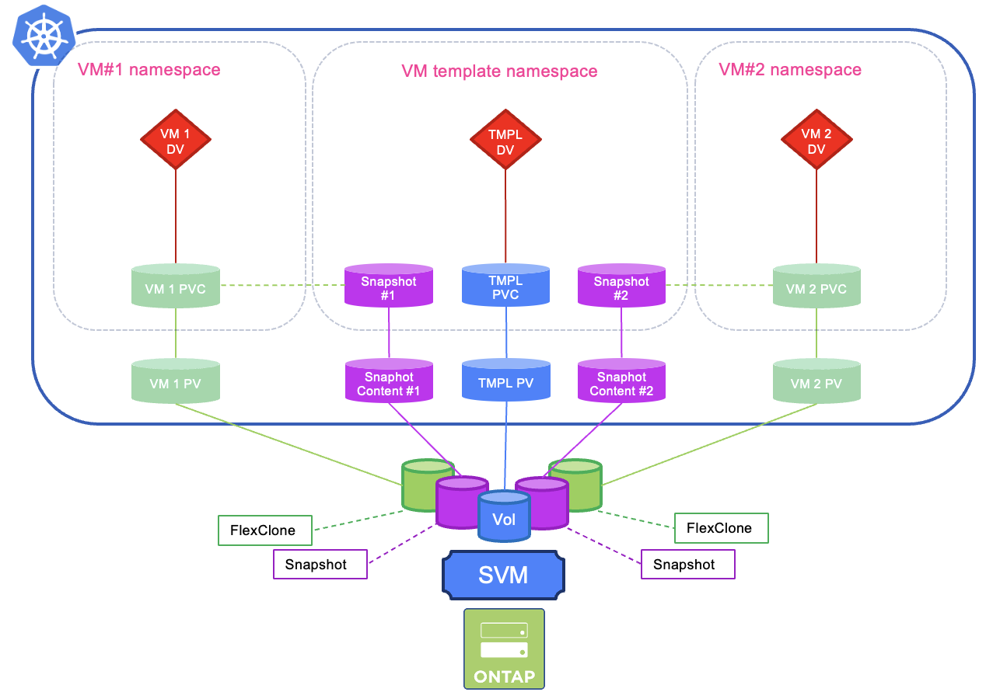
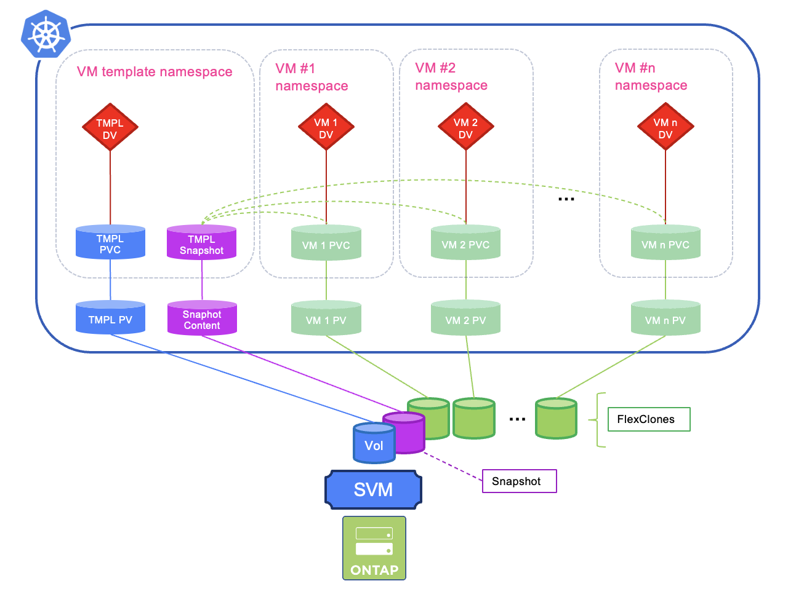

#########################################################################################
# SCENARIO 27: Creating a catalogue of bootable images
#########################################################################################

With what we learned in the previous chapters of this Scenario, let's create a catalogue of Virtual Machines bootable disks!  

**TL;DR START**  
Creating a template catalogue based on **CSI Snapshots** is much more efficient & faster compared to using PVC, simply because creating a VM Disk will then use the NetApp FlexClone feature.  
**TL;DR STOP**

## A. Chapter requirements

Let's start by creating a namespace for that purpose:  
```bash
$ kubectl create ns vm-templates
namespace/vm-templates created
```

We will follow the [Method2](../2_Method2/) to provision volumes.  
If not done yet, make sure you have pushed an Alpine image on the lab registry.  

Also, make sure there is a _Volume Snapshot Class_ available.  
```bash
$ kubectl get vsclass
NAME             DRIVER                  DELETIONPOLICY   AGE
csi-snap-class   csi.trident.netapp.io   Delete           20h
```
If not present, you can use the following to create one:  
```bash
$ kubectl create -f ../../../Scenario13/1_CSI_Snapshots/sc-volumesnapshot.yaml
volumesnapshotclass.snapshot.storage.k8s.io/csi-snap-class created
```
Last, if you went through the previous chapter, you may want to reset the _storageprofile_ to its default value when linked to a volume snapshot class (_snapshot_):  
```bash
$ kubectl patch storageprofile storage-class-iscsi --type=merge -p '{"spec":{"cloneStrategy":"snapshot"}}'
storageprofile.cdi.kubevirt.io/storage-class-iscsi patched
```

## B. Templates creation

Let's create two templates with the following method:  
- create a secret containing the registry credentials  
- create a DataVolume based on Alpine Linux 
- create a Virtual Machine with a CloudInit customization  
- delete the Virtual Machine

Let's begin with the 2 DataVolumes:  
```bash
$ kubectl create -f registry_secret.yaml -f tmpl1_dv.yaml -f tmpl2_dv.yaml
secret/endpoint-secret
datavolume.cdi.kubevirt.io/alpine-tmpl1 created
datavolume.cdi.kubevirt.io/alpine-tmpl2 created
```
After a minutes, both volumes should be ready and all the temporary objects should be deleted (scratch PVC, importer POD ...):  
```bash
$ kubectl get -n vm-templates all,pvc
NAME                                      PHASE       PROGRESS   RESTARTS   AGE
datavolume.cdi.kubevirt.io/alpine-tmpl1   Succeeded   100.0%                3m23s
datavolume.cdi.kubevirt.io/alpine-tmpl2   Succeeded   100.0%                3m23s

NAME                                 STATUS   VOLUME                                     CAPACITY   ACCESS MODES   STORAGECLASS          VOLUMEATTRIBUTESCLASS   AGE
persistentvolumeclaim/alpine-tmpl1   Bound    pvc-7a46108c-ffbe-49f9-8754-cce205852cb3   1Gi        RWX            storage-class-iscsi   <unset>                 3m22s
persistentvolumeclaim/alpine-tmpl2   Bound    pvc-db1bb1df-bc73-4052-ba39-6697271dfa98   1Gi        RWX            storage-class-iscsi   <unset>                 3m22s
```
Time to deploy our Virtual Machine templates. For this exercise, the only difference will be in the "Message of the day" file.  
Of course, you could go quite far in the customization of your boot images...  
```bash
$ kubectl create -f tmpl1_vm.yaml -f tmpl2_vm.yaml
virtualmachine.kubevirt.io/alpine-tmpl1 created
virtualmachine.kubevirt.io/alpine-tmpl2 created
```
We now have 2 Virtual Machines available (need to wait for them to be "Ready"):  
```bash
$ kubectl get -n vm-templates vm
NAME           AGE     STATUS    READY
alpine-tmpl1   2m25s   Running   True
alpine-tmpl2   2m25s   Running   True
```
Connect to the VMs to see that the init process was correctly executed.  
Example with the second VM:  
```bash
$ virtctl console -n vm-templates alpine-tmpl2
Successfully connected to alpine-tmpl2 console. Press Ctrl+] or Ctrl+5 to exit console.

Welcome to Alpine Linux 3.22
Kernel 6.12.38-0-virt on x86_64 (/dev/ttyS0)

alpine-tmpl2.vm-templates.svc.cluster.local login: alpine
Password:
This is the second template
```
Your disks templates are now ready, you can stop the VMs:  
```bash
$ virtctl stop -n vm-templates alpine-tmpl1
VM alpine-tmpl1 was scheduled to stop

$ virtctl stop -n vm-templates alpine-tmpl2
VM alpine-tmpl2 was scheduled to stop
```

## C. Creating a VM from a template based on a PVC

<p align="center"></p>

A new user comes on the platform and would like to start a VM based on the second disk.  
Let's start by creating a new namespace:  
```bash
$ kubectl create ns my-alpine
namespace/my-alpine created
```
Creating our VM from the catalogue of boot disks is done in 2 steps in this example:  
- creation of a DataVolume  
- creation of the Virtual Machine

You could very well manage everything at once, by including a DataVolumeTemplate in the VM definition.  
However, this is not covered here.

Note how the DataVolume is defined this time (*vm1_dv.yaml*), as it includes a "source" field:
```yaml
  source:
    pvc:
      name: alpine-tmpl2
      namespace: vm-templates
```
As you can see, the DataVolume explicitly points to the PVC we created earlier.  
Let's apply those.
```bash
$ kubectl create -f vm1_dv.yaml
datavolume.cdi.kubevirt.io/alpine-boot created

$ kubectl get -n my-alpine all,pvc
Warning: kubevirt.io/v1 VirtualMachineInstancePresets is now deprecated and will be removed in v2.
NAME                                     PHASE       PROGRESS   RESTARTS   AGE
datavolume.cdi.kubevirt.io/alpine-boot   Succeeded   100.0%                23s

NAME                                STATUS   VOLUME                                     CAPACITY   ACCESS MODES   STORAGECLASS          VOLUMEATTRIBUTESCLASS   AGE
persistentvolumeclaim/alpine-boot   Bound    pvc-0e57372e-f121-4a3b-aa70-6f1adaef83b6   1Gi        RWX            storage-class-iscsi   <unset>                 23s

$ kubectl create -f vm1_vm.yaml
virtualmachine.kubevirt.io/alpine-vm created

$ kubectl get vm -n my-alpine
NAME        AGE   STATUS    READY
alpine-vm   44s   Running   True
```
Seems like everything is running! Let's connect to the VM to validate we have the correct content:  
```bash
$ virtctl console -n my-alpine alpine-vm
Successfully connected to alpine-vm console. Press Ctrl+] or Ctrl+5 to exit console.

Welcome to Alpine Linux 3.22
Kernel 6.12.38-0-virt on x86_64 (/dev/ttyS0)

alpine-vm.my-alpine.svc.cluster.local login: alpine
Password:
This is the second template
```

Now, let's see what happens under the hood...  
Even though we created a disk from a PVC, Kubernetes first launched the provisioning of a Volume Snapshot of the template disk:  
```bash
$ kubectl get -n vm-templates vs
NAME                                                READYTOUSE   SOURCEPVC      SOURCESNAPSHOTCONTENT   RESTORESIZE   SNAPSHOTCLASS    SNAPSHOTCONTENT                                    CREATIONTIME   AGE
tmp-snapshot-2ea47bdf-8a77-4dc1-97fa-f392c88a502c   true         alpine-tmpl2                           1Gi           csi-snap-class   snapcontent-8d89fec3-d764-4f39-9922-334b3c3fb8f9   60s            60s
```
Why is that?  
You can also a reference to that snapshot in the target PVC events:  
```bash
$ kubectl describe -n my-alpine pvc alpine-boot
...
DataSource:
  APIGroup:  cdi.kubevirt.io
  Kind:      VolumeCloneSource
  Name:      volume-clone-source-fe177877-e1a3-47c6-856f-bdc22441f8cc
...
Events:
  Type     Reason                       Age                       From               Message
  ----     ------                       ----                      ----               -------
  Normal   VolumeSnapshotClassSelected  2m54s (x15 over 2m56s)    clone-populator    VolumeSnapshotClass selected according to StorageProfile csi-snap-class
```
Reading those logs, you can see them mentioning a **StorageProfile**.
>> StorageProfile is a Kubernetes custom resource (in CDI/KubeVirt) that defines how a specific StorageClass behaves and what storage capabilities it supports. It acts as metadata about a storage backend's features and limitations.  
>> StorageProfile specifies how volumes are cloned via the **cloneStrategy** field (snapshot, copy, csi-clone).

The _copy_ strategy is the slowest & least efficient method, as it reads data from the source & writes to the target.  
The _snapshot_ strategy relies on Kubernetes CSI Snapshots and how the underlying driver manages them.  
The _csi-clone_ stategy depends on the CSI driver to support such native cloning.  

ONTAP clones are based on snapshots, hence providing a very fast and efficient provisioning of a new volume. Hence with Trident, the _snapshot_ strategy is picked by default by the CDI.  

Let's check the details of the StorageProfile corresponding to the StorageClass used for our Virtual Machines:  
```bash
$ kubectl describe storageprofile storage-class-iscsi
Name:         storage-class-iscsi
Namespace:
Labels:       app=containerized-data-importer
              app.kubernetes.io/component=storage
              app.kubernetes.io/managed-by=cdi-controller
              cdi.kubevirt.io=
Annotations:  <none>
API Version:  cdi.kubevirt.io/v1beta1
Kind:         StorageProfile
...
Status:
  Claim Property Sets:
    Access Modes:
      ReadWriteMany
    Volume Mode:                   Block
  Clone Strategy:                  snapshot
  Data Import Cron Source Format:  snapshot
  Provisioner:                     csi.trident.netapp.io
  Snapshot Class:                  csi-snap-class
  Storage Class:                   storage-class-iscsi
```
There you go, the clone strategy is indeed set to _snapshot_.  

Going further, you can see in the ONTAP system, that our PVC is indeed a clone based on a snapshot:  
```bash
cluster1::> vol clone show
                      Parent  Parent        Parent
Vserver FlexClone     Vserver Volume        Snapshot             State     Type
------- ------------- ------- ------------- -------------------- --------- ----
sansvm  trident_pvc_0e57372e_f121_4a3b_aa70_6f1adaef83b6
                      sansvm  trident_pvc_db1bb1df_bc73_4052_ba39_6697271dfa98
                                            snapshot-8d89fec3-d764-4f39-9922-334b3c3fb8f9
                                                                 online    RW
```
Out of curiosity, let's create a new VM from the same template in a different namespace:  
```bash
$ kubectl create -f vm2.yaml
namespace/my-alpine2 created
datavolume.cdi.kubevirt.io/alpine-boot created
virtualmachine.kubevirt.io/alpine-vm created
```
It takes a few seconds for the VM to be ready:  
```bash
$ kubectl get -n my-alpine2 vm,pvc
NAME                                   AGE   STATUS    READY
virtualmachine.kubevirt.io/alpine-vm   89s   Running   True

NAME                                STATUS   VOLUME                                     CAPACITY   ACCESS MODES   STORAGECLASS          VOLUMEATTRIBUTESCLASS   AGE
persistentvolumeclaim/alpine-boot   Bound    pvc-55376ee0-4e72-419e-aca3-a25a0782794f   1Gi        RWX            storage-class-iscsi   <unset>                 89s
```
Great!  
However, based on your choice, you get a new Volume Snapshot in the source namespace for this new VM:  
```bash 
$ kubectl get -n vm-templates vs
NAME                                                READYTOUSE   SOURCEPVC      SOURCESNAPSHOTCONTENT   RESTORESIZE   SNAPSHOTCLASS    SNAPSHOTCONTENT                                    CREATIONTIME   AGE
tmp-snapshot-2ea47bdf-8a77-4dc1-97fa-f392c88a502c   true         alpine-tmpl2                           1Gi           csi-snap-class   snapcontent-8d89fec3-d764-4f39-9922-334b3c3fb8f9   7m1s           7m2s
tmp-snapshot-d656ddc6-43d1-4ac5-87f9-5b522a4b4bab   true         alpine-tmpl2                           1Gi           csi-snap-class   snapcontent-6e43fc23-e807-4d01-818f-375f8514786c   42s            43s
```
as well as a new clone based on that new snapshot on the storage layer:  
```bash 
cluster1::> vol clone show
                      Parent  Parent        Parent
Vserver FlexClone     Vserver Volume        Snapshot             State     Type
------- ------------- ------- ------------- -------------------- --------- ----
sansvm  trident_pvc_0e57372e_f121_4a3b_aa70_6f1adaef83b6
                      sansvm  trident_pvc_db1bb1df_bc73_4052_ba39_6697271dfa98
                                            snapshot-8d89fec3-d764-4f39-9922-334b3c3fb8f9
                                                                 online    RW
        trident_pvc_55376ee0_4e72_419e_aca3_a25a0782794f
                      sansvm  trident_pvc_db1bb1df_bc73_4052_ba39_6697271dfa98
                                            snapshot-6e43fc23-e807-4d01-818f-375f8514786c
                                                                 online    RW
2 entries were displayed.
```
Though everything is fully automated and orchestrated, you end up with unnecesary additional objects.  
Hence the following chapter that showcases a more efficient method to create Virtual Machines from a template, based on snapshot.  

But before, let's clean up:  
```bash 
kubectl delete ns my-alpine my-alpine2
```
This also deletes the volume snapshots in the template namespace.  

## D. Creating a VM from a template based on a Snapshot

<p align="center"></p>

Our first step will be to create a Volume Snapshot for each of our VM template disks:  
```bash 
$ kubectl create -f tmpl_snapshots.yaml
volumesnapshot.snapshot.storage.k8s.io/alpine-tmpl1 created
volumesnapshot.snapshot.storage.k8s.io/alpine-tmpl2 created

$ kubectl get -n vm-templates vs
NAME           READYTOUSE   SOURCEPVC      SOURCESNAPSHOTCONTENT   RESTORESIZE   SNAPSHOTCLASS    SNAPSHOTCONTENT                                    CREATIONTIME   AGE
alpine-tmpl1   true         alpine-tmpl1                           1Gi           csi-snap-class   snapcontent-16968b84-e454-4878-9ecd-1963a2cc2e56   108s           107s
alpine-tmpl2   true         alpine-tmpl2                           1Gi           csi-snap-class   snapcontent-4244b46e-f824-40ba-ad16-bb7fccfb2965   107s           107s
```
In order for the clone to succeed, the VolumeSnapshotContent objects must contain the field **sourceVolumeMode**.  
If that were not the case, you would see the following message in the target _"The volume modes of source and target are incompatible"_ and the cloning method would fall back to _copy_ which is not what we want. Let's verify that both snapshots are ready:  
```bash
$ kubectl get volumesnapshotcontent -o yaml | grep sourceVolumeMode
    sourceVolumeMode: Block
    sourceVolumeMode: Block
```

Before you create a new VM, let's take a look at the YAML manifest (_vm3.yaml_):  
```yaml
  source:
    snapshot:
      name: alpine-tmpl2
      namespace: vm-templates
```
You can indeed see that this time the DataVolume refers to the snapshot you created earlier.  
Let's apply that manifest:  
```bash 
$ kubect create -f vm3.yaml
namespace/my-alpine3 created
datavolume.cdi.kubevirt.io/alpine-boot created
virtualmachine.kubevirt.io/alpine-vm created

$ kubectl get -n my-alpine3 vm,pvc
NAME                                   AGE   STATUS    READY
virtualmachine.kubevirt.io/alpine-vm   68s   Running   True

NAME                                STATUS   VOLUME                                     CAPACITY   ACCESS MODES   STORAGECLASS          VOLUMEATTRIBUTESCLASS   AGE
persistentvolumeclaim/alpine-boot   Bound    pvc-6597563a-0b2c-493f-9afc-d006515238c2   1Gi        RWX            storage-class-iscsi   <unset>                 68s
```
If you quickly check at the storage layer, you can see that the new volume (*trident_pvc_6597563a_0b2c_493f_9afc_d006515238c2*) is a clone based on the snapshot *alpine-tmpl2* (*snapshot-284d47be-117d-4cdd-af54-152d46f9643b*) present in the template namespace:  
```bash
cluster1::> vol clone show
                      Parent  Parent        Parent
Vserver FlexClone     Vserver Volume        Snapshot             State     Type
------- ------------- ------- ------------- -------------------- --------- ----
sansvm  trident_pvc_6597563a_0b2c_493f_9afc_d006515238c2
                      sansvm  trident_pvc_afc41ff4_8449_498f_bfdf_051e87636b27
                                            snapshot-284d47be-117d-4cdd-af54-152d46f9643b
                                                                 online    RW
```
Reading the DataVolume events also shows interesting information:  
```bash
$ kubectl get events -n my-alpine3 --field-selector involvedObject.kind=DataVolume
LAST SEEN   TYPE      REASON                              OBJECT                   MESSAGE
85s         Normal    CloneScheduled                      datavolume/alpine-boot   Cloning from vm-templates/alpine-tmpl2 into my-alpine3/alpine-boot scheduled
85s         Normal    Pending                             datavolume/alpine-boot   PVC alpine-boot Pending
85s         Warning   Pending                             datavolume/alpine-boot   Clone Pending
85s         Normal    CloneFromSnapshotSourceInProgress   datavolume/alpine-boot   Creating PVC from snapshot source is in progress (for snapshot vm-templates/alpine-tmpl2)
83s         Normal    Bound                               datavolume/alpine-boot   PVC alpine-boot Bound
83s         Normal    CloneSucceeded                      datavolume/alpine-boot   Successfully cloned from vm-templates/alpine-tmpl2 into my-alpine3/alpine-boot
```
That validates that the PVC is indeed created after a clone based from a snapshot.  
Don't forget to verify that the VM's content is what is expected:  
```bash
$ virtctl console -n my-alpine3 alpine-vm
alpine-vm.my-alpine.svc.cluster.local login: alpine
Password:
This is the second template
```

Time to create a new VM from the same template, but in a different namespace this time:  
```bash 
$ kubect create -f vm4.yaml
namespace/my-alpine4 created
datavolume.cdi.kubevirt.io/alpine-boot created
virtualmachine.kubevirt.io/alpine-vm created

$ kubectl get -n my-alpine4 vm,pvc
NAME                                   AGE   STATUS    READY
virtualmachine.kubevirt.io/alpine-vm   68s   Running   True

NAME                                STATUS   VOLUME                                     CAPACITY   ACCESS MODES   STORAGECLASS          VOLUMEATTRIBUTESCLASS   AGE
persistentvolumeclaim/alpine-boot   Bound    pvc-58aaebbf-af79-4562-a93b-6776452cdae1   1Gi        RWX            storage-class-iscsi   <unset>                 68s
```
Once again, the creation was super fast.  
Let's quickly check the storage:  
```bash 
cluster1::> vol clone show
                      Parent  Parent        Parent
Vserver FlexClone     Vserver Volume        Snapshot             State     Type
------- ------------- ------- ------------- -------------------- --------- ----
sansvm  trident_pvc_58aaebbf_af79_4562_a93b_6776452cdae1
                      sansvm  trident_pvc_afc41ff4_8449_498f_bfdf_051e87636b27
                                            snapshot-284d47be-117d-4cdd-af54-152d46f9643b
                                                                 online    RW
        trident_pvc_f649e3ec_285d_415a_bd20_904585a36e40
                      sansvm  trident_pvc_afc41ff4_8449_498f_bfdf_051e87636b27
                                            snapshot-284d47be-117d-4cdd-af54-152d46f9643b
                                                                 online    RW
2 entries were displayed.
```
The interesting information here is that both disks/PVC clones from the same ONTAP volume created from the same snapshot!  

**Conclusion:** Using templates based on snapshot is more efficient, as you do not need to manage multiple snapshots.

**Note:** By adding the _splitOnClone: "true"_ parameter in the Trident backend, once the volume is created, Trident will trigger the disconnection (ie _split_) of the PVC (ie the _clone_) from its parent volume (ie the _template_), which is a non-disruptive process happening in the background, the goal being to make the disk an ONTAP volume on its own, if for instance you plan on keeping the Virtual Machine for a long time. This parameter could also be added as a PVC annotation.


And voilà, you have successfully created a catalogue of customized bootable disks!  
You are now the expert!


## D. Clean up time

```bash
kubectl delete ns my-alpine4 my-alpine3
```