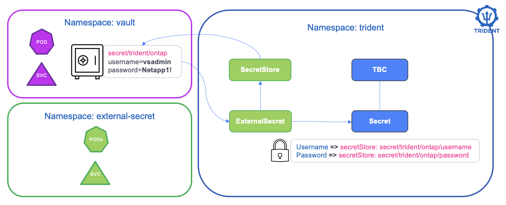

#########################################################################################
# SCENARIO 30: Vault-backed Trident credentials
#########################################################################################

Trident backend credentials are stored in Kubernetes Secrets. Trident does not connect directly to an external vault, but a secret synchronization operator can keep the Kubernetes Secret populated from one.

In this scenario, the complete chain is:  
**HashiCorp Vault KV -> External Secrets Operator -> Kubernetes Secret -> Trident backend -> StorageClass -> PVC -> ONTAP volume**

<p align="center"></p>

We will install a simple Vault server, store the ONTAP SVM credentials in it, create a dedicated NFS backend, and finally mount a dynamically provisioned PVC in BusyBox.

> **Demo configuration only:** Vault runs in development mode, in memory, over HTTP, with a known root token. It is automatically unsealed and loses 
> its data when its pod restarts. Never use this configuration in production. A production deployment should use persistent HA storage, TLS, auto-unseal, 
> least-privilege policies, and Kubernetes authentication instead of a root token.

## A. Prerequisites and images

This scenario expects:  
- a working Kubernetes cluster with Trident installed
- the `trident` namespace
- Helm
- access to the lab ONTAP SVM at `192.168.0.133`
- the lab private registry at `registry.demo.netapp.com`

Move to this scenario directory:  
```bash
cd ~/LabNetApp/Kubernetes_v6/Trident_Scenarios/Scenario30
```

If you have not yet read [Addenda08](../../Addendum/Addenda08), it explains image
management in the lab. Stage the images used by this scenario in the private registry:  
```bash
sh scenario30_pull_images.sh
```

## B. Install a development Vault

There are multiple vaults available online. We will build this demo using Hashicorp's.  
Add the HashiCorp Helm repository and prepare the namespace and registry credentials:  
```bash
helm repo add hashicorp https://helm.releases.hashicorp.com
helm repo update

kubectl create namespace vault
kubectl create secret docker-registry regcred -n vault \
  --docker-server=registry.demo.netapp.com \
  --docker-username=registryuser \
  --docker-password='Netapp1!'
```

Install Vault in development mode. The Vault Agent Injector is a Kubernetes mutating admission webhook that automatically injects Vault secrets into pods by modifying their containers at runtime. However, it is not required in this scenario because External Secrets Operator will handle the secret synchronization instead, creating standard Kubernetes Secrets that Trident can consume directly:  
```bash
$ helm upgrade --install vault hashicorp/vault --namespace vault --version 0.34.1 \
  --set server.dev.enabled=true \
  --set server.dev.devRootToken=root \
  --set injector.enabled=false \
  --set server.image.repository=registry.demo.netapp.com/vault \
  --set server.image.tag=2.0.4 \
  --set 'global.imagePullSecrets[0]=regcred'

$ kubectl wait --for=condition=Ready pod/vault-0 -n vault --timeout=180s

$ kubectl get pod,service -n vault
NAME          READY   STATUS    RESTARTS   AGE
pod/vault-0   1/1     Running   0          6h3m

NAME                     TYPE        CLUSTER-IP      EXTERNAL-IP   PORT(S)             AGE
service/vault            ClusterIP   10.108.211.64   <none>        8200/TCP,8201/TCP   6h3m
service/vault-internal   ClusterIP   None            <none>        8200/TCP,8201/TCP   6h3m
```
The HashiCorp chart always creates both services. This lab only needs one of them.

`vault` is a normal ClusterIP service (`10.108.211.64`).  
Clients talk to Vault through it's DNS `vault.vault.svc`, port **8200** (API). That is what External Secrets Operator uses in `vault-secret-sync.yaml`:  
```yaml
spec:
  provider:
    vault:
      server: http://vault.vault.svc:8200
```
In this minimal scenario, you can ignore the `vault-internal` service.  

The development server enables a KV v2 engine named `secret`. A KV (Key-Value) v2 engine is Vault's versioned secret storage backend that allows you to store arbitrary key-value pairs with automatic versioning, metadata tracking, and optional check-and-set operations for safe concurrent updates. Unlike KV v1, the v2 engine maintains a history of secret versions and provides additional metadata capabilities. Add the ONTAP SVM credentials to it:  
```bash
kubectl exec -n vault vault-0 -- env \
  VAULT_ADDR=http://127.0.0.1:8200 \
  VAULT_TOKEN=root \
  vault kv put secret/trident/ontap username=vsadmin password='Netapp1!'
```

Verify the metadata without displaying the secret values:  
```bash
$ kubectl exec -n vault vault-0 -- env \
  VAULT_ADDR=http://127.0.0.1:8200 \
  VAULT_TOKEN=root \
  vault kv metadata get secret/trident/ontap

======= Metadata Path =======
secret/metadata/trident/ontap

========== Metadata ==========
Key                     Value
---                     -----
cas_required            false
created_time            2026-09-16T10:52:23.175977663Z
...
```

## C. Install External Secrets Operator

External Secrets Operator (ESO) reads the values from Vault and creates the Kubernetes Secret that Trident expects.

The chart is pinned to 0.19.2, the last release whose CRDs do not use the `selectableFields` property. That property requires Kubernetes 1.31 or later, and the lab runs 1.29 by default, where a newer chart fails with:  
```text
Error: failed to create typed patch object (/externalsecrets.external-secrets.io;
apiextensions.k8s.io/v1, Kind=CustomResourceDefinition):
.spec.versions[0].selectableFields: field not declared in schema
```

Version 0.19.2 already serves the `external-secrets.io/v1` API used in this scenario, so the manifests are unchanged. If you have upgraded the cluster to 1.31 or later (see [Addenda14](../../Addendum/Addenda14)), you can use a current 1.x or 2.x chart instead, adjusting the version and image tags below accordingly.

```bash
helm repo add external-secrets https://charts.external-secrets.io
helm repo update

kubectl create namespace external-secrets
kubectl create secret docker-registry regcred -n external-secrets \
  --docker-server=registry.demo.netapp.com \
  --docker-username=registryuser \
  --docker-password='Netapp1!'

helm upgrade --install external-secrets external-secrets/external-secrets --namespace external-secrets --version 0.19.2 \
  --set image.repository=registry.demo.netapp.com/external-secrets \
  --set image.tag=v0.19.2 \
  --set webhook.image.repository=registry.demo.netapp.com/external-secrets \
  --set webhook.image.tag=v0.19.2 \
  --set certController.image.repository=registry.demo.netapp.com/external-secrets \
  --set certController.image.tag=v0.19.2 \
  --set 'imagePullSecrets[0].name=regcred' \
  --set 'webhook.imagePullSecrets[0].name=regcred' \
  --set 'certController.imagePullSecrets[0].name=regcred'

kubectl wait --for=condition=Available deployment --all -n external-secrets --timeout=180s
```

For simplicity, ESO authenticates to this development Vault with its known root token.
Create that bootstrap credential interactively so it is not stored in a repository file:  
```bash
kubectl create secret generic vault-token --from-literal=token=root -n trident
```

Create the `SecretStore` connection and the `ExternalSecret` mapping:  
```bash
kubectl apply -f vault-secret-sync.yaml

kubectl wait --for=condition=Ready secretstore/vault -n trident --timeout=60s
kubectl wait --for=condition=Ready externalsecret/trident-ontap-credentials -n trident --timeout=60s
```

ESO has now materialized `secret-nas-svm-vault`. Check its keys without printing their values:  
```bash
$ kubectl get secretstore,externalsecret -n trident
NAME                                    AGE    STATUS   CAPABILITIES   READY
secretstore.external-secrets.io/vault   5h6m   Valid    ReadWrite      True

NAME                                                           STORETYPE     STORE   REFRESH INTERVAL   STATUS         READY
externalsecret.external-secrets.io/trident-ontap-credentials   SecretStore   vault   1m                 SecretSynced   True

$ kubectl get secret secret-nas-svm-vault -n trident -o json | jq -r '.data | keys[]'
```

The output should contain:  
```text
password
username
```
To make sure the values are the expected ones, let's read them:  
```bash
$ kubectl get secret secret-nas-svm-vault -n trident -o jsonpath="{.data.username}" | base64 -d; echo
vadmin
$ kubectl get secret secret-nas-svm-vault -n trident -o jsonpath="{.data.password}" | base64 -d; echo
Netapp1!
```

## D. Create the Trident backend

The backend manifest references only the generated Kubernetes Secret. No ONTAP credential is present in the backend definition:  
```bash
$ kubectl apply -f trident-vault-backend.yaml

$ kubectl get tbc backend-nfs-vault -n trident
NAME                BACKEND NAME         BACKEND UUID                           PHASE   STATUS
backend-nfs-vault   BackendForNFSVault   2258ace6-f10b-4942-bbda-ebcc4caa6b46   Bound   Success

$ kubectl get storageclass storage-class-nfs-vault
NAME                      PROVISIONER             RECLAIMPOLICY   VOLUMEBINDINGMODE   ALLOWVOLUMEEXPANSION   AGE
storage-class-nfs-vault   csi.trident.netapp.io   Delete          Immediate           true                   5h5m
```

The expected `TridentBackendConfig` phase is `Bound` and its status is `Success`.  
`storage-class-nfs-vault` is restricted to `BackendForNFSVault:.*`, ensuring that the test PVC is provisioned by this backend and not by another NFS backend in the cluster.

## E. Prove the complete chain with BusyBox

Create the application, its PVC, and its namespace:  
```bash
$ kubectl apply -f busybox.yaml
$ kubectl wait --for=condition=Bound pvc/mydata -n scenario30 --timeout=120s
$ kubectl rollout status deployment/busybox -n scenario30 --timeout=120s

$ kubectl get pod,pvc -n scenario30
NAME                           READY   STATUS    RESTARTS        AGE
pod/busybox-7477c74d9f-5xhtw   1/1     Running   5 (5m14s ago)   5h5m

NAME                           STATUS   VOLUME                                     CAPACITY   ACCESS MODES   STORAGECLASS              VOLUMEATTRIBUTESCLASS   AGE
persistentvolumeclaim/mydata   Bound    pvc-50ff8956-378a-46a4-9475-58a69ca019ba   1Gi        RWX            storage-class-nfs-vault   <unset>                 5h5m

$ tridentctl -n trident get backend BackendForNFSVault
┌────────────────────┬────────────────┬──────────────────────────────────────┬────────┬──────────────┬─────────┐
│        NAME        │ STORAGE DRIVER │                 UUID                 │ STATE  │ USER - STATE │ VOLUMES │
├────────────────────┼────────────────┼──────────────────────────────────────┼────────┼──────────────┼─────────┤
│ BackendForNFSVault │ ontap-nas      │ 2258ace6-f10b-4942-bbda-ebcc4caa6b46 │ online │ normal       │ 1       │
└────────────────────┴────────────────┴──────────────────────────────────────┴────────┴──────────────┴─────────┘
```

The backend should now report one volume. Write a file through the mounted PVC and read it back:  
```bash
kubectl exec -n scenario30 deployment/busybox -- \
  sh -c 'echo "Vault -> ESO -> Trident -> ONTAP works" > /data/scenario30.txt'

kubectl exec -n scenario30 deployment/busybox -- cat /data/scenario30.txt
```

Expected output:  
```text
Vault -> ESO -> Trident -> ONTAP works
```

This proves that Vault supplied the credentials used to bring the dedicated Trident backend online, and that the backend successfully provisioned and mounted an ONTAP volume.

## F. Troubleshooting

If the ESO installation fails on `.spec.versions[0].selectableFields: field not declared in schema`, the chart is too recent for the cluster. Compare the server version with the 1.31 requirement of that CRD property, then install 0.19.2 as described in chapter C:  
```bash
kubectl version -o json | jq -r '.serverVersion.gitVersion'
```

A failed install still registers a Helm release, so remove it before retrying:  
```bash
helm list -a -n external-secrets
helm uninstall external-secrets -n external-secrets
```

If the generated Secret does not appear, inspect the synchronization resources and ESO logs:  
```bash
kubectl describe secretstore vault -n trident
kubectl describe externalsecret trident-ontap-credentials -n trident
kubectl logs -n external-secrets deployment/external-secrets --tail=100
```

If the backend does not reach `Bound/Success`, check its message and the Trident
controller logs:

```bash
kubectl describe tbc backend-nfs-vault -n trident
kubectl logs -n trident \
  -l app=controller.csi.trident.netapp.io \
  -c trident-main --tail=100
```

## G. Cleanup

Remove consumers before deleting the generated credentials:  
```bash
kubectl delete namespace scenario30
kubectl delete storageclass storage-class-nfs-vault
kubectl delete tbc backend-nfs-vault -n trident
kubectl wait --for=delete tbc/backend-nfs-vault -n trident --timeout=120s
kubectl delete -f vault-secret-sync.yaml
kubectl delete secret vault-token -n trident

helm uninstall external-secrets -n external-secrets
helm uninstall vault -n vault
kubectl delete namespace external-secrets vault
```

Because this Vault runs in development mode, deleting or restarting `vault-0` also destroys its stored credentials.
